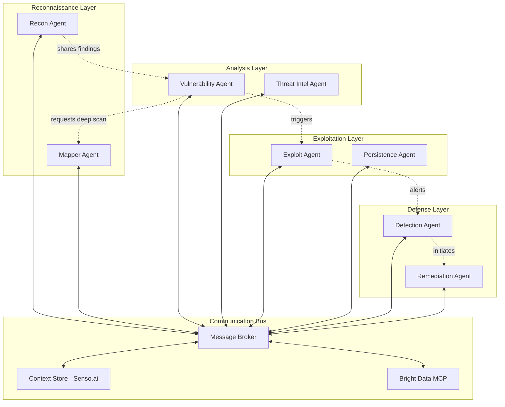

# A2A (Agent-to-Agent) Interaction Architecture

## Executive Summary

Agent-to-Agent (A2A) interaction enables autonomous security agents to collaborate, share intelligence, and coordinate complex multi-stage attacks or defenses. This lightweight implementation is designed for a one-day hackathon while demonstrating powerful collaborative capabilities.

## Core A2A Architecture



## 1. Simple A2A Communication Protocol

```typescript
// Lightweight A2A communication protocol
interface A2AMessage {
  id: string;
  from_agent: string;
  to_agent: string | 'broadcast';
  type: 'request' | 'response' | 'notification' | 'command';
  priority: 'low' | 'medium' | 'high' | 'critical';
  payload: any;
  context: {
    session_id: string;
    target: string;
    timestamp: number;
  };
}

// Agent base class with A2A capabilities
class BaseSecurityAgent {
  protected id: string;
  protected type: AgentType;
  protected messageBus: MessageBus;
  protected capabilities: string[];

  constructor(type: AgentType) {
    this.id = `${type}_${generateId()}`;
    this.type = type;
    this.capabilities = this.defineCapabilities();
    this.messageBus = MessageBus.getInstance();
    this.subscribe();
  }

  // Subscribe to relevant messages
  private subscribe(): void {
    this.messageBus.subscribe(this.id, (message: A2AMessage) => {
      this.handleMessage(message);
    });

    // Subscribe to broadcast messages
    this.messageBus.subscribe('broadcast', (message: A2AMessage) => {
      if (this.isRelevant(message)) {
        this.handleMessage(message);
      }
    });
  }

  // Send message to another agent
  protected async sendMessage(to: string, type: string, payload: any): Promise<void> {
    const message: A2AMessage = {
      id: generateId(),
      from_agent: this.id,
      to_agent: to,
      type: type as any,
      priority: this.calculatePriority(payload),
      payload,
      context: {
        session_id: this.currentSession,
        target: this.currentTarget,
        timestamp: Date.now()
      }
    };

    await this.messageBus.publish(message);
  }

  // Handle incoming messages
  protected abstract handleMessage(message: A2AMessage): Promise<void>;
  protected abstract defineCapabilities(): string[];
  protected abstract isRelevant(message: A2AMessage): boolean;
}
```

## 2. Collaborative Attack Simulation (Red Team A2A)

```typescript
// Reconnaissance Agent - Initiates the attack chain
class ReconnaissanceAgent extends BaseSecurityAgent {
  private brightData: BrightDataMCPClient;

  constructor() {
    super('reconnaissance');
    this.brightData = new BrightDataMCPClient();
  }

  async startReconnaissance(target: string): Promise<void> {
    // Perform initial reconnaissance
    const findings = await this.brightData.call({
      tool: 'web_scraper',
      params: {
        url: target,
        extract_links: true,
        discover_subdomains: true,
        find_technologies: true
      }
    });

    // Share findings with Vulnerability Agent
    await this.sendMessage('vulnerability_agent', 'notification', {
      type: 'recon_complete',
      findings: {
        subdomains: findings.subdomains,
        technologies: findings.technologies,
        endpoints: findings.endpoints
      }
    });

    // Request deeper mapping from Mapper Agent
    await this.sendMessage('mapper_agent', 'request', {
      type: 'deep_scan',
      targets: findings.subdomains
    });
  }

  protected async handleMessage(message: A2AMessage): Promise<void> {
    if (message.payload.type === 'need_recon') {
      await this.startReconnaissance(message.payload.target);
    }
  }
}

// Vulnerability Agent - Analyzes findings and identifies weaknesses
class VulnerabilityAgent extends BaseSecurityAgent {
  private knownVulns: Map<string, Vulnerability[]> = new Map();

  constructor() {
    super('vulnerability');
  }

  protected async handleMessage(message: A2AMessage): Promise<void> {
    if (message.payload.type === 'recon_complete') {
      const vulns = await this.analyzeForVulnerabilities(message.payload.findings);

      if (vulns.length > 0) {
        // Notify Exploit Agent about exploitable vulnerabilities
        await this.sendMessage('exploit_agent', 'command', {
          type: 'exploit_available',
          vulnerabilities: vulns.filter(v => v.exploitable),
          target: message.context.target
        });

        // Alert Detection Agent (for defensive awareness)
        await this.sendMessage('detection_agent', 'notification', {
          type: 'vulnerabilities_found',
          count: vulns.length,
          severity: this.getHighestSeverity(vulns)
        });
      }
    }
  }

  private async analyzeForVulnerabilities(findings: any): Promise<Vulnerability[]> {
    const vulnerabilities: Vulnerability[] = [];

    // Check for known vulnerable technologies
    for (const tech of findings.technologies) {
      if (this.hasKnownVulnerabilities(tech)) {
        vulnerabilities.push(...this.getVulnerabilities(tech));
      }
    }

    // Check for common misconfigurations
    const misconfigs = await this.checkMisconfigurations(findings.endpoints);
    vulnerabilities.push(...misconfigs);

    return vulnerabilities;
  }
}

// Exploit Agent - Attempts safe exploitation
class ExploitAgent extends BaseSecurityAgent {
  private exploitDatabase: ExploitDB;
  private safetyFramework: SafetyFramework;

  constructor() {
    super('exploit');
    this.exploitDatabase = new ExploitDB();
    this.safetyFramework = new SafetyFramework();
  }

  protected async handleMessage(message: A2AMessage): Promise<void> {
    if (message.payload.type === 'exploit_available') {
      for (const vuln of message.payload.vulnerabilities) {
        // Check if safe to exploit
        if (this.safetyFramework.isSafeToExploit(vuln)) {
          const result = await this.attemptExploit(vuln);

          if (result.success) {
            // Notify Persistence Agent
            await this.sendMessage('persistence_agent', 'command', {
              type: 'establish_persistence',
              access: result.access_gained,
              method: result.method
            });

            // Alert Detection Agent (test detection capabilities)
            await this.sendMessage('detection_agent', 'notification', {
              type: 'exploitation_attempted',
              vulnerability: vuln,
              success: result.success
            });
          }
        }
      }
    }
  }

  private async attemptExploit(vuln: Vulnerability): Promise<ExploitResult> {
    // Safe, simulated exploitation
    const exploit = this.exploitDatabase.getExploit(vuln.cve);

    if (exploit && exploit.safe_for_production) {
      // Simulate exploitation without actual damage
      return {
        success: Math.random() > 0.3, // Simulated success rate
        access_gained: 'read_only',
        method: exploit.type,
        evidence: this.generateProofOfConcept(vuln)
      };
    }

    return { success: false };
  }
}
```

## 3. Collaborative Defense (Blue Team A2A)

```typescript
// Detection Agent - Monitors for attacks
class DetectionAgent extends BaseSecurityAgent {
  private alertThresholds: Map<string, number> = new Map();
  private detectionRules: DetectionRule[];

  constructor() {
    super('detection');
    this.initializeDetectionRules();
  }

  protected async handleMessage(message: A2AMessage): Promise<void> {
    // Analyze all incoming threat notifications
    const threatLevel = this.assessThreat(message);

    if (threatLevel > 0.7) {
      // High threat - immediate remediation needed
      await this.sendMessage('remediation_agent', 'command', {
        type: 'immediate_remediation',
        threat: message.payload,
        severity: 'critical',
        suggested_actions: this.getSuggestedActions(message.payload)
      });
    } else if (threatLevel > 0.4) {
      // Medium threat - investigate further
      await this.sendMessage('threat_intel_agent', 'request', {
        type: 'investigate',
        indicators: this.extractIOCs(message.payload)
      });
    }

    // Log for correlation
    await this.logToSenso(message);
  }

  private assessThreat(message: A2AMessage): number {
    let score = 0;

    if (message.payload.type === 'exploitation_attempted') {
      score = 0.8;
    } else if (message.payload.type === 'vulnerabilities_found') {
      score = 0.5 + (message.payload.severity / 20);
    } else if (message.payload.type === 'suspicious_activity') {
      score = 0.6;
    }

    return Math.min(score, 1.0);
  }

  private async logToSenso(message: A2AMessage): Promise<void> {
    // Use Senso.ai for context persistence
    await sensoClient.update({
      context_id: 'security_monitoring',
      data: {
        timestamp: Date.now(),
        agent: message.from_agent,
        event: message.payload,
        threat_level: this.assessThreat(message)
      }
    });
  }
}

// Remediation Agent - Takes defensive actions
class RemediationAgent extends BaseSecurityAgent {
  private remediationPlaybooks: Map<string, Playbook> = new Map();

  constructor() {
    super('remediation');
    this.loadPlaybooks();
  }

  protected async handleMessage(message: A2AMessage): Promise<void> {
    if (message.payload.type === 'immediate_remediation') {
      const playbook = this.selectPlaybook(message.payload.threat);

      // Execute remediation
      const result = await this.executePlaybook(playbook, message.payload);

      // Notify other agents about remediation
      await this.sendMessage('broadcast', 'notification', {
        type: 'remediation_completed',
        threat: message.payload.threat,
        actions_taken: result.actions,
        success: result.success
      });

      // Request verification from Recon Agent
      await this.sendMessage('reconnaissance_agent', 'request', {
        type: 'verify_remediation',
        target: message.context.target,
        expected_state: result.expected_state
      });
    }
  }

  private async executePlaybook(playbook: Playbook, threat: any): Promise<RemediationResult> {
    const actions = [];

    for (const step of playbook.steps) {
      if (step.type === 'block_ip') {
        actions.push(await this.blockIP(threat.source_ip));
      } else if (step.type === 'isolate_system') {
        actions.push(await this.isolateSystem(threat.affected_system));
      } else if (step.type === 'patch_vulnerability') {
        actions.push(await this.applyPatch(threat.vulnerability));
      }
    }

    return {
      actions,
      success: actions.every(a => a.success),
      expected_state: playbook.desired_state
    };
  }
}
```

## 4. Intelligence Sharing Network (A2A Mesh)

```typescript
// Threat Intelligence Agent - Shares threat data between agents
class ThreatIntelligenceAgent extends BaseSecurityAgent {
  private threatDatabase: Map<string, ThreatIndicator> = new Map();
  private partnerAgents: Set<string> = new Set();

  constructor() {
    super('threat_intel');
  }

  protected async handleMessage(message: A2AMessage): Promise<void> {
    if (message.payload.type === 'investigate') {
      const intelligence = await this.gatherIntelligence(message.payload.indicators);

      // Share with all relevant agents
      await this.broadcastIntelligence(intelligence);
    } else if (message.payload.type === 'threat_update') {
      // Receive threat updates from other agents
      this.updateThreatDatabase(message.payload.indicators);

      // Propagate to partner agents (federated learning)
      await this.propagateToPartners(message.payload);
    }
  }

  private async broadcastIntelligence(intel: ThreatIntelligence): Promise<void> {
    // Send to all defensive agents
    const defensiveAgents = ['detection_agent', 'remediation_agent'];

    for (const agent of defensiveAgents) {
      await this.sendMessage(agent, 'notification', {
        type: 'threat_intelligence_update',
        indicators: intel.indicators,
        ttps: intel.ttps,
        confidence: intel.confidence
      });
    }

    // Update offensive agents for better testing
    await this.sendMessage('vulnerability_agent', 'notification', {
      type: 'new_vulnerabilities',
      cves: intel.related_cves
    });
  }

  private async propagateToPartners(threat: any): Promise<void> {
    // Federated threat intelligence sharing
    for (const partner of this.partnerAgents) {
      await this.sendMessage(partner, 'notification', {
        type: 'federated_threat_update',
        threat,
        source: this.id,
        sharing_level: 'TLP_GREEN' // Traffic Light Protocol
      });
    }
  }
}
```

## 5. Coordination Patterns

### 5.1 Kill Chain Coordination

```typescript
// Coordinated attack following the kill chain
class KillChainCoordinator {
  private agents: Map<string, BaseSecurityAgent> = new Map();
  private currentPhase: KillChainPhase = 'reconnaissance';

  async executeKillChain(target: string): Promise<void> {
    // Phase 1: Reconnaissance
    await this.executePhase('reconnaissance', {
      agents: ['reconnaissance_agent', 'mapper_agent'],
      parallel: true,
      timeout: 300000 // 5 minutes
    });

    // Phase 2: Weaponization
    await this.executePhase('weaponization', {
      agents: ['vulnerability_agent'],
      requires: ['reconnaissance'],
      timeout: 180000
    });

    // Phase 3: Delivery
    await this.executePhase('delivery', {
      agents: ['exploit_agent'],
      requires: ['weaponization'],
      safety_check: true
    });

    // Phase 4: Exploitation
    await this.executePhase('exploitation', {
      agents: ['exploit_agent', 'persistence_agent'],
      parallel: false,
      monitoring: true
    });

    // Phase 5: Installation
    await this.executePhase('installation', {
      agents: ['persistence_agent'],
      stealth_mode: true
    });

    // Phase 6: Command & Control
    await this.executePhase('command_control', {
      agents: ['c2_agent'],
      encrypted: true
    });

    // Phase 7: Actions on Objectives
    await this.executePhase('actions', {
      agents: ['exfiltration_agent'],
      safe_mode: true // No actual data exfiltration
    });
  }

  private async executePhase(phase: string, config: PhaseConfig): Promise<void> {
    const results = [];

    if (config.parallel) {
      // Execute agents in parallel
      const promises = config.agents.map(agent =>
        this.sendCommand(agent, `execute_${phase}`, { target: this.target })
      );
      results.push(...await Promise.all(promises));
    } else {
      // Execute agents sequentially
      for (const agent of config.agents) {
        const result = await this.sendCommand(agent, `execute_${phase}`, { target: this.target });
        results.push(result);
      }
    }

    // Check phase success
    if (results.every(r => r.success)) {
      this.currentPhase = this.getNextPhase(phase);
    } else {
      await this.handlePhaseFailure(phase, results);
    }
  }
}
```

### 5.2 Swarm Intelligence Pattern

```typescript
// Swarm of lightweight agents working together
class SwarmCoordinator {
  private swarm: Set<MicroAgent> = new Set();
  private consensus: ConsensusEngine;

  async deploySwarm(target: string, size: number = 10): Promise<void> {
    // Create swarm of micro-agents
    for (let i = 0; i < size; i++) {
      const agent = new MicroAgent(`swarm_${i}`, this.consensus);
      this.swarm.add(agent);
    }

    // Each agent explores different attack vectors
    const tasks = this.generateSwarmTasks(target);

    let taskIndex = 0;
    for (const agent of this.swarm) {
      agent.assignTask(tasks[taskIndex % tasks.length]);
      taskIndex++;
    }

    // Agents share findings in real-time
    const findings = await this.collectSwarmIntelligence();

    // Consensus on best attack vector
    const bestVector = await this.consensus.vote(findings);

    // Coordinate swarm to focus on best vector
    await this.focusSwarm(bestVector);
  }

  private async collectSwarmIntelligence(): Promise<Finding[]> {
    const findings = [];

    // Set up real-time collection
    this.swarm.forEach(agent => {
      agent.onFinding((finding) => {
        // Share with other agents immediately
        this.broadcastToSwarm(finding, agent.id);
        findings.push(finding);
      });
    });

    // Wait for exploration phase
    await this.delay(60000); // 1 minute exploration

    return findings;
  }

  private broadcastToSwarm(finding: Finding, sender: string): void {
    this.swarm.forEach(agent => {
      if (agent.id !== sender) {
        agent.receiveFinding(finding);
      }
    });
  }
}

// Lightweight agent for swarm operations
class MicroAgent {
  id: string;
  private task: Task;
  private consensus: ConsensusEngine;
  private findings: Finding[] = [];

  constructor(id: string, consensus: ConsensusEngine) {
    this.id = id;
    this.consensus = consensus;
  }

  async assignTask(task: Task): Promise<void> {
    this.task = task;
    await this.execute();
  }

  private async execute(): Promise<void> {
    // Focused, lightweight exploration
    const result = await this.exploreVector(this.task.vector);

    if (result.interesting) {
      this.onFindingCallback({
        agent: this.id,
        vector: this.task.vector,
        confidence: result.confidence,
        details: result.details
      });
    }
  }

  receiveFinding(finding: Finding): void {
    // Learn from other agents' findings
    this.findings.push(finding);

    // Adjust strategy based on collective intelligence
    if (finding.confidence > 0.8) {
      this.pivotStrategy(finding.vector);
    }
  }
}
```

## 6. Simple Implementation for Hackathon

```typescript
// Minimal A2A setup for hackathon demo
class HackathonA2ADemo {
  private messageBus: SimpleMessageBus;
  private agents: Map<string, BaseAgent> = new Map();

  async runDemo(target: string): Promise<void> {
    // Create minimal agent set
    this.agents.set('recon', new ReconAgent());
    this.agents.set('vuln', new VulnAgent());
    this.agents.set('exploit', new ExploitAgent());
    this.agents.set('detect', new DetectAgent());
    this.agents.set('remediate', new RemediateAgent());

    // Set up message routing
    this.messageBus = new SimpleMessageBus();
    this.agents.forEach(agent => agent.connect(this.messageBus));

    // Start attack simulation
    console.log('🚀 Starting A2A Attack Simulation');
    await this.agents.get('recon').start(target);

    // Wait for chain to complete
    await this.waitForCompletion();

    // Display results
    this.displayResults();
  }

  private async waitForCompletion(): Promise<void> {
    return new Promise((resolve) => {
      this.messageBus.on('chain_complete', () => {
        resolve();
      });

      // Timeout after 5 minutes
      setTimeout(resolve, 300000);
    });
  }

  private displayResults(): void {
    console.log('\n📊 A2A Interaction Results:');
    console.log('================================');

    const messages = this.messageBus.getHistory();

    // Show agent interactions
    console.log(`\n💬 Total Messages Exchanged: ${messages.length}`);

    // Show attack path
    const attackPath = messages
      .filter(m => m.type === 'command' || m.type === 'notification')
      .map(m => `${m.from_agent} → ${m.to_agent}: ${m.payload.type}`);

    console.log('\n🔄 Attack Path:');
    attackPath.forEach((step, i) => console.log(`  ${i + 1}. ${step}`));

    // Show findings
    const findings = messages
      .filter(m => m.payload.type?.includes('found') || m.payload.type?.includes('detected'))
      .map(m => m.payload);

    console.log(`\n🎯 Findings: ${findings.length} vulnerabilities/threats detected`);

    // Show remediations
    const remediations = messages
      .filter(m => m.payload.type === 'remediation_completed')
      .map(m => m.payload.actions_taken);

    console.log(`\n🛡️ Remediations: ${remediations.length} defensive actions taken`);
  }
}

// Simple message bus for hackathon
class SimpleMessageBus extends EventEmitter {
  private history: A2AMessage[] = [];

  async publish(message: A2AMessage): Promise<void> {
    this.history.push(message);

    // Route to specific agent or broadcast
    if (message.to_agent === 'broadcast') {
      this.emit('broadcast', message);
    } else {
      this.emit(message.to_agent, message);
    }

    // Log for debugging
    console.log(`📨 ${message.from_agent} → ${message.to_agent}: ${message.payload.type}`);
  }

  subscribe(agent: string, handler: (msg: A2AMessage) => void): void {
    this.on(agent, handler);
  }

  getHistory(): A2AMessage[] {
    return this.history;
  }
}
```

## 7. Quick Start for Hackathon

```bash
# 1. Install dependencies
npm install @brightdata/mcp axios eventemitter3

# 2. Set up environment
export BRIGHTDATA_CUSTOMER_ID=your_id
export BRIGHTDATA_PASSWORD=your_password
export SENSO_API_KEY=your_key

# 3. Run the demo
npm run a2a-demo
```

```typescript
// main.ts - Entry point for hackathon
async function main() {
  const demo = new HackathonA2ADemo();

  // Run against a safe test target
  await demo.runDemo('https://test-target.hackathon.local');

  // Show real-time visualization
  const visualizer = new A2AVisualizer();
  visualizer.displayRealTime(demo.getMessageBus());
}

main().catch(console.error);
```

## 8. Visualization Dashboard

```html
<!DOCTYPE html>
<html>
<head>
    <title>A2A Security Interaction Visualizer</title>
    <script src="https://cdn.jsdelivr.net/npm/vis-network/dist/vis-network.min.js"></script>
</head>
<body>
    <div id="network" style="width: 100%; height: 600px;"></div>
    <div id="messages" style="height: 200px; overflow-y: scroll;"></div>

    <script>
        // Real-time A2A visualization
        const nodes = new vis.DataSet([
            {id: 'recon', label: 'Recon Agent', color: '#ff9999'},
            {id: 'vuln', label: 'Vuln Agent', color: '#ffcc99'},
            {id: 'exploit', label: 'Exploit Agent', color: '#ff6666'},
            {id: 'detect', label: 'Detect Agent', color: '#99ccff'},
            {id: 'remediate', label: 'Remediate Agent', color: '#99ff99'}
        ]);

        const edges = new vis.DataSet([]);

        const container = document.getElementById('network');
        const data = { nodes, edges };
        const options = {
            physics: {
                enabled: true,
                stabilization: false
            }
        };

        const network = new vis.Network(container, data, options);

        // WebSocket connection for real-time updates
        const ws = new WebSocket('ws://localhost:8080');

        ws.onmessage = (event) => {
            const message = JSON.parse(event.data);

            // Add edge for message
            edges.add({
                from: message.from_agent,
                to: message.to_agent,
                arrows: 'to',
                color: message.priority === 'critical' ? 'red' : 'green',
                label: message.payload.type
            });

            // Add to message log
            const messageLog = document.getElementById('messages');
            messageLog.innerHTML += `<div>${message.from_agent} → ${message.to_agent}: ${message.payload.type}</div>`;
        };
    </script>
</body>
</html>
```

## Conclusion

This A2A architecture is **hackathon-ready** with:
- ✅ Simple message passing between agents
- ✅ Clear attack and defense coordination
- ✅ Minimal setup requirements
- ✅ Visual demonstration capabilities
- ✅ Integration with Bright Data and Senso.ai

The key is keeping it focused: 5 agents that demonstrate both offensive (red team) and defensive (blue team) A2A collaboration in a single, impressive demo.