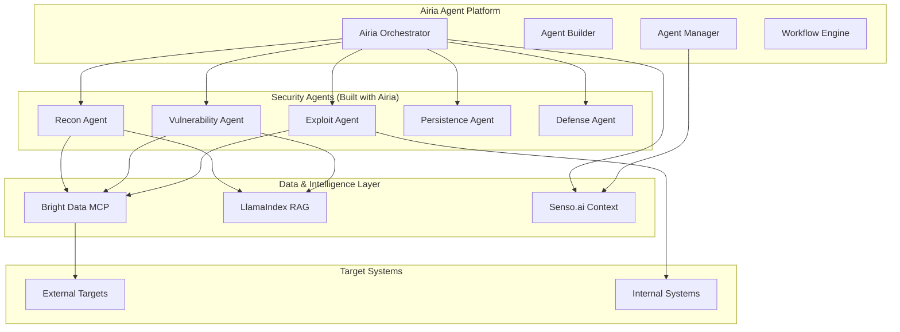

# Airia Agent Orchestration for Security Automation

## Executive Summary

Airia provides the **agent development and orchestration platform** that perfectly complements Bright Data's MCP infrastructure. While Bright Data provides safe external access and MCP communication, Airia provides the actual agent building, coordination, and execution framework.

## Updated Architecture with Airia



## Why Airia is Perfect for This Use Case

### What Airia Provides:
1. **Agent Development Framework** - Build security agents quickly
2. **Orchestration Engine** - Coordinate multi-agent attacks
3. **Workflow Management** - Define attack chains and playbooks
4. **State Management** - Track attack progress across agents
5. **Built-in Communication** - Agents can share findings natively

### How It Fits:
- **Airia** = The agent platform (builds and runs agents)
- **Bright Data** = The external access layer (safe web scanning)
- **LlamaIndex** = The knowledge base (security intelligence)
- **Senso.ai** = The context store (shared memory)

## Building Security Agents with Airia

### 1. Reconnaissance Agent

```python
# Using Airia's agent framework
from airia import Agent, Task, Workflow
from brightdata import MCPClient

class ReconnaissanceAgent(Agent):
    """Airia agent for external reconnaissance"""

    def __init__(self):
        super().__init__(name="recon_agent")
        self.brightdata = MCPClient()  # Bright Data for external scanning
        self.llamaindex = LlamaIndexClient()  # Knowledge base

    @Task(description="Discover external attack surface")
    async def discover_assets(self, target: str):
        # Use Bright Data MCP for safe external recon
        findings = await self.brightdata.call({
            "tool": "search_api",
            "params": {
                "queries": [
                    f"site:{target}",
                    f'"{target}" password filetype:txt',
                    f'"{target}" api key',
                    f'site:github.com "{target}"'
                ]
            }
        })

        # Store in Airia's shared state
        await self.set_state("discovered_assets", findings)

        # Trigger next agent
        await self.emit("assets_discovered", findings)

        return findings

    @Task(description="Find exposed credentials")
    async def find_credentials(self, target: str):
        # Query breach databases via Bright Data
        credentials = await self.brightdata.call({
            "tool": "breach_checker",
            "params": {"domain": target}
        })

        # Check LlamaIndex for historical breaches
        historical = await self.llamaindex.query(
            f"Previous breaches for {target}"
        )

        # Share with other agents via Airia
        await self.broadcast("credentials_found", credentials)

        return credentials
```

### 2. Exploit Agent

```python
class ExploitAgent(Agent):
    """Airia agent for vulnerability exploitation"""

    def __init__(self):
        super().__init__(name="exploit_agent")
        self.brightdata = MCPClient()

    @Task(description="Test for vulnerabilities")
    async def test_vulnerabilities(self, assets: list):
        vulnerabilities = []

        for asset in assets:
            # Safe vulnerability testing via Bright Data
            result = await self.brightdata.call({
                "tool": "vulnerability_scanner",
                "params": {
                    "target": asset,
                    "tests": ["sqli", "xss", "rce"],
                    "mode": "safe",  # Production-safe
                    "proxy": "residential"  # Avoid detection
                }
            })

            if result.vulnerabilities:
                vulnerabilities.extend(result.vulnerabilities)

                # Notify other agents through Airia
                await self.notify("vulnerability_found", result)

        return vulnerabilities

    @Task(description="Attempt safe exploitation")
    async def exploit(self, vulnerability: dict):
        # Only proceed if safe
        if not self.is_safe_to_exploit(vulnerability):
            return {"status": "skipped", "reason": "unsafe"}

        # Attempt exploitation through Bright Data
        exploit_result = await self.brightdata.call({
            "tool": "exploit_tester",
            "params": {
                "vulnerability": vulnerability,
                "mode": "proof_of_concept",
                "no_damage": True
            }
        })

        if exploit_result.success:
            # Trigger persistence agent
            await self.trigger_agent("persistence_agent", {
                "access": exploit_result.access_gained
            })

        return exploit_result
```

### 3. Orchestration Workflow

```python
# Define the attack workflow in Airia
class SecurityAssessmentWorkflow(Workflow):
    """Multi-agent security assessment orchestrated by Airia"""

    def __init__(self):
        super().__init__(name="security_assessment")

        # Register agents
        self.recon = ReconnaissanceAgent()
        self.exploit = ExploitAgent()
        self.persist = PersistenceAgent()
        self.defense = DefenseDetectionAgent()

    async def execute(self, target: str):
        # Phase 1: External Reconnaissance
        assets = await self.recon.discover_assets(target)
        credentials = await self.recon.find_credentials(target)

        # Phase 2: Vulnerability Assessment
        vulnerabilities = await self.exploit.test_vulnerabilities(assets)

        # Phase 3: Safe Exploitation
        for vuln in vulnerabilities:
            if self.should_exploit(vuln):
                result = await self.exploit.exploit(vuln)

                # Phase 4: Establish Persistence (simulated)
                if result.success:
                    await self.persist.establish_backdoor(result.access)

        # Phase 5: Detection Testing
        detection_rate = await self.defense.test_detection()

        return {
            "assets": assets,
            "vulnerabilities": vulnerabilities,
            "exploited": self.get_exploited(),
            "detection_rate": detection_rate
        }
```

## Airia + Bright Data MCP Integration

### How They Work Together

```python
# Airia provides the agent framework
# Bright Data provides the safe external access

class AiriaSecurityPlatform:
    def __init__(self):
        # Airia handles agent orchestration
        self.airia = AiriaOrchestrator()

        # Bright Data provides MCP for external ops
        self.brightdata = BrightDataMCP()

        # LlamaIndex for knowledge
        self.llamaindex = LlamaIndexRAG()

        # Senso.ai for context
        self.senso = SensoContext()

    async def run_assessment(self, target: str):
        # Create Airia workflow
        workflow = self.airia.create_workflow("security_assessment")

        # Configure agents to use Bright Data for external access
        workflow.configure({
            "external_scanner": self.brightdata,
            "knowledge_base": self.llamaindex,
            "context_store": self.senso
        })

        # Execute multi-agent assessment
        results = await workflow.execute(target)

        return results
```

### Communication Flow

```python
# Example: How agents communicate through Airia + vendors

async def coordinated_attack():
    # 1. Recon Agent (Airia) finds exposed S3 bucket via Bright Data
    recon_agent = airia.get_agent("recon")
    s3_bucket = await recon_agent.scan_cloud_resources("target.com")

    # 2. Airia orchestrator receives finding and triggers next agent
    await airia.orchestrator.on("s3_bucket_found", async (data) => {
        # 3. Cloud Agent (Airia) explores S3 via Bright Data
        cloud_agent = airia.get_agent("cloud")
        files = await cloud_agent.explore_s3(data.bucket_url)

        # 4. Store findings in Senso.ai for context
        await senso.ingest({"s3_files": files})

        # 5. Query LlamaIndex for exploitation guidance
        exploit_guide = await llamaindex.query(
            f"How to exploit S3 misconfigurations with files: {files}"
        )

        # 6. Exploit Agent (Airia) attempts safe exploitation
        exploit_agent = airia.get_agent("exploit")
        await exploit_agent.exploit_s3(data.bucket_url, exploit_guide)
    })
```

## Why This Architecture Works

### 1. Clear Separation of Concerns

| Component | Responsibility | Why It's Needed |
|-----------|---------------|-----------------|
| **Airia** | Agent development & orchestration | Builds and coordinates the attack agents |
| **Bright Data** | Safe external access via MCP | Provides proxy infrastructure for scanning |
| **LlamaIndex** | Security knowledge & memory | RAG for vulnerability research |
| **Senso.ai** | Context management | Shared state between agents |

### 2. Production Safety

```python
# Airia agents use Bright Data for safe scanning
class SafeProductionAgent(AiriaAgent):
    async def scan(self, target):
        # Airia agent logic
        if self.is_production(target):
            # Use Bright Data's residential proxies for safety
            return await self.brightdata.call({
                "tool": "web_unlocker",  # Gentle scanning
                "proxy": "residential",    # Avoid detection
                "rate_limit": "1/s",      # Respect limits
                "safe_mode": True         # No exploitation
            })
```

### 3. Intelligent Coordination

```python
# Airia orchestrates based on findings
class AttackOrchestrator(AiriaOrchestrator):
    async def coordinate(self):
        # Define attack phases
        phases = [
            ("recon", self.reconnaissance_phase),
            ("exploit", self.exploitation_phase),
            ("persist", self.persistence_phase),
            ("exfil", self.exfiltration_phase)
        ]

        for phase_name, phase_func in phases:
            result = await phase_func()

            # Intelligent decision making
            if not result.success:
                # Adapt strategy
                await self.adapt_strategy(phase_name, result)

            # Check if detected
            if await self.check_detection():
                await self.go_stealth_mode()
```

## Implementation for Hackathon

### Quick Start with Airia

```python
# main.py - Hackathon demo
from airia import Platform
from brightdata import MCPClient

# Initialize platforms
airia = Platform(api_key="your_airia_key")
brightdata = MCPClient(api_key="your_brightdata_key")

# Create security assessment workflow
workflow = airia.create_workflow("security_assessment")

# Add agents
workflow.add_agent("recon", ReconAgent(brightdata))
workflow.add_agent("exploit", ExploitAgent(brightdata))
workflow.add_agent("report", ReportAgent())

# Define flow
workflow.define_flow([
    ("recon", "discover_assets"),
    ("recon", "find_vulnerabilities"),
    ("exploit", "test_safely"),
    ("report", "generate_findings")
])

# Run assessment
results = await workflow.execute("hackathon-target.com")
print(f"Found {len(results.vulnerabilities)} vulnerabilities")
print(f"Attack paths: {results.attack_paths}")
```

### Demo Script

```bash
# 1. Start Airia platform
airia start

# 2. Deploy agents
airia deploy recon-agent exploit-agent defense-agent

# 3. Configure Bright Data MCP
airia config set brightdata.api_key=$BRIGHTDATA_KEY

# 4. Run security assessment
airia run security-assessment --target example.com

# 5. View results
airia dashboard
```

## Benefits of Using Airia

1. **Rapid Agent Development** - Build security agents in minutes
2. **Built-in Orchestration** - No need to build coordination logic
3. **State Management** - Agents share context automatically
4. **Workflow Engine** - Define complex attack chains easily
5. **Monitoring & Debugging** - See what agents are doing in real-time

## Updated Vendor Roles

| Vendor | Role | What It Does |
|--------|------|--------------|
| **Airia** | Agent Platform | Builds, runs, and orchestrates security agents |
| **Bright Data** | External Access | Safe web scanning and reconnaissance via MCP |
| **LlamaIndex** | Knowledge Base | Security intelligence and vulnerability research |
| **Senso.ai** | Context Store | Shared memory and webhook triggers |

## Conclusion

With Airia as the agent development and orchestration platform:
- **Easier Development**: Build agents using Airia's framework
- **Better Coordination**: Airia handles agent communication natively
- **Production Safe**: Bright Data ensures safe external scanning
- **Intelligent**: LlamaIndex provides security knowledge
- **Contextual**: Senso.ai maintains shared state

This is a much cleaner architecture where each vendor has a clear, distinct role!