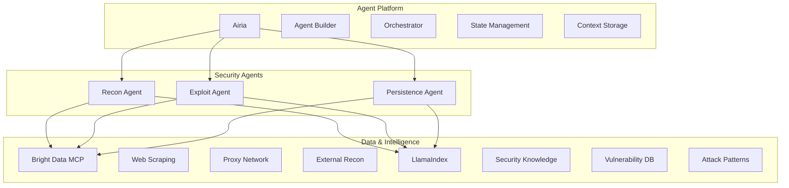

# Final Vendor Architecture: Streamlined 3-Vendor Approach

## Executive Summary

Simplified architecture using **3 key vendors** with clear, non-overlapping responsibilities:
- **Airia**: Complete agent development and orchestration platform
- **Bright Data**: MCP server and external data collection
- **LlamaIndex**: Knowledge base and RAG for security intelligence

*Senso.ai removed to avoid redundancy since Airia handles orchestration and context.*

## Clean Vendor Separation



## Why This Architecture is Better

### Before (4 vendors with overlap):
- Airia for agents
- Senso.ai for context/orchestration (redundant with Airia)
- Bright Data for data
- LlamaIndex for knowledge

### After (3 vendors, no overlap):
- **Airia**: Everything agent-related (building, orchestration, context, state)
- **Bright Data**: Everything external data-related (web access, scanning, recon)
- **LlamaIndex**: Everything knowledge-related (vulnerabilities, exploits, research)

## Vendor Responsibilities

### 1. Airia - The Complete Agent Platform 🤖

**What it handles:**
- Agent development framework
- Multi-agent orchestration
- Context and state management (no need for Senso.ai!)
- Workflow automation
- Inter-agent communication

```python
# Airia handles EVERYTHING agent-related
class AiriaSecurityPlatform:
    def __init__(self):
        self.airia = AiriaPlatform()

    async def build_security_team(self):
        # Create all agents in Airia
        self.recon_agent = self.airia.create_agent("recon")
        self.exploit_agent = self.airia.create_agent("exploit")
        self.persist_agent = self.airia.create_agent("persistence")

        # Airia handles orchestration (no Senso.ai needed)
        self.workflow = self.airia.create_workflow([
            self.recon_agent,
            self.exploit_agent,
            self.persist_agent
        ])

        # Airia handles context sharing (no Senso.ai needed)
        self.shared_context = self.airia.create_context({
            "target": "",
            "vulnerabilities": [],
            "access_gained": False
        })
```

### 2. Bright Data - The External Data Layer 🌐

**What it handles:**
- MCP server for tool access
- Web scraping and data collection
- Proxy infrastructure for safe scanning
- External reconnaissance
- All interaction with target systems

```python
# Bright Data handles ALL external data collection
class BrightDataIntegration:
    def __init__(self):
        self.mcp = BrightDataMCPServer()

    async def scan_external(self, target):
        return await self.mcp.call({
            "tool": "web_scraper",
            "params": {
                "url": target,
                "proxy": "residential",  # Safe scanning
                "extract": ["technologies", "endpoints", "forms"]
            }
        })

    async def test_vulnerability(self, vuln):
        return await self.mcp.call({
            "tool": "vulnerability_tester",
            "params": {
                "target": vuln.endpoint,
                "payloads": self.get_safe_payloads(vuln.type),
                "mode": "production_safe"
            }
        })
```

### 3. LlamaIndex - The Intelligence Layer 🧠

**What it handles:**
- Security knowledge base
- Vulnerability research and CVE data
- Historical attack patterns
- Exploit techniques
- RAG for security questions

```python
# LlamaIndex handles ALL knowledge and research
class LlamaIndexIntelligence:
    def __init__(self):
        self.index = self.build_security_index()

    async def research_vulnerability(self, vuln_type):
        # Query knowledge base for exploit techniques
        return await self.index.query(
            f"How to exploit {vuln_type} vulnerabilities"
        )

    async def find_similar_attacks(self, target_profile):
        # Search historical data for similar targets
        return await self.index.similarity_search(
            target_profile,
            top_k=5
        )
```

## Complete Integration Example

```python
# Clean 3-vendor architecture in action
class HackathonDemo:
    def __init__(self):
        # Three clear vendors
        self.airia = AiriaPlatform()          # Agents & orchestration
        self.brightdata = BrightDataMCP()     # External data
        self.llamaindex = LlamaIndexRAG()     # Knowledge

    async def run_security_assessment(self, target):
        # 1. Create agents in Airia
        recon = self.airia.create_agent("recon")
        exploit = self.airia.create_agent("exploit")

        # 2. Recon agent uses Bright Data for scanning
        @recon.task
        async def scan():
            # Use Bright Data for external recon
            assets = await self.brightdata.discover_assets(target)

            # Query LlamaIndex for intelligence
            intel = await self.llamaindex.query(
                f"Known vulnerabilities for {assets.technologies}"
            )

            # Airia handles context storage (no Senso.ai!)
            await self.airia.store_context({
                "assets": assets,
                "intel": intel
            })

            return assets

        # 3. Exploit agent acts on findings
        @exploit.task
        async def exploit():
            # Get context from Airia (not Senso.ai)
            context = await self.airia.get_context()

            # Use Bright Data to test vulnerabilities
            for vuln in context.intel.vulnerabilities:
                result = await self.brightdata.test_exploit(vuln)

                if result.success:
                    # Store success in Airia's context
                    await self.airia.update_context({
                        "exploited": vuln,
                        "access": result.access
                    })

        # 4. Airia orchestrates the workflow
        workflow = self.airia.create_workflow([scan, exploit])
        results = await workflow.execute()

        return results
```

## Why Skip Senso.ai?

### Redundant Features with Airia:

| Feature | Airia | Senso.ai | Need Both? |
|---------|-------|----------|------------|
| Context Storage | ✅ | ✅ | ❌ No |
| Orchestration | ✅ | ✅ | ❌ No |
| Webhooks | ✅ | ✅ | ❌ No |
| State Management | ✅ | ✅ | ❌ No |
| Agent Communication | ✅ | ❌ | ✅ Airia |
| Agent Building | ✅ | ❌ | ✅ Airia |

**Conclusion**: Airia does everything Senso.ai does PLUS agent building. No need for both!

## Simple Analogy

### Your Clean Architecture:

- **Airia** = The Orchestra (musicians + conductor + sheet music)
- **Bright Data** = The Stage (where performance happens)
- **LlamaIndex** = The Music Library (all the songs and knowledge)

You don't need a separate conductor (Senso.ai) because Airia already includes one!

## Implementation for Hackathon

```bash
# Simple 3-vendor setup
npm install airia brightdata-mcp llamaindex

# Environment variables (only 3!)
AIRIA_API_KEY=xxx
BRIGHTDATA_API_KEY=xxx
LLAMAINDEX_API_KEY=xxx

# Run demo
npm run demo
```

```javascript
// main.js - Complete hackathon demo
import { Airia } from 'airia';
import { BrightDataMCP } from 'brightdata-mcp';
import { LlamaIndex } from 'llamaindex';

async function main() {
  // Initialize 3 vendors
  const airia = new Airia(process.env.AIRIA_API_KEY);
  const brightdata = new BrightDataMCP(process.env.BRIGHTDATA_API_KEY);
  const llamaindex = new LlamaIndex(process.env.LLAMAINDEX_API_KEY);

  // Create security assessment workflow
  const workflow = airia.createWorkflow('security-assessment');

  // Add recon agent
  workflow.addAgent('recon', async (context) => {
    // Use Bright Data for scanning
    const assets = await brightdata.scan(context.target);

    // Use LlamaIndex for research
    const vulns = await llamaindex.research(assets);

    // Context stored in Airia
    return { assets, vulns };
  });

  // Add exploit agent
  workflow.addAgent('exploit', async (context) => {
    // Use previous agent's findings (from Airia context)
    for (const vuln of context.vulns) {
      // Test with Bright Data
      const result = await brightdata.testExploit(vuln);
      if (result.success) return result;
    }
  });

  // Execute assessment
  const results = await workflow.execute({ target: 'example.com' });
  console.log('Assessment complete:', results);
}

main();
```

## Benefits of This Approach

1. **No Redundancy**: Each vendor has a unique role
2. **Simpler Integration**: Only 3 APIs to manage
3. **Lower Cost**: Not paying for overlapping features
4. **Cleaner Code**: Clear separation of concerns
5. **Easier to Explain**: Each vendor has one job

## Summary

**Your Final Stack:**
- **Airia**: Build agents, orchestrate them, manage context
- **Bright Data**: Scan websites, collect data, provide MCP
- **LlamaIndex**: Store knowledge, research vulnerabilities

This is the optimal architecture - clean, efficient, and no overlap!