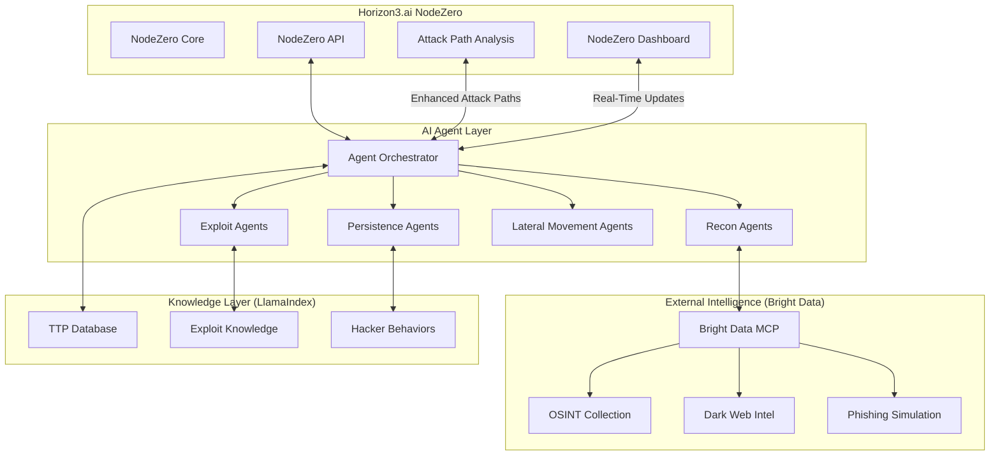

# Horizon3.ai Integration: Real Attacker Simulation with AI Agents

## Executive Summary

This integration strategy shows how AI agents using MCP and Bright Data can enhance Horizon3.ai's NodeZero platform by simulating **real attacker behavior** - not just running vulnerability scans, but thinking and adapting like actual threat actors. This addresses Horizon3's core mission: "Find, fix, and verify exploitable attack paths before attackers do."

## Why Horizon3.ai Would Be Interested

Horizon3.ai's NodeZero currently:
- ✅ Performs autonomous pentesting
- ✅ Finds exploitable vulnerabilities
- ✅ Maps attack paths
- ❌ But doesn't fully simulate human attacker creativity and persistence

**Our AI agents add:**
- 🧠 **Adversarial thinking** - Agents reason about targets like real hackers
- 🔄 **Adaptive tactics** - Change approach based on defenses encountered
- 🌐 **External reconnaissance** - OSINT and external attack surface (via Bright Data)
- 🤝 **Collaborative attacks** - Multiple agents working together (like APT groups)

## Integration Architecture



## 1. Integration with NodeZero API

```typescript
// NodeZero Integration Adapter
class NodeZeroIntegration {
  private nodeZeroAPI: NodeZeroClient;
  private agentOrchestrator: AgentOrchestrator;
  private brightData: BrightDataMCPClient;

  async enhanceNodeZeroWithAgents(assessment: NodeZeroAssessment): Promise<EnhancedAssessment> {
    // Step 1: Get NodeZero's initial findings
    const nodeZeroFindings = await this.nodeZeroAPI.getFindings(assessment.id);

    // Step 2: Deploy AI agents to simulate real attacker behavior
    const agentSimulation = await this.simulateRealAttacker({
      target: assessment.target,
      findings: nodeZeroFindings,
      ttp_profile: 'APT29',  // Simulate specific threat actor
      objective: 'data_exfiltration'
    });

    // Step 3: Enhance NodeZero's attack paths with agent discoveries
    const enhancedPaths = await this.mergeAttackPaths(
      nodeZeroFindings.attack_paths,
      agentSimulation.discovered_paths
    );

    // Step 4: Feed back to NodeZero for verification
    await this.nodeZeroAPI.verifyPaths(enhancedPaths);

    return {
      original: nodeZeroFindings,
      agent_enhanced: agentSimulation,
      combined_paths: enhancedPaths,
      risk_score: this.calculateRealWorldRisk(enhancedPaths)
    };
  }

  async simulateRealAttacker(params: AttackSimulation): Promise<SimulationResult> {
    // This is where we add value beyond NodeZero
    const attackerProfile = await this.loadAttackerProfile(params.ttp_profile);

    // Phase 1: External Reconnaissance (Bright Data)
    const externalRecon = await this.performExternalRecon(params.target);

    // Phase 2: Initial Access Attempts
    const initialAccess = await this.attemptInitialAccess(
      params.target,
      externalRecon,
      attackerProfile.preferred_methods
    );

    // Phase 3: Establish Foothold (if successful)
    if (initialAccess.success) {
      const foothold = await this.establishFoothold(initialAccess.access_point);

      // Phase 4: Discovery and Lateral Movement
      const lateralMovement = await this.performLateralMovement(foothold);

      // Phase 5: Objective Achievement
      const objectiveResult = await this.achieveObjective(
        params.objective,
        lateralMovement.accessible_resources
      );

      return {
        kill_chain_completion: this.assessKillChainCompletion(objectiveResult),
        discovered_paths: this.extractAttackPaths(objectiveResult),
        techniques_used: this.extractTechniques(objectiveResult)
      };
    }

    return {
      kill_chain_completion: 'blocked_at_initial_access',
      discovered_paths: [],
      techniques_used: initialAccess.attempted_techniques
    };
  }
}
```

## 2. Real Hacker Behavior Simulation

### 2.1 Thinking Like an Attacker

```typescript
class RealAttackerAgent extends BaseAgent {
  private mindset: AttackerMindset;
  private patience: number;  // Real attackers are patient
  private creativity: number;  // Real attackers are creative

  async planAttack(target: Target): Promise<AttackPlan> {
    // Real attackers don't just run tools - they think strategically

    // 1. Understand the business
    const businessIntel = await this.researchTarget(target);

    // 2. Find the weakest link (often human)
    const weakestLinks = await this.identifyWeakestLinks(businessIntel);

    // 3. Plan multiple entry vectors
    const entryVectors = await this.planEntryVectors(weakestLinks);

    // 4. Prepare for long campaign
    return {
      primary_vector: entryVectors[0],
      backup_vectors: entryVectors.slice(1),
      timeline: 'weeks_to_months',  // Real attacks take time
      persistence_strategy: this.planPersistence(),
      evasion_techniques: this.planEvasion(),
      data_exfil_strategy: this.planExfiltration()
    };
  }

  async executeWithPatience(plan: AttackPlan): Promise<void> {
    // Real attackers work slowly to avoid detection

    for (const action of plan.actions) {
      // Wait for right time (outside business hours)
      await this.waitForOptimalTime();

      // Execute with random delays (1-24 hours between actions)
      await this.delay(this.randomHours(1, 24));

      // Check if detected
      if (await this.checkIfDetected()) {
        // Real attackers retreat and wait
        await this.retreat();
        await this.delay(this.randomDays(7, 30));
        await this.tryDifferentApproach();
      } else {
        await this.executeAction(action);
      }
    }
  }

  private async researchTarget(target: Target): Promise<BusinessIntel> {
    // Use Bright Data for OSINT like real attackers do

    const research = await this.brightData.call({
      tool: 'search_api',
      params: {
        queries: [
          `"${target.company}" employees linkedin`,
          `"${target.company}" breach`,
          `"${target.company}" technology stack`,
          `"${target.company}" job openings`,
          `site:github.com "${target.company}"`
        ]
      }
    });

    // Extract valuable intelligence
    return {
      employees: this.extractEmployees(research),
      technologies: this.extractTechStack(research),
      leaked_credentials: this.searchBreachDatabases(target.company),
      exposed_secrets: this.searchGithubForSecrets(research)
    };
  }
}
```

### 2.2 APT Group Behavior Patterns

```typescript
class APTSimulator {
  // Simulate specific APT group behaviors
  private aptProfiles = {
    'APT29': {  // Cozy Bear
      name: 'Russian SVR',
      characteristics: {
        patience: 'extreme',
        sophistication: 'high',
        persistence: 'months_to_years',
        preferred_c2: 'legitimate_services',
        stealth: 'maximum'
      },
      ttps: {
        initial_access: ['spearphishing', 'supply_chain', 'valid_accounts'],
        persistence: ['registry_run_keys', 'scheduled_tasks'],
        defense_evasion: ['timestomping', 'indicator_removal'],
        collection: ['automated_collection', 'email_collection'],
        exfiltration: ['exfiltration_over_c2', 'exfiltration_over_web_service']
      }
    },

    'APT28': {  // Fancy Bear
      name: 'Russian GRU',
      characteristics: {
        patience: 'moderate',
        sophistication: 'high',
        persistence: 'weeks_to_months',
        preferred_c2: 'custom_infrastructure',
        stealth: 'moderate'
      },
      ttps: {
        initial_access: ['exploit_public_facing', 'spearphishing'],
        persistence: ['bootkit', 'component_firmware'],
        lateral_movement: ['pass_the_hash', 'remote_services'],
        collection: ['keylogging', 'screen_capture']
      }
    },

    'Lazarus': {  // North Korean
      name: 'North Korean',
      characteristics: {
        patience: 'variable',
        sophistication: 'medium_to_high',
        persistence: 'weeks',
        preferred_c2: 'compromised_infrastructure',
        stealth: 'variable'
      },
      ttps: {
        initial_access: ['supply_chain', 'watering_hole'],
        execution: ['powershell', 'wmi'],
        persistence: ['new_service', 'registry_run_keys'],
        impact: ['data_destruction', 'ransomware']
      }
    }
  };

  async simulateAPT(groupName: string, target: Target): Promise<APTSimulation> {
    const profile = this.aptProfiles[groupName];

    // Create specialized agents that behave like this APT
    const agents = await this.createAPTAgents(profile);

    // Execute campaign following APT's known patterns
    const campaign = await this.executeCampaign(agents, target, profile);

    return {
      group: groupName,
      campaign_duration: campaign.duration,
      techniques_used: campaign.techniques,
      objectives_achieved: campaign.objectives,
      iocs_generated: campaign.iocs,
      detection_opportunities: campaign.detection_points
    };
  }

  private async executeCampaign(
    agents: Agent[],
    target: Target,
    profile: APTProfile
  ): Promise<Campaign> {
    const campaign = new Campaign();

    // Phase 1: Reconnaissance (weeks of patient watching)
    campaign.log('Starting reconnaissance phase');
    for (let day = 0; day < profile.characteristics.recon_days; day++) {
      await agents.recon.performDailyRecon(target);
      await this.delay(this.hours(24));
    }

    // Phase 2: Weaponization
    const weapon = await agents.weaponizer.createWeapon(
      profile.ttps.preferred_malware
    );

    // Phase 3: Delivery
    const delivered = await agents.delivery.deliver(
      weapon,
      profile.ttps.initial_access[0]
    );

    // Phase 4: Exploitation
    if (delivered) {
      const exploited = await agents.exploit.exploit(
        delivered.target,
        profile.ttps.execution
      );

      // Phase 5: Installation
      if (exploited) {
        await agents.installer.install(
          profile.ttps.persistence,
          profile.characteristics.stealth
        );

        // Phase 6: Command & Control
        await agents.c2.establish(
          profile.characteristics.preferred_c2
        );

        // Phase 7: Actions on Objectives
        await agents.operator.achieveObjectives(
          profile.objectives
        );
      }
    }

    return campaign;
  }
}
```

## 3. Horizon3.ai Integration Points

### 3.1 Enhancing NodeZero's Attack Path Discovery

```typescript
class AttackPathEnhancer {
  async enhanceWithRealAttackerLogic(
    nodeZeroPaths: AttackPath[],
    target: Target
  ): Promise<EnhancedAttackPath[]> {

    const enhanced = [];

    for (const path of nodeZeroPaths) {
      // Add real attacker considerations
      const realAttackerPath = await this.addRealAttackerLogic(path);

      // Add external attack surface
      const withExternal = await this.addExternalVectors(realAttackerPath);

      // Add human factors
      const withHuman = await this.addHumanFactors(withExternal);

      // Add time-based elements (business hours, holidays)
      const withTiming = await this.addTimingConsiderations(withHuman);

      enhanced.push({
        original: path,
        enhanced: withTiming,
        real_world_likelihood: this.calculateRealWorldLikelihood(withTiming),
        detection_difficulty: this.assessDetectionDifficulty(withTiming),
        business_impact: this.assessBusinessImpact(withTiming)
      });
    }

    return enhanced;
  }

  private async addRealAttackerLogic(path: AttackPath): Promise<AttackPath> {
    // Real attackers look for:
    // 1. Path of least resistance
    // 2. Paths that avoid detection
    // 3. Paths that maintain persistence

    const stealthScore = await this.assessStealth(path);
    const persistenceOptions = await this.findPersistencePoints(path);
    const detectionRisk = await this.assessDetectionRisk(path);

    return {
      ...path,
      real_attacker_score: this.calculateAttackerPreference(
        stealthScore,
        persistenceOptions,
        detectionRisk
      ),
      alternative_techniques: await this.findAlternatives(path),
      evasion_techniques: await this.suggestEvasion(path)
    };
  }
}
```

### 3.2 API Integration

```typescript
// Horizon3.ai NodeZero API Integration
class NodeZeroAPIClient {
  private apiKey: string;
  private baseUrl = 'https://api.nodezero.horizon3.ai/v1';

  async startEnhancedAssessment(target: string): Promise<Assessment> {
    // Start standard NodeZero assessment
    const assessment = await this.post('/assessments', {
      target,
      type: 'enhanced_with_agents',
      options: {
        external_recon: true,
        apt_simulation: true,
        human_factors: true
      }
    });

    // Deploy our AI agents in parallel
    await this.deployAgents(assessment.id, target);

    return assessment;
  }

  async deployAgents(assessmentId: string, target: string): Promise<void> {
    // Deploy specialized agents for different attack vectors

    const agents = [
      new ExternalReconAgent(this.brightData),
      new SocialEngineeringAgent(this.brightData),
      new WebAppAgent(this.brightData),
      new NetworkAgent(this.nodeZero),
      new CloudAgent(this.brightData),
      new PersistenceAgent(this.nodeZero)
    ];

    // Agents work alongside NodeZero
    await Promise.all(
      agents.map(agent => agent.enhance(assessmentId, target))
    );
  }

  async getEnhancedResults(assessmentId: string): Promise<EnhancedResults> {
    // Combine NodeZero results with agent findings

    const nodeZeroResults = await this.get(`/assessments/${assessmentId}/results`);
    const agentResults = await this.getAgentResults(assessmentId);

    return {
      vulnerabilities: this.mergeVulnerabilities(
        nodeZeroResults.vulnerabilities,
        agentResults.vulnerabilities
      ),
      attack_paths: this.mergeAttackPaths(
        nodeZeroResults.attack_paths,
        agentResults.discovered_paths
      ),
      recommendations: this.prioritizeRecommendations(
        nodeZeroResults,
        agentResults
      ),
      real_world_risk: this.calculateRealWorldRisk(
        nodeZeroResults,
        agentResults
      )
    };
  }
}
```

## 4. Unique Value Propositions for Horizon3

### 4.1 External Attack Surface Discovery

```typescript
// NodeZero focuses on internal, we add external
class ExternalAttackSurfaceAgent {
  async discoverExternalAttackSurface(organization: string): Promise<ExternalAttackSurface> {
    // This is what NodeZero doesn't see

    const brightDataResults = await this.brightData.call({
      tool: 'search_api',
      params: {
        queries: [
          `site:${organization}.com -www`,  // Subdomains
          `"${organization}" site:github.com`,  // Code leaks
          `"${organization}" site:pastebin.com`,  // Data leaks
          `"${organization}" filetype:pdf`,  // Documents
          `"${organization}@" email`,  // Email addresses
        ]
      }
    });

    return {
      exposed_subdomains: await this.findSubdomains(brightDataResults),
      leaked_credentials: await this.findLeakedCreds(brightDataResults),
      exposed_apis: await this.findExposedAPIs(brightDataResults),
      employee_info: await this.findEmployeeInfo(brightDataResults),
      technology_stack: await this.identifyTechStack(brightDataResults)
    };
  }
}
```

### 4.2 Social Engineering Simulation

```typescript
// Real attackers use social engineering - NodeZero doesn't
class SocialEngineeringAgent {
  async simulateSocialEngineering(target: Organization): Promise<SocialEngResults> {
    // Research employees
    const employees = await this.findEmployees(target);

    // Create targeted phishing campaigns (simulated)
    const phishingVectors = await this.createPhishingVectors(employees);

    // Test security awareness (ethically)
    const awarenessResults = await this.testSecurityAwareness(employees);

    // Identify high-risk individuals
    const highRiskTargets = await this.identifyHighRiskIndividuals(employees);

    return {
      attack_vectors: phishingVectors,
      risk_score: this.calculateSocialRisk(awarenessResults),
      recommendations: this.generateAwarenessRecommendations(awarenessResults),
      high_value_targets: highRiskTargets
    };
  }

  private async findEmployees(target: Organization): Promise<Employee[]> {
    // Use Bright Data to find employees
    const linkedinData = await this.brightData.call({
      tool: 'search_api',
      params: {
        engine: 'google',
        query: `site:linkedin.com/in "${target.name}" current`
      }
    });

    return this.parseEmployeeData(linkedinData);
  }
}
```

## 5. Demo Scenario for Horizon3.ai

```typescript
// Complete demo showing value to Horizon3
async function demonstrateToHorizon3(): Promise<void> {
  console.log('🚀 Starting Enhanced NodeZero Assessment with AI Agents');

  // 1. Start standard NodeZero assessment
  const nodeZero = new NodeZeroAPIClient(process.env.NODEZERO_API_KEY);
  const assessment = await nodeZero.startAssessment('target.company.com');

  console.log('✅ NodeZero assessment started:', assessment.id);

  // 2. Deploy AI agents for enhanced assessment
  const agentOrchestrator = new AgentOrchestrator({
    brightData: new BrightDataMCPClient(),
    llamaIndex: new LlamaIndexClient(),
    senso: new SensoClient()
  });

  // 3. Agents perform external recon (what NodeZero can't see)
  console.log('🔍 AI Agents performing external reconnaissance...');
  const externalAttackSurface = await agentOrchestrator.discoverExternal('target.company.com');

  console.log(`  Found ${externalAttackSurface.subdomains.length} exposed subdomains`);
  console.log(`  Found ${externalAttackSurface.leaked_credentials.length} leaked credentials`);
  console.log(`  Found ${externalAttackSurface.github_repos.length} GitHub repos with secrets`);

  // 4. Simulate APT behavior
  console.log('👹 Simulating APT29 (Cozy Bear) attack patterns...');
  const aptSimulation = await agentOrchestrator.simulateAPT('APT29', 'target.company.com');

  console.log(`  APT simulation discovered ${aptSimulation.attack_paths.length} new paths`);
  console.log(`  Likelihood of success: ${aptSimulation.success_probability}%`);

  // 5. Test social engineering vectors
  console.log('🎣 Testing social engineering vulnerabilities...');
  const socialEngineering = await agentOrchestrator.testSocialVectors('target.company.com');

  console.log(`  Identified ${socialEngineering.vulnerable_employees} high-risk employees`);
  console.log(`  Phishing success probability: ${socialEngineering.phishing_risk}%`);

  // 6. Combine with NodeZero results
  console.log('🔄 Merging AI Agent findings with NodeZero...');
  const combined = await nodeZero.mergeResults(assessment.id, {
    external: externalAttackSurface,
    apt: aptSimulation,
    social: socialEngineering
  });

  // 7. Generate enhanced report
  console.log('📊 Generating enhanced security assessment report...');
  const report = await generateEnhancedReport(combined);

  console.log('\n✨ ENHANCED ASSESSMENT COMPLETE ✨');
  console.log('════════════════════════════════════════');
  console.log(`Total Attack Paths: ${report.total_attack_paths}`);
  console.log(`  - NodeZero discovered: ${report.nodezero_paths}`);
  console.log(`  - AI Agents discovered: ${report.agent_paths}`);
  console.log(`  - Combined unique paths: ${report.unique_paths}`);
  console.log(`\nReal-World Risk Score: ${report.risk_score}/100`);
  console.log(`Most Likely Attack Vector: ${report.most_likely_vector}`);
  console.log(`Estimated Time to Compromise: ${report.ttc} hours`);
  console.log('════════════════════════════════════════');
}
```

## 6. Business Value for Horizon3.ai

### Why This Integration Matters

1. **Competitive Advantage**
   - NodeZero + AI Agents = Most realistic pentesting platform
   - Goes beyond vulnerability scanning to true attacker simulation

2. **New Revenue Streams**
   - "APT Simulation Module" - Premium feature
   - "External Attack Surface Monitoring" - Subscription service
   - "Social Engineering Assessment" - Add-on service

3. **Better Customer Outcomes**
   - Find attack paths that tools alone can't discover
   - Understand real-world risk, not just CVE scores
   - Prepare for actual attacker behaviors

4. **Market Differentiation**
   - "The only platform that thinks like a real attacker"
   - "Combines internal and external attack surface"
   - "AI-powered adversarial simulation"

## 7. Implementation Roadmap

### Phase 1: Proof of Concept (Hackathon Demo)
```yaml
duration: 1 day
deliverables:
  - Working integration with NodeZero API
  - External recon via Bright Data
  - Basic APT simulation
  - Enhanced attack path discovery
```

### Phase 2: Pilot Integration (2 weeks)
```yaml
duration: 2 weeks
deliverables:
  - Full API integration
  - 3 APT group profiles
  - Social engineering module
  - Production-safe scanning
```

### Phase 3: Production Release (1 month)
```yaml
duration: 1 month
deliverables:
  - Horizon3 marketplace integration
  - Customer dashboard
  - Reporting enhancements
  - Support for all NodeZero features
```

## Conclusion

This integration would give Horizon3.ai:
- **External attack surface visibility** (via Bright Data)
- **Real attacker behavior simulation** (via AI agents)
- **Social engineering assessment** (not currently in NodeZero)
- **APT group emulation** (specific TTP patterns)
- **Adaptive, thinking adversaries** (not just static tools)

The key insight: **NodeZero finds vulnerabilities, but AI agents find how real attackers would exploit them.**