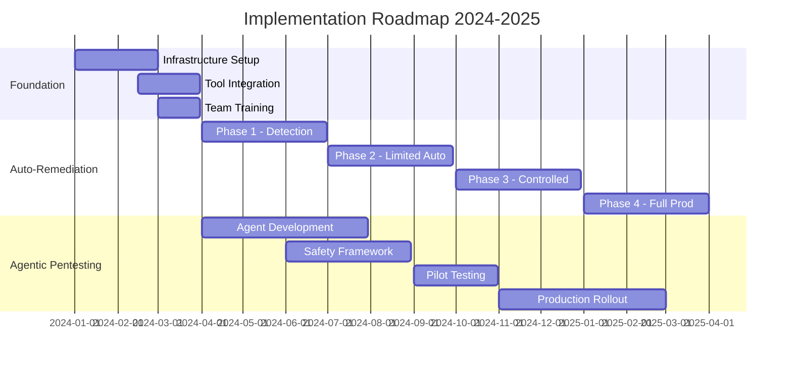

# Implementation Roadmap: Auto-Remediation & Agentic Pentesting Systems

## Executive Overview

This roadmap outlines the phased implementation approach for deploying both the Auto-Remediation Security System and Production-Safe Agentic Pentesting platform. The implementation follows a risk-managed, iterative approach with clear milestones, success criteria, and go/no-go decision points.

## Implementation Timeline Overview



## Phase 0: Foundation (Months 1-3)

### Infrastructure Requirements

#### Hardware Infrastructure
```yaml
compute_requirements:
  auto_remediation:
    production:
      nodes: 6
      cpu_per_node: 32
      ram_per_node: "128GB"
      storage_per_node: "2TB SSD"
    development:
      nodes: 3
      cpu_per_node: 16
      ram_per_node: "64GB"
      storage_per_node: "1TB SSD"

  agentic_pentesting:
    orchestration:
      nodes: 3
      cpu_per_node: 16
      ram_per_node: "64GB"
    agent_pool:
      nodes: 10
      cpu_per_node: 8
      ram_per_node: "32GB"

network_requirements:
  bandwidth: "10Gbps"
  segmentation: "VLAN-based"
  firewall_rules: "Zero-trust model"
```

#### Software Stack
```yaml
core_platform:
  orchestration: "Kubernetes 1.28+"
  service_mesh: "Istio 1.19+"
  monitoring: "Prometheus + Grafana"
  logging: "ELK Stack 8.0+"

security_tools:
  siem: ["Splunk", "QRadar", "Sentinel"]
  vulnerability_management: ["Qualys", "Rapid7"]
  threat_intelligence: ["MISP", "ThreatConnect"]

development_tools:
  ci_cd: "GitLab CI / Jenkins"
  artifact_registry: "Artifactory"
  secret_management: "HashiCorp Vault"
```

### Team Structure and Roles

```yaml
organizational_structure:
  steering_committee:
    - ciso
    - cto
    - vp_engineering
    - compliance_officer

  implementation_team:
    security_architects: 2
    security_engineers: 4
    ml_engineers: 2
    devops_engineers: 3
    qa_engineers: 2
    project_manager: 1

  support_teams:
    soc_analysts: 4
    incident_response: 2
    compliance: 1
    legal: 1
```

### Training Program

#### Week 1-2: Foundational Knowledge
- Security automation principles
- ML/AI in security
- Production safety considerations
- Regulatory requirements

#### Week 3-4: Technical Deep Dive
- System architecture
- API integrations
- Playbook development
- Agent programming

#### Week 5-6: Hands-on Labs
- Sandbox environment setup
- Test scenario execution
- Incident simulation
- Emergency procedures

## Phase 1: Auto-Remediation - Detection Layer (Months 4-6)

### Month 4: Detection Infrastructure

#### Implementation Tasks
```python
tasks = {
    "week_1-2": [
        "Deploy SIEM collectors",
        "Configure log aggregation",
        "Set up threat intelligence feeds",
        "Establish baseline metrics"
    ],
    "week_3-4": [
        "Implement correlation rules",
        "Deploy ML models in shadow mode",
        "Configure alerting pipelines",
        "Create detection dashboards"
    ]
}
```

#### Success Criteria
- 95% log source coverage
- <5 minute detection latency
- <10% false positive rate
- 24/7 monitoring capability

### Month 5: Threat Intelligence Integration

#### Integration Points
```yaml
threat_feeds:
  commercial:
    - vendor: "CrowdStrike"
      type: "API"
      update_frequency: "real-time"
    - vendor: "Recorded Future"
      type: "API"
      update_frequency: "hourly"

  open_source:
    - source: "AlienVault OTX"
      format: "STIX/TAXII"
    - source: "Abuse.ch"
      format: "CSV/JSON"

  internal:
    - honeypots: 5
    - deception_technology: "enabled"
    - threat_hunting_outputs: "integrated"
```

### Month 6: Validation and Tuning

#### Testing Protocol
```python
class ValidationPhase:
    def __init__(self):
        self.test_scenarios = [
            "ransomware_simulation",
            "data_exfiltration_attempt",
            "privilege_escalation",
            "lateral_movement"
        ]

    def execute_validation(self):
        results = {}
        for scenario in self.test_scenarios:
            results[scenario] = {
                "detection_time": self.measure_detection_time(scenario),
                "accuracy": self.calculate_accuracy(scenario),
                "false_positives": self.count_false_positives(scenario)
            }
        return results

    def acceptance_criteria(self, results):
        return all([
            result["detection_time"] < 300,  # 5 minutes
            result["accuracy"] > 0.9,
            result["false_positives"] < 5
        ] for result in results.values())
```

## Phase 2: Auto-Remediation - Limited Automation (Months 7-9)

### Month 7: Playbook Development

#### Playbook Categories
```yaml
level_1_playbooks:
  information_gathering:
    - enhanced_logging:
        triggers: ["suspicious_activity", "anomaly_detected"]
        actions: ["increase_log_verbosity", "capture_network_traffic"]
    - context_enrichment:
        triggers: ["new_threat_detected"]
        actions: ["query_threat_intelligence", "gather_asset_info"]

level_2_playbooks:
  containment:
    - rate_limiting:
        triggers: ["brute_force_attempt", "api_abuse"]
        actions: ["apply_rate_limits", "notify_user"]
    - session_termination:
        triggers: ["suspicious_session", "concurrent_login"]
        actions: ["terminate_session", "force_reauthentication"]
```

### Month 8: Automation Engine

#### Implementation Architecture
```python
class AutomationEngine:
    def __init__(self):
        self.playbook_library = PlaybookLibrary()
        self.execution_engine = ExecutionEngine()
        self.safety_checks = SafetyValidator()

    def process_threat(self, threat_event):
        # Threat analysis
        threat_analysis = self.analyze_threat(threat_event)

        # Playbook selection
        applicable_playbooks = self.playbook_library.match(
            threat_type=threat_analysis.type,
            confidence=threat_analysis.confidence,
            severity=threat_analysis.severity
        )

        # Safety validation
        for playbook in applicable_playbooks:
            if self.safety_checks.validate(playbook, threat_analysis):
                return self.execution_engine.execute(
                    playbook=playbook,
                    context=threat_analysis,
                    mode="limited_automation"
                )

        # Fallback to manual
        return self.escalate_to_human(threat_event)
```

### Month 9: Integration Testing

#### Test Scenarios
```yaml
integration_tests:
  scenario_1:
    name: "Multi-stage attack response"
    stages:
      - initial_compromise_detection
      - automated_containment
      - investigation_trigger
      - remediation_execution
    expected_outcome: "Attack contained within 10 minutes"

  scenario_2:
    name: "False positive handling"
    stages:
      - legitimate_activity_flagged
      - context_analysis
      - confidence_scoring
      - no_action_taken
    expected_outcome: "No disruption to legitimate users"

  scenario_3:
    name: "Escalation workflow"
    stages:
      - low_confidence_threat
      - human_review_trigger
      - analyst_investigation
      - manual_remediation
    expected_outcome: "Smooth escalation within SLA"
```

## Phase 3: Agentic Pentesting - Agent Development (Months 4-7)

### Month 4-5: Core Agent Framework

#### Agent Architecture
```python
class BaseAgent:
    def __init__(self, agent_config):
        self.id = generate_uuid()
        self.capabilities = agent_config.capabilities
        self.constraints = agent_config.constraints
        self.safety_module = SafetyModule()
        self.communication = AgentCommunication()

    def execute_task(self, task):
        # Pre-execution checks
        if not self.safety_module.validate_task(task):
            return TaskResult(status="rejected", reason="safety_violation")

        # Resource allocation
        resources = self.request_resources(task.requirements)

        # Task execution with monitoring
        with self.safety_module.monitor():
            result = self.perform_task(task, resources)

        # Post-execution cleanup
        self.release_resources(resources)
        self.report_results(result)

        return result
```

#### Agent Types Implementation
```yaml
agent_implementations:
  reconnaissance_agent:
    month: 4
    capabilities:
      - network_discovery
      - service_enumeration
      - technology_detection
    development_time: "2 weeks"
    testing_time: "1 week"

  vulnerability_scanner:
    month: 5
    capabilities:
      - cve_detection
      - misconfiguration_check
      - weak_credential_test
    development_time: "3 weeks"
    testing_time: "1 week"

  exploitation_agent:
    month: 6
    capabilities:
      - safe_exploitation
      - privilege_testing
      - lateral_movement_sim
    development_time: "4 weeks"
    testing_time: "2 weeks"
```

### Month 6-7: Safety Framework

#### Safety Implementation
```python
class SafetyFramework:
    def __init__(self):
        self.guardrails = self.load_guardrails()
        self.monitors = self.initialize_monitors()
        self.emergency_stop = EmergencyStop()

    def load_guardrails(self):
        return {
            "network": NetworkGuardrail(
                allowed_ranges=["10.0.0.0/8"],
                blocked_ports=[22, 3389],
                rate_limits={"requests_per_second": 10}
            ),
            "resource": ResourceGuardrail(
                max_cpu_percent=25,
                max_memory_mb=512,
                max_threads=10
            ),
            "data": DataGuardrail(
                no_modification=True,
                no_exfiltration=True,
                pii_protection=True
            )
        }

    def validate_action(self, action):
        violations = []
        for guardrail_name, guardrail in self.guardrails.items():
            if not guardrail.check(action):
                violations.append(guardrail_name)

        if violations:
            self.log_violation(action, violations)
            return False
        return True
```

## Phase 4: Production Deployment (Months 10-12)

### Month 10: Pilot Program

#### Pilot Scope
```yaml
pilot_configuration:
  auto_remediation:
    scope:
      - environments: ["development", "staging"]
      - threat_types: ["known_malware", "brute_force"]
      - remediation_levels: [1, 2]
    duration: "30 days"
    success_metrics:
      - false_positive_rate: "<5%"
      - mttr_reduction: ">30%"
      - system_stability: "99.9%"

  agentic_pentesting:
    scope:
      - targets: ["non-critical_systems"]
      - test_types: ["vulnerability_scanning", "configuration_review"]
      - frequency: "weekly"
    duration: "30 days"
    success_metrics:
      - vulnerability_discovery: ">80%"
      - false_positive_rate: "<10%"
      - zero_disruption: "100%"
```

### Month 11: Gradual Rollout

#### Rollout Strategy
```python
class GradualRollout:
    def __init__(self):
        self.rollout_stages = [
            {
                "stage": 1,
                "coverage": "10%",
                "duration": "1 week",
                "rollback_threshold": {"errors": 5, "incidents": 1}
            },
            {
                "stage": 2,
                "coverage": "25%",
                "duration": "1 week",
                "rollback_threshold": {"errors": 10, "incidents": 2}
            },
            {
                "stage": 3,
                "coverage": "50%",
                "duration": "2 weeks",
                "rollback_threshold": {"errors": 20, "incidents": 3}
            },
            {
                "stage": 4,
                "coverage": "100%",
                "duration": "ongoing",
                "rollback_threshold": {"errors": 50, "incidents": 5}
            }
        ]

    def execute_stage(self, stage_number):
        stage = self.rollout_stages[stage_number - 1]

        # Deploy to percentage of infrastructure
        self.deploy_to_subset(stage["coverage"])

        # Monitor for issues
        issues = self.monitor_deployment(stage["duration"])

        # Decide on progression
        if self.should_rollback(issues, stage["rollback_threshold"]):
            self.rollback()
            return "rollback"
        else:
            return "proceed"
```

### Month 12: Full Production

#### Production Readiness Checklist
```yaml
readiness_checklist:
  operational:
    - 24x7_monitoring: "✓"
    - incident_response_procedures: "✓"
    - escalation_paths: "✓"
    - runbook_documentation: "✓"
    - training_completed: "✓"

  technical:
    - high_availability: "✓"
    - disaster_recovery: "✓"
    - backup_procedures: "✓"
    - performance_benchmarks: "✓"
    - security_hardening: "✓"

  compliance:
    - audit_trail: "✓"
    - regulatory_approval: "✓"
    - risk_assessment: "✓"
    - privacy_impact: "✓"
    - legal_review: "✓"

  business:
    - executive_approval: "✓"
    - budget_allocation: "✓"
    - roi_validation: "✓"
    - stakeholder_communication: "✓"
    - success_metrics: "✓"
```

## Continuous Improvement Framework

### Feedback Loops

#### Performance Monitoring
```python
class ContinuousImprovement:
    def __init__(self):
        self.metrics_collector = MetricsCollector()
        self.ml_pipeline = MLPipeline()
        self.feedback_processor = FeedbackProcessor()

    def improvement_cycle(self):
        while True:
            # Collect performance data
            metrics = self.metrics_collector.gather([
                "detection_accuracy",
                "remediation_success",
                "false_positive_rate",
                "system_performance"
            ])

            # Analyze for improvements
            improvements = self.analyze_metrics(metrics)

            # Update models and rules
            if improvements["model_updates"]:
                self.ml_pipeline.retrain(improvements["training_data"])

            if improvements["rule_updates"]:
                self.update_detection_rules(improvements["new_rules"])

            # Process human feedback
            feedback = self.feedback_processor.get_analyst_feedback()
            self.incorporate_feedback(feedback)

            # Wait for next cycle
            time.sleep(86400)  # Daily cycle
```

### Model Retraining Schedule

```yaml
retraining_schedule:
  detection_models:
    frequency: "weekly"
    trigger_conditions:
      - accuracy_drop: ">5%"
      - new_threat_types: ">10"
      - false_positive_spike: ">20%"

  remediation_models:
    frequency: "bi-weekly"
    trigger_conditions:
      - success_rate_drop: ">10%"
      - new_playbooks_added: ">5"

  pentesting_models:
    frequency: "monthly"
    trigger_conditions:
      - vulnerability_miss_rate: ">15%"
      - new_attack_vectors: ">5"
```

## Risk Management

### Risk Register

```yaml
risk_register:
  high_risks:
    - risk: "False positive causes service disruption"
      probability: "Medium"
      impact: "High"
      mitigation:
        - "Multi-factor confidence scoring"
        - "Gradual rollout approach"
        - "Human review for critical actions"

    - risk: "Attacker manipulates auto-remediation"
      probability: "Low"
      impact: "Critical"
      mitigation:
        - "Rate limiting on remediations"
        - "Anomaly detection on remediation patterns"
        - "Integrity monitoring of system"

  medium_risks:
    - risk: "Performance degradation in production"
      probability: "Medium"
      impact: "Medium"
      mitigation:
        - "Resource quotas and limits"
        - "Circuit breaker patterns"
        - "Performance monitoring and alerting"

    - risk: "Compliance violation"
      probability: "Low"
      impact: "High"
      mitigation:
        - "Regular compliance audits"
        - "Automated compliance checks"
        - "Legal review of all playbooks"
```

### Contingency Plans

```python
class ContingencyPlan:
    def __init__(self):
        self.scenarios = {
            "system_compromise": self.handle_system_compromise,
            "mass_false_positives": self.handle_false_positive_storm,
            "performance_degradation": self.handle_performance_issues,
            "data_breach": self.handle_data_breach
        }

    def handle_system_compromise(self):
        actions = [
            "immediately_disable_auto_remediation",
            "isolate_affected_systems",
            "activate_incident_response",
            "forensic_investigation",
            "notify_stakeholders"
        ]
        return self.execute_actions(actions)

    def handle_false_positive_storm(self):
        actions = [
            "pause_automated_actions",
            "increase_confidence_thresholds",
            "manual_review_mode",
            "root_cause_analysis",
            "model_rollback_if_needed"
        ]
        return self.execute_actions(actions)
```

## Success Metrics and KPIs

### Auto-Remediation Metrics

```yaml
kpi_targets:
  year_1:
    detection:
      mean_time_to_detect: "<5 minutes"
      detection_coverage: ">90%"
      false_negative_rate: "<5%"

    response:
      mean_time_to_respond: "<2 minutes"
      auto_remediation_rate: ">70%"
      successful_remediation: ">95%"

    operational:
      system_availability: ">99.9%"
      analyst_workload_reduction: ">40%"
      cost_per_incident: "<$500"

  year_2:
    detection:
      mean_time_to_detect: "<2 minutes"
      detection_coverage: ">95%"
      false_negative_rate: "<2%"

    response:
      mean_time_to_respond: "<1 minute"
      auto_remediation_rate: ">85%"
      successful_remediation: ">98%"
```

### Agentic Pentesting Metrics

```yaml
pentesting_metrics:
  coverage:
    asset_coverage: ">95%"
    vulnerability_types: ">50 categories"
    test_frequency: "continuous"

  effectiveness:
    vulnerability_discovery_rate: ">85%"
    false_positive_rate: "<5%"
    critical_finding_accuracy: ">95%"

  safety:
    production_incidents: "0"
    service_disruptions: "0"
    data_modifications: "0"

  efficiency:
    cost_vs_manual: "-70%"
    time_to_complete: "-80%"
    findings_per_day: ">100"
```

## Budget and Resource Allocation

### Year 1 Budget

```yaml
budget_year_1:
  capital_expenses:
    hardware: "$300,000"
    software_licenses: "$200,000"
    infrastructure: "$150,000"
    total_capex: "$650,000"

  operational_expenses:
    personnel: "$800,000"
    training: "$50,000"
    consulting: "$100,000"
    cloud_services: "$120,000"
    maintenance: "$80,000"
    total_opex: "$1,150,000"

  total_year_1: "$1,800,000"

  projected_savings:
    incident_cost_reduction: "$500,000"
    efficiency_gains: "$300,000"
    compliance_automation: "$200,000"
    total_savings: "$1,000,000"

  net_investment: "$800,000"
```

### Resource Utilization Plan

```python
class ResourcePlanning:
    def __init__(self):
        self.team_allocation = {
            "phase_1": {
                "security_architects": 2,
                "engineers": 4,
                "project_hours": 2880
            },
            "phase_2": {
                "security_architects": 1,
                "engineers": 6,
                "ml_engineers": 2,
                "project_hours": 4320
            },
            "phase_3": {
                "engineers": 5,
                "ml_engineers": 2,
                "qa_engineers": 2,
                "project_hours": 4320
            },
            "phase_4": {
                "engineers": 4,
                "operations": 3,
                "project_hours": 3360
            }
        }

    def calculate_resource_needs(self, phase):
        allocation = self.team_allocation[phase]
        return {
            "total_headcount": sum(v for k, v in allocation.items()
                                 if k != "project_hours"),
            "total_hours": allocation["project_hours"],
            "estimated_cost": self.calculate_cost(allocation)
        }
```

## Communication and Change Management

### Stakeholder Communication Plan

```yaml
communication_plan:
  executive_updates:
    frequency: "monthly"
    format: "dashboard + presentation"
    metrics:
      - roi_progress
      - risk_status
      - milestone_achievement

  technical_teams:
    frequency: "weekly"
    format: "detailed_reports"
    content:
      - implementation_progress
      - technical_challenges
      - performance_metrics

  end_users:
    frequency: "quarterly"
    format: "newsletter + training"
    content:
      - system_capabilities
      - process_changes
      - success_stories

  external_stakeholders:
    frequency: "as_needed"
    format: "formal_reports"
    content:
      - compliance_status
      - audit_results
      - security_posture
```

### Change Management Strategy

```python
class ChangeManagement:
    def __init__(self):
        self.change_stages = [
            "awareness",
            "desire",
            "knowledge",
            "ability",
            "reinforcement"
        ]

    def implement_change(self, change_type):
        activities = {
            "awareness": [
                "executive_sponsorship_message",
                "town_hall_meetings",
                "communication_campaign"
            ],
            "desire": [
                "benefits_demonstration",
                "success_story_sharing",
                "incentive_programs"
            ],
            "knowledge": [
                "training_programs",
                "documentation",
                "hands_on_workshops"
            ],
            "ability": [
                "pilot_programs",
                "mentoring",
                "gradual_rollout"
            ],
            "reinforcement": [
                "continuous_monitoring",
                "feedback_loops",
                "recognition_programs"
            ]
        }

        for stage in self.change_stages:
            self.execute_activities(activities[stage])
            self.measure_adoption(stage)
```

## Appendices

### A. Detailed Technical Requirements
### B. Vendor Evaluation Criteria
### C. Training Curriculum
### D. Compliance Mapping
### E. Disaster Recovery Procedures
### F. Performance Benchmarks