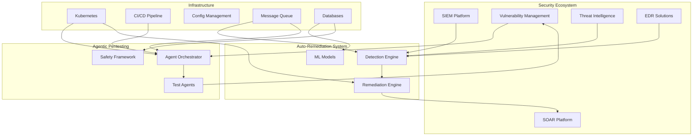

# Integration Guide: Auto-Remediation & Agentic Pentesting Systems

## Overview

This guide provides detailed integration instructions for connecting the Auto-Remediation Security System and Production-Safe Agentic Pentesting platform with existing enterprise infrastructure, security tools, and operational workflows.

## Integration Architecture



## SIEM Integration

### Splunk Integration

#### Event Collection
```python
class SplunkIntegration:
    def __init__(self, config):
        self.hec_url = config['hec_endpoint']
        self.token = config['hec_token']
        self.index = config['index']
        self.source_type = "security:automation"

    def send_event(self, event_data):
        payload = {
            "time": time.time(),
            "host": socket.gethostname(),
            "source": "auto_remediation",
            "sourcetype": self.source_type,
            "index": self.index,
            "event": event_data
        }

        headers = {
            "Authorization": f"Splunk {self.token}",
            "Content-Type": "application/json"
        }

        response = requests.post(
            self.hec_url,
            headers=headers,
            json=payload,
            verify=True
        )
        return response.status_code == 200

    def create_saved_search(self):
        return """
        index=security sourcetype="security:automation"
        | stats count by threat_type, remediation_action, result
        | eval success_rate=round((success/count)*100,2)
        | table threat_type remediation_action success_rate count
        """
```

#### Alert Integration
```yaml
splunk_alerts:
  high_severity_threat:
    search: |
      index=security severity="critical" OR severity="high"
      | where automation_eligible="true"
    trigger:
      condition: "results > 0"
      throttle: "5m"
    action:
      type: "webhook"
      endpoint: "https://auto-remediation.internal/api/trigger"
      payload:
        threat_id: "$result.threat_id$"
        severity: "$result.severity$"
        asset: "$result.affected_asset$"

  remediation_failure:
    search: |
      index=security sourcetype="security:automation"
      remediation_status="failed"
    trigger:
      condition: "results > 3 in 5m"
    action:
      - type: "email"
        to: "soc-team@company.com"
      - type: "pagerduty"
        service_key: "${PAGERDUTY_KEY}"
```

### QRadar Integration

#### DSM Configuration
```xml
<device-extension xmlns="event_parsing">
    <pattern id="AutoRemediationPattern">
        <match-field>
            <pattern-match>AUTO_REMEDIATION:</pattern-match>
        </match-field>
        <event>
            <event-name>Automated Security Response</event-name>
            <event-category>Security Operations</event-category>
            <severity>
                <mapping-match>
                    <mapping-value>Critical</mapping-value>
                    <mapped-value>10</mapped-value>
                </mapping-match>
            </severity>
        </event>
    </pattern>
</device-extension>
```

#### API Integration
```python
class QRadarConnector:
    def __init__(self, console_url, api_token):
        self.base_url = f"{console_url}/api"
        self.headers = {
            "SEC": api_token,
            "Content-Type": "application/json",
            "Accept": "application/json"
        }

    def get_offenses(self, status="OPEN"):
        endpoint = f"{self.base_url}/siem/offenses"
        params = {
            "filter": f"status={status}",
            "fields": "id,description,severity,categories"
        }
        response = requests.get(
            endpoint,
            headers=self.headers,
            params=params
        )
        return response.json()

    def create_reference_set(self, name, element_type="IP"):
        endpoint = f"{self.base_url}/reference_data/sets"
        data = {
            "name": name,
            "element_type": element_type,
            "time_to_live": "7 days",
            "timeout_type": "LAST_SEEN"
        }
        return requests.post(
            endpoint,
            headers=self.headers,
            json=data
        )

    def trigger_remediation(self, offense_id, action):
        # Custom API endpoint for remediation
        endpoint = f"{self.base_url}/custom/remediation/trigger"
        payload = {
            "offense_id": offense_id,
            "action": action,
            "automated": True,
            "source": "auto_remediation_system"
        }
        return requests.post(
            endpoint,
            headers=self.headers,
            json=payload
        )
```

### Microsoft Sentinel Integration

#### Logic Apps Connector
```json
{
    "definition": {
        "$schema": "https://schema.management.azure.com/schemas/2016-06-01/Microsoft.Logic.json",
        "contentVersion": "1.0.0.0",
        "triggers": {
            "When_a_Sentinel_incident_is_created": {
                "type": "ApiConnectionWebhook",
                "inputs": {
                    "host": {
                        "connection": {
                            "name": "@parameters('$connections')['azuresentinel']"
                        }
                    },
                    "body": {
                        "callback_url": "@{listCallbackUrl()}"
                    },
                    "path": "/incident/creation"
                }
            }
        },
        "actions": {
            "Evaluate_for_Automation": {
                "type": "Function",
                "inputs": {
                    "function": {
                        "id": "/subscriptions/.../AutomationEvaluator"
                    },
                    "body": {
                        "incident": "@triggerBody()",
                        "confidence_threshold": 0.85
                    }
                }
            },
            "Trigger_Remediation": {
                "type": "Http",
                "inputs": {
                    "method": "POST",
                    "uri": "https://auto-remediation.internal/api/remediate",
                    "headers": {
                        "Authorization": "Bearer @{parameters('api_key')}"
                    },
                    "body": "@body('Evaluate_for_Automation')"
                },
                "runAfter": {
                    "Evaluate_for_Automation": ["Succeeded"]
                }
            }
        }
    }
}
```

#### KQL Queries for Detection
```kql
// High-risk authentication anomalies
SigninLogs
| where TimeGenerated > ago(1h)
| where ResultType != 0
| summarize
    FailedAttempts = count(),
    UniqueIPs = dcount(IPAddress),
    Countries = make_set(LocationDetails.countryOrRegion)
    by UserPrincipalName
| where FailedAttempts > 10 and UniqueIPs > 5
| extend AutoRemediationAction = "suspend_account"
| project
    UserPrincipalName,
    FailedAttempts,
    UniqueIPs,
    Countries,
    AutoRemediationAction,
    Confidence = 0.9

// Suspicious process execution
SecurityEvent
| where TimeGenerated > ago(15m)
| where EventID == 4688
| where Process has_any ("powershell", "cmd", "wscript")
| where CommandLine has_any ("invoke-expression", "downloadstring", "encodedcommand")
| extend ThreatScore = case(
    CommandLine has "invoke-expression", 9,
    CommandLine has "downloadstring", 8,
    CommandLine has "encodedcommand", 7,
    5)
| where ThreatScore >= 7
| extend AutoRemediationAction = "isolate_endpoint"
| project
    Computer,
    Process,
    CommandLine,
    ThreatScore,
    AutoRemediationAction,
    Confidence = ThreatScore/10.0
```

## SOAR Platform Integration

### Phantom/Splunk SOAR

#### Playbook Integration
```python
def phantom_app_run(action, success, container, results, handle, filtered_artifacts, filtered_results, custom_function, **kwargs):

    phantom.debug("Auto-Remediation Integration Starting")

    # Get incident details
    incident_data = phantom.get_container(container['id'])

    # Evaluate for automation
    automation_params = {
        "incident_type": incident_data['label'],
        "severity": incident_data['severity'],
        "confidence_required": 0.85
    }

    # Call auto-remediation API
    response = phantom.requests.post(
        "https://auto-remediation.internal/api/evaluate",
        json=automation_params,
        verify=True
    )

    if response.status_code == 200:
        remediation = response.json()

        if remediation['automated']:
            # Execute automated remediation
            action_result = phantom.execute_action(
                action=remediation['action'],
                assets=remediation['assets'],
                parameters=remediation['parameters'],
                callback=remediation_callback
            )

            # Add note to incident
            phantom.add_note(
                container=container['id'],
                note_type="general",
                note_format="markdown",
                title="Automated Remediation Executed",
                content=f"Action: {remediation['action']}\nConfidence: {remediation['confidence']}"
            )
        else:
            # Create task for manual review
            phantom.create_task(
                container=container['id'],
                name="Manual Remediation Required",
                owner="soc-analyst",
                message=remediation['reason']
            )

    return
```

### Cortex XSOAR

#### Integration Configuration
```yaml
name: AutoRemediationSystem
display: Auto-Remediation Security System
category: Utilities
description: Automated threat detection and remediation
configuration:
  - display: Server URL
    name: url
    type: 0
    required: true
  - display: API Key
    name: apikey
    type: 4
    required: true
  - display: Trust any certificate
    name: insecure
    type: 8
    required: false

script:
  type: python3
  commands:
    - name: auto-remediate-threat
      description: Trigger automated remediation
      arguments:
        - name: threat_id
          required: true
          description: Threat identifier
        - name: confidence_threshold
          required: false
          default: 0.85
          description: Minimum confidence for automation
      outputs:
        - contextPath: AutoRemediation.Action
          description: Remediation action taken
        - contextPath: AutoRemediation.Status
          description: Remediation status
        - contextPath: AutoRemediation.Confidence
          description: Action confidence score
```

## Vulnerability Management Integration

### Qualys VMDR

#### API Integration
```python
class QualysIntegration:
    def __init__(self, config):
        self.base_url = config['api_url']
        self.username = config['username']
        self.password = config['password']
        self.session = self._authenticate()

    def _authenticate(self):
        session = requests.Session()
        session.headers.update({
            'X-Requested-With': 'Auto-Remediation System'
        })
        session.auth = (self.username, self.password)
        return session

    def get_vulnerabilities(self, severity_filter="4,5"):
        """Get high and critical vulnerabilities"""
        params = {
            'action': 'list',
            'show_results': 1,
            'severities': severity_filter,
            'status': 'New,Active,Re-Opened'
        }

        response = self.session.get(
            f"{self.base_url}/api/2.0/fo/knowledge_base/vuln/",
            params=params
        )
        return self.parse_vulnerabilities(response.text)

    def trigger_scan(self, ip_list, scan_type="vulnerability"):
        """Trigger on-demand scan for verification"""
        params = {
            'action': 'launch',
            'scan_title': f'Auto-Remediation Verification {datetime.now()}',
            'ip': ','.join(ip_list),
            'option_id': self.get_scan_option(scan_type)
        }

        response = self.session.post(
            f"{self.base_url}/api/2.0/fo/scan/",
            data=params
        )
        return response.text

    def create_remediation_ticket(self, vuln_id, asset_id):
        """Create remediation ticket in Qualys"""
        data = {
            'action': 'create',
            'title': f'Auto-Remediation: Vulnerability {vuln_id}',
            'vuln_id': vuln_id,
            'asset_id': asset_id,
            'priority': 'Urgent',
            'assignee': 'auto-remediation-system'
        }

        response = self.session.post(
            f"{self.base_url}/api/2.0/fo/remediation/ticket/",
            data=data
        )
        return response.status_code == 200
```

### Tenable.io

#### Integration Module
```python
class TenableIntegration:
    def __init__(self, access_key, secret_key):
        self.tio = TenableIO(access_key, secret_key)

    def get_critical_vulnerabilities(self):
        """Fetch critical vulnerabilities for remediation"""
        filters = {
            'severity': ['critical', 'high'],
            'state': ['open', 'reopened'],
            'exploitable': True
        }

        vulns = []
        for vuln in self.tio.vulnerabilities.export(filters=filters):
            vulns.append({
                'plugin_id': vuln['plugin_id'],
                'asset': vuln['asset']['hostname'],
                'severity': vuln['severity'],
                'solution': vuln['plugin']['solution'],
                'exploitable': vuln['plugin']['exploitability_ease']
            })

        return vulns

    def verify_remediation(self, asset_id, plugin_id):
        """Verify vulnerability remediation"""
        scan_id = self.tio.scans.create(
            name=f'Remediation Verification {datetime.now()}',
            targets=[asset_id],
            template='basic',
            plugins={'individual': [plugin_id]}
        )

        self.tio.scans.launch(scan_id)

        # Wait for scan completion
        while True:
            status = self.tio.scans.status(scan_id)
            if status['status'] == 'completed':
                break
            time.sleep(30)

        # Check if vulnerability still exists
        results = self.tio.scans.results(scan_id)
        return not any(v['plugin_id'] == plugin_id
                      for v in results['vulnerabilities'])

    def export_for_pentesting(self):
        """Export vulnerability data for pentest agents"""
        export_uuid = self.tio.exports.vulns()
        chunks = self.tio.exports.download_chunks(export_uuid)

        pentest_targets = []
        for chunk in chunks:
            for vuln in chunk:
                if vuln['severity'] in ['critical', 'high']:
                    pentest_targets.append({
                        'target': vuln['asset']['fqdn'],
                        'port': vuln['port']['port'],
                        'protocol': vuln['port']['protocol'],
                        'service': vuln['port']['service'],
                        'vulnerability': vuln['plugin']['name'],
                        'cve': vuln['plugin'].get('cve', [])
                    })

        return pentest_targets
```

## CI/CD Pipeline Integration

### GitLab CI

#### Pipeline Configuration
```yaml
stages:
  - build
  - security-test
  - pentesting
  - deploy
  - verify

variables:
  AUTO_REMEDIATION_API: "https://auto-remediation.internal/api"
  PENTEST_API: "https://agentic-pentest.internal/api"

security-scan:
  stage: security-test
  image: security-scanner:latest
  script:
    - |
      # Run security scans
      trivy image $CI_REGISTRY_IMAGE:$CI_COMMIT_SHA

      # Submit results to auto-remediation
      curl -X POST $AUTO_REMEDIATION_API/scan-results \
        -H "Authorization: Bearer $AUTO_REM_TOKEN" \
        -H "Content-Type: application/json" \
        -d @trivy-results.json
  artifacts:
    reports:
      container_scanning: trivy-results.json

agentic-pentesting:
  stage: pentesting
  image: pentest-runner:latest
  script:
    - |
      # Trigger production-safe pentesting
      TEST_ID=$(curl -X POST $PENTEST_API/tests \
        -H "Authorization: Bearer $PENTEST_TOKEN" \
        -H "Content-Type: application/json" \
        -d '{
          "target": "'$CI_ENVIRONMENT_URL'",
          "mode": "production-safe",
          "test_types": ["web_app", "api", "infrastructure"],
          "max_duration": 3600
        }' | jq -r '.test_id')

      # Wait for completion
      while true; do
        STATUS=$(curl -s $PENTEST_API/tests/$TEST_ID/status \
          -H "Authorization: Bearer $PENTEST_TOKEN" | jq -r '.status')

        if [ "$STATUS" = "completed" ]; then
          break
        elif [ "$STATUS" = "failed" ]; then
          exit 1
        fi

        sleep 30
      done

      # Get results
      curl -s $PENTEST_API/tests/$TEST_ID/results \
        -H "Authorization: Bearer $PENTEST_TOKEN" > pentest-results.json

      # Check for critical findings
      CRITICAL=$(jq '.findings | map(select(.severity == "critical")) | length' pentest-results.json)
      if [ "$CRITICAL" -gt 0 ]; then
        echo "Critical vulnerabilities found!"
        exit 1
      fi
  artifacts:
    reports:
      pentest: pentest-results.json
  only:
    - main
    - develop
```

### Jenkins Integration

#### Jenkinsfile
```groovy
pipeline {
    agent any

    environment {
        AUTO_REM_URL = credentials('auto-remediation-url')
        AUTO_REM_TOKEN = credentials('auto-remediation-token')
        PENTEST_URL = credentials('pentest-url')
        PENTEST_TOKEN = credentials('pentest-token')
    }

    stages {
        stage('Security Assessment') {
            parallel {
                stage('Static Analysis') {
                    steps {
                        script {
                            def scanResults = sh(
                                script: "security-scanner --format json",
                                returnStdout: true
                            )

                            // Submit to auto-remediation
                            def response = httpRequest(
                                url: "${AUTO_REM_URL}/analyze",
                                httpMode: 'POST',
                                authentication: 'auto-rem-auth',
                                contentType: 'APPLICATION_JSON',
                                requestBody: scanResults
                            )

                            if (response.status != 200) {
                                error("Auto-remediation analysis failed")
                            }
                        }
                    }
                }

                stage('Pentest Simulation') {
                    when {
                        branch pattern: "(main|staging)", comparator: "REGEXP"
                    }
                    steps {
                        script {
                            // Trigger pentesting
                            def testId = triggerPentest(
                                target: env.DEPLOY_URL,
                                mode: 'production-safe',
                                duration: 1800
                            )

                            // Wait and get results
                            def results = waitForPentest(testId)

                            // Process findings
                            processPentestResults(results)
                        }
                    }
                }
            }
        }

        stage('Auto-Remediation') {
            when {
                expression {
                    return currentBuild.result == null || currentBuild.result == 'SUCCESS'
                }
            }
            steps {
                script {
                    def remediations = getRequiredRemediations()

                    remediations.each { remediation ->
                        executeRemediation(remediation)
                    }
                }
            }
        }
    }

    post {
        always {
            // Report to dashboards
            publishHTML([
                reportDir: 'security-reports',
                reportFiles: 'index.html',
                reportName: 'Security Assessment Report'
            ])
        }
    }
}

def triggerPentest(Map params) {
    def response = httpRequest(
        url: "${PENTEST_URL}/tests",
        httpMode: 'POST',
        authentication: 'pentest-auth',
        contentType: 'APPLICATION_JSON',
        requestBody: groovy.json.JsonOutput.toJson(params)
    )

    def json = readJSON text: response.content
    return json.test_id
}

def executeRemediation(remediation) {
    println "Executing remediation: ${remediation.action}"

    def response = httpRequest(
        url: "${AUTO_REM_URL}/remediate",
        httpMode: 'POST',
        authentication: 'auto-rem-auth',
        contentType: 'APPLICATION_JSON',
        requestBody: groovy.json.JsonOutput.toJson(remediation)
    )

    if (response.status != 200) {
        error("Remediation failed: ${remediation.action}")
    }
}
```

## Cloud Provider Integration

### AWS Integration

#### CloudTrail Event Processing
```python
class AWSIntegration:
    def __init__(self):
        self.s3_client = boto3.client('s3')
        self.sns_client = boto3.client('sns')
        self.lambda_client = boto3.client('lambda')

    def setup_cloudtrail_processing(self):
        """Setup CloudTrail event processing for auto-remediation"""

        # Lambda function for processing CloudTrail events
        lambda_code = """
import json
import boto3
import requests

def lambda_handler(event, context):
    # Parse CloudTrail event
    for record in event['Records']:
        cloudtrail_event = json.loads(record['Sns']['Message'])

        # Check for security-relevant events
        if is_security_event(cloudtrail_event):
            # Send to auto-remediation system
            response = requests.post(
                'https://auto-remediation.internal/api/aws-event',
                json=cloudtrail_event,
                headers={'Authorization': 'Bearer ' + get_secret('auto-rem-token')}
            )

            if response.status_code == 200:
                remediation = response.json()
                if remediation['action_required']:
                    execute_aws_remediation(remediation)

    return {'statusCode': 200}

def is_security_event(event):
    security_events = [
        'UnauthorizedAccess',
        'ConsoleLogin',
        'CreateAccessKey',
        'PutBucketPolicy',
        'AuthorizeSecurityGroupIngress'
    ]
    return event['eventName'] in security_events

def execute_aws_remediation(remediation):
    if remediation['action'] == 'revoke_access_key':
        iam = boto3.client('iam')
        iam.delete_access_key(
            UserName=remediation['user'],
            AccessKeyId=remediation['access_key']
        )
    elif remediation['action'] == 'isolate_instance':
        ec2 = boto3.client('ec2')
        ec2.modify_instance_attribute(
            InstanceId=remediation['instance_id'],
            Groups=[remediation['isolation_sg']]
        )
"""

        # Create Lambda function
        self.lambda_client.create_function(
            FunctionName='AutoRemediationProcessor',
            Runtime='python3.9',
            Role='arn:aws:iam::account:role/lambda-execution-role',
            Handler='index.lambda_handler',
            Code={'ZipFile': lambda_code},
            Environment={
                'Variables': {
                    'AUTO_REM_ENDPOINT': 'https://auto-remediation.internal/api'
                }
            }
        )

    def setup_guardduty_integration(self):
        """Integrate with AWS GuardDuty"""

        # EventBridge rule for GuardDuty findings
        events_client = boto3.client('events')

        events_client.put_rule(
            Name='GuardDutyAutoRemediation',
            EventPattern=json.dumps({
                'source': ['aws.guardduty'],
                'detail-type': ['GuardDuty Finding'],
                'detail': {
                    'severity': [{'numeric': ['>=', 7]}]
                }
            }),
            State='ENABLED'
        )

        # Target Lambda for processing
        events_client.put_targets(
            Rule='GuardDutyAutoRemediation',
            Targets=[{
                'Id': '1',
                'Arn': 'arn:aws:lambda:region:account:function:AutoRemediationProcessor'
            }]
        )
```

### Azure Integration

#### Azure Sentinel Connector
```python
class AzureIntegration:
    def __init__(self, tenant_id, client_id, client_secret):
        self.credential = ClientSecretCredential(
            tenant_id=tenant_id,
            client_id=client_id,
            client_secret=client_secret
        )
        self.sentinel_client = SecurityCenter(
            self.credential,
            subscription_id
        )

    def process_sentinel_alerts(self):
        """Process Azure Sentinel alerts for remediation"""

        # Get active incidents
        incidents = self.sentinel_client.incidents.list(
            resource_group_name=rg_name,
            workspace_name=workspace_name,
            filter="properties/status eq 'New'"
        )

        for incident in incidents:
            # Analyze for automation
            remediation = self.analyze_incident(incident)

            if remediation['automate']:
                self.execute_azure_remediation(remediation)
            else:
                self.create_playbook_task(incident, remediation)

    def execute_azure_remediation(self, remediation):
        """Execute remediation in Azure"""

        if remediation['type'] == 'disable_user':
            graph_client = GraphServiceClient(self.credential)
            user = graph_client.users.by_user_id(remediation['user_id'])
            user.account_enabled = False
            graph_client.users.by_user_id(remediation['user_id']).patch(user)

        elif remediation['type'] == 'isolate_vm':
            network_client = NetworkManagementClient(
                self.credential,
                subscription_id
            )

            # Create isolation NSG
            isolation_nsg = NetworkSecurityGroup(
                location=remediation['location'],
                security_rules=[
                    SecurityRule(
                        name='DenyAllInbound',
                        priority=100,
                        direction='Inbound',
                        access='Deny',
                        protocol='*',
                        source_address_prefix='*',
                        destination_address_prefix='*',
                        source_port_range='*',
                        destination_port_range='*'
                    )
                ]
            )

            # Apply to VM
            network_client.network_security_groups.begin_create_or_update(
                resource_group_name=remediation['resource_group'],
                network_security_group_name='isolation-nsg',
                parameters=isolation_nsg
            )

    def setup_policy_remediation(self):
        """Setup Azure Policy remediation tasks"""

        policy_client = PolicyClient(self.credential, subscription_id)

        # Create remediation task
        remediation = PolicyRemediation(
            policy_assignment_id="/subscriptions/.../policyAssignments/SecurityBaseline",
            filters=RemediationFilters(
                locations=["eastus", "westus"]
            ),
            resource_discovery_mode="ReEvaluateCompliance"
        )

        policy_client.remediations.create_or_update(
            scope=f"/subscriptions/{subscription_id}",
            remediation_name="AutoSecurityRemediation",
            parameters=remediation
        )
```

### Google Cloud Integration

#### Security Command Center Integration
```python
class GCPIntegration:
    def __init__(self, project_id):
        self.project_id = project_id
        self.scc_client = securitycenter.SecurityCenterClient()
        self.org_name = f"organizations/{self.get_org_id()}"

    def process_scc_findings(self):
        """Process Security Command Center findings"""

        # List active findings
        findings = self.scc_client.list_findings(
            request={
                "parent": f"{self.org_name}/sources/-",
                "filter": 'state="ACTIVE" AND severity="HIGH"'
            }
        )

        for finding in findings:
            remediation = self.determine_remediation(finding)

            if remediation:
                self.execute_gcp_remediation(finding, remediation)
                self.update_finding_state(finding, "RESOLVED")

    def execute_gcp_remediation(self, finding, remediation):
        """Execute remediation in GCP"""

        if remediation['type'] == 'remove_public_access':
            storage_client = storage.Client()
            bucket = storage_client.bucket(remediation['bucket_name'])

            # Remove public access
            policy = bucket.get_iam_policy(requested_policy_version=3)
            policy.bindings = [
                b for b in policy.bindings
                if 'allUsers' not in b.members and 'allAuthenticatedUsers' not in b.members
            ]
            bucket.set_iam_policy(policy)

        elif remediation['type'] == 'disable_service_account':
            iam_client = iam.IAMClient()

            iam_client.disable_service_account(
                request={
                    "name": f"projects/{self.project_id}/serviceAccounts/{remediation['account']}"
                }
            )

        elif remediation['type'] == 'update_firewall':
            compute_client = compute.FirewallsClient()

            # Get current firewall rule
            firewall = compute_client.get(
                project=self.project_id,
                firewall=remediation['firewall_name']
            )

            # Remove overly permissive rules
            firewall.source_ranges = ["10.0.0.0/8"]

            compute_client.update(
                project=self.project_id,
                firewall=remediation['firewall_name'],
                firewall_resource=firewall
            )

    def setup_cloud_functions_integration(self):
        """Setup Cloud Functions for automated response"""

        functions_client = functions.CloudFunctionsServiceClient()

        # Deploy remediation function
        function = functions.CloudFunction(
            name=f"projects/{self.project_id}/locations/us-central1/functions/autoRemediation",
            source_archive_url="gs://remediation-functions/function.zip",
            entry_point="handle_security_event",
            trigger=functions.EventTrigger(
                event_type="providers/cloud.pubsub/eventTypes/topic.publish",
                resource=f"projects/{self.project_id}/topics/security-events"
            ),
            environment_variables={
                "REMEDIATION_API": "https://auto-remediation.internal/api",
                "PROJECT_ID": self.project_id
            }
        )

        functions_client.create_function(
            parent=f"projects/{self.project_id}/locations/us-central1",
            function=function
        )
```

## Kubernetes Integration

### Admission Webhook

```yaml
apiVersion: admissionregistration.k8s.io/v1
kind: ValidatingAdmissionWebhook
metadata:
  name: security-validator
webhooks:
- name: validate.security.io
  clientConfig:
    service:
      name: security-validator
      namespace: security
      path: "/validate"
    caBundle: LS0tLS1CRUdJTi...
  rules:
  - operations: ["CREATE", "UPDATE"]
    apiGroups: ["*"]
    apiVersions: ["*"]
    resources: ["pods", "deployments", "services"]
  admissionReviewVersions: ["v1", "v1beta1"]
  sideEffects: None
  timeoutSeconds: 10
  failurePolicy: Fail
```

```python
class K8sSecurityWebhook:
    def __init__(self):
        self.app = Flask(__name__)
        self.setup_routes()

    def setup_routes(self):
        @self.app.route('/validate', methods=['POST'])
        def validate():
            admission_review = request.get_json()

            # Extract object
            obj = admission_review['request']['object']

            # Security validation
            violations = self.check_security_policies(obj)

            if violations:
                # Attempt auto-remediation
                remediated_obj = self.auto_remediate(obj, violations)

                if remediated_obj:
                    # Return patched object
                    return self.admission_response(
                        allowed=True,
                        patch=self.generate_patch(obj, remediated_obj)
                    )
                else:
                    # Deny if can't remediate
                    return self.admission_response(
                        allowed=False,
                        message=f"Security violations: {violations}"
                    )

            return self.admission_response(allowed=True)

    def check_security_policies(self, obj):
        violations = []

        # Check for security issues
        if obj['kind'] == 'Pod':
            spec = obj['spec']

            # Check security context
            if not spec.get('securityContext', {}).get('runAsNonRoot'):
                violations.append('Container must run as non-root')

            # Check image sources
            for container in spec.get('containers', []):
                if not container['image'].startswith('registry.company.com/'):
                    violations.append(f"Unauthorized image source: {container['image']}")

                # Check for latest tag
                if ':latest' in container['image'] or ':' not in container['image']:
                    violations.append('Must specify explicit image tag')

        return violations

    def auto_remediate(self, obj, violations):
        """Attempt to automatically fix security violations"""

        remediated = copy.deepcopy(obj)

        if 'Container must run as non-root' in violations:
            if 'securityContext' not in remediated['spec']:
                remediated['spec']['securityContext'] = {}
            remediated['spec']['securityContext']['runAsNonRoot'] = True
            remediated['spec']['securityContext']['runAsUser'] = 1000

        return remediated
```

## Monitoring and Observability

### Prometheus Integration

```yaml
# Prometheus configuration
global:
  scrape_interval: 15s
  evaluation_interval: 15s

scrape_configs:
  - job_name: 'auto-remediation'
    static_configs:
      - targets: ['auto-remediation:9090']
    metric_relabel_configs:
      - source_labels: [__name__]
        regex: 'remediation_(.*)'
        target_label: system
        replacement: 'auto_remediation'

  - job_name: 'agentic-pentesting'
    static_configs:
      - targets: ['pentest-agents:9091']
    metric_relabel_configs:
      - source_labels: [__name__]
        regex: 'pentest_(.*)'
        target_label: system
        replacement: 'agentic_pentesting'

rule_files:
  - '/etc/prometheus/security_rules.yml'

alerting:
  alertmanagers:
    - static_configs:
        - targets: ['alertmanager:9093']
```

```yaml
# security_rules.yml
groups:
  - name: security_automation
    interval: 30s
    rules:
      - alert: HighRemediationFailureRate
        expr: rate(remediation_failures_total[5m]) > 0.1
        for: 5m
        labels:
          severity: critical
          system: auto_remediation
        annotations:
          summary: High remediation failure rate detected
          description: "{{ $value }} failures per second"

      - alert: PentestAgentStuck
        expr: pentest_agent_last_activity > 300
        for: 5m
        labels:
          severity: warning
          system: agentic_pentesting
        annotations:
          summary: Pentest agent appears stuck
          description: "Agent {{ $labels.agent_id }} inactive for {{ $value }}s"
```

### Grafana Dashboard

```json
{
  "dashboard": {
    "title": "Security Automation Overview",
    "panels": [
      {
        "title": "Threat Detection Rate",
        "targets": [
          {
            "expr": "rate(threats_detected_total[5m])",
            "legendFormat": "{{ threat_type }}"
          }
        ],
        "type": "graph"
      },
      {
        "title": "Auto-Remediation Success Rate",
        "targets": [
          {
            "expr": "rate(remediation_success_total[5m]) / rate(remediation_attempts_total[5m])",
            "legendFormat": "Success Rate"
          }
        ],
        "type": "stat"
      },
      {
        "title": "Pentest Coverage",
        "targets": [
          {
            "expr": "pentest_assets_tested / pentest_assets_total",
            "legendFormat": "Coverage %"
          }
        ],
        "type": "gauge"
      },
      {
        "title": "System Performance",
        "targets": [
          {
            "expr": "histogram_quantile(0.95, remediation_duration_seconds_bucket)",
            "legendFormat": "P95 Remediation Time"
          }
        ],
        "type": "graph"
      }
    ]
  }
}
```

## API Documentation

### Auto-Remediation API

```yaml
openapi: 3.0.0
info:
  title: Auto-Remediation API
  version: 1.0.0
  description: API for automated security threat remediation

servers:
  - url: https://auto-remediation.internal/api/v1

paths:
  /threats:
    post:
      summary: Report a security threat
      requestBody:
        required: true
        content:
          application/json:
            schema:
              $ref: '#/components/schemas/ThreatReport'
      responses:
        '200':
          description: Threat processed
          content:
            application/json:
              schema:
                $ref: '#/components/schemas/RemediationResponse'

  /remediate:
    post:
      summary: Execute remediation action
      requestBody:
        required: true
        content:
          application/json:
            schema:
              $ref: '#/components/schemas/RemediationRequest'
      responses:
        '200':
          description: Remediation executed
          content:
            application/json:
              schema:
                $ref: '#/components/schemas/RemediationResult'

  /status/{remediation_id}:
    get:
      summary: Get remediation status
      parameters:
        - name: remediation_id
          in: path
          required: true
          schema:
            type: string
      responses:
        '200':
          description: Remediation status
          content:
            application/json:
              schema:
                $ref: '#/components/schemas/RemediationStatus'

components:
  schemas:
    ThreatReport:
      type: object
      properties:
        threat_type:
          type: string
          enum: [malware, intrusion, data_leak, misconfiguration]
        severity:
          type: string
          enum: [low, medium, high, critical]
        source:
          type: string
        affected_assets:
          type: array
          items:
            type: string
        evidence:
          type: object

    RemediationResponse:
      type: object
      properties:
        remediation_id:
          type: string
        action:
          type: string
        confidence:
          type: number
        automated:
          type: boolean
        estimated_time:
          type: integer
```

### Agentic Pentesting API

```yaml
openapi: 3.0.0
info:
  title: Agentic Pentesting API
  version: 1.0.0
  description: API for production-safe autonomous penetration testing

paths:
  /tests:
    post:
      summary: Start a new pentest
      requestBody:
        required: true
        content:
          application/json:
            schema:
              $ref: '#/components/schemas/PentestRequest'
      responses:
        '200':
          description: Test initiated
          content:
            application/json:
              schema:
                $ref: '#/components/schemas/PentestResponse'

  /tests/{test_id}/status:
    get:
      summary: Get test status
      parameters:
        - name: test_id
          in: path
          required: true
          schema:
            type: string
      responses:
        '200':
          description: Test status
          content:
            application/json:
              schema:
                $ref: '#/components/schemas/TestStatus'

  /tests/{test_id}/findings:
    get:
      summary: Get test findings
      parameters:
        - name: test_id
          in: path
          required: true
          schema:
            type: string
      responses:
        '200':
          description: Test findings
          content:
            application/json:
              schema:
                $ref: '#/components/schemas/TestFindings'

  /agents:
    get:
      summary: List active agents
      responses:
        '200':
          description: Active agents list
          content:
            application/json:
              schema:
                type: array
                items:
                  $ref: '#/components/schemas/Agent'

components:
  schemas:
    PentestRequest:
      type: object
      properties:
        targets:
          type: array
          items:
            type: string
        test_types:
          type: array
          items:
            type: string
            enum: [reconnaissance, vulnerability, exploitation]
        mode:
          type: string
          enum: [production-safe, staging, development]
        constraints:
          type: object
          properties:
            max_duration:
              type: integer
            max_requests_per_second:
              type: integer
            business_hours_only:
              type: boolean
```

## Troubleshooting Guide

### Common Integration Issues

```yaml
troubleshooting:
  connection_issues:
    symptom: "Unable to connect to external service"
    checks:
      - Verify network connectivity
      - Check firewall rules
      - Validate SSL certificates
      - Confirm API endpoints
    resolution:
      - Update security groups
      - Add service to allow-list
      - Install root certificates

  authentication_failures:
    symptom: "401/403 errors from APIs"
    checks:
      - Verify API keys/tokens
      - Check token expiration
      - Validate permissions
    resolution:
      - Rotate credentials
      - Update IAM policies
      - Request elevated permissions

  data_format_issues:
    symptom: "Integration receiving unexpected data"
    checks:
      - Validate API versions
      - Check data schemas
      - Review recent API changes
    resolution:
      - Update integration mappings
      - Add data validation layer
      - Implement version detection

  performance_degradation:
    symptom: "Slow response times"
    checks:
      - Monitor API rate limits
      - Check network latency
      - Review resource usage
    resolution:
      - Implement caching
      - Add connection pooling
      - Optimize batch sizes
```

## Appendices

### A. API Authentication Methods
### B. Data Format Specifications
### C. Network Requirements
### D. Security Best Practices
### E. Compliance Mappings
### F. Vendor Contact Information