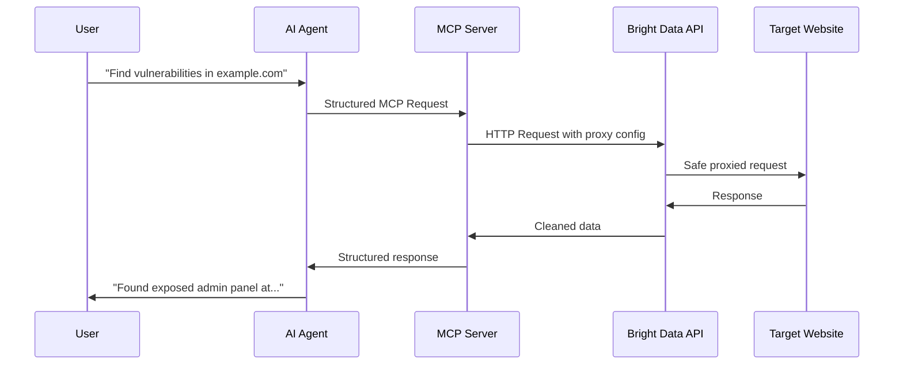

# Detailed MCP + Bright Data Workflow: From Prompts to Vulnerability Discovery

## Understanding MCP (Model Context Protocol)

MCP is a protocol that allows AI models (like Claude) to communicate with external tools and services. Think of it as a standardized way for AI to "use tools" just like a human would use a web browser or command line.

```
User Prompt → AI Model → MCP Server → External Tool → Response → AI Model → User
```

## How MCP Works with Bright Data

### The Basic Flow



## Detailed Reconnaissance Workflow

### Step 1: User Gives Natural Language Prompt

```
User: "Check if example.com has any security issues"
```

### Step 2: AI Agent Interprets and Plans

The AI agent breaks this down into specific reconnaissance tasks:

```typescript
class ReconnaissanceAgent {
  async interpretUserRequest(prompt: string): Promise<ReconPlan> {
    // AI interprets the natural language
    const intent = this.analyzeIntent(prompt);

    // Creates a structured plan
    return {
      target: this.extractTarget(prompt),  // "example.com"
      tasks: [
        'discover_subdomains',
        'find_exposed_files',
        'check_security_headers',
        'search_for_leaks',
        'identify_technologies'
      ],
      safety_level: 'production_safe'
    };
  }
}
```

### Step 3: AI Translates to MCP Calls

Here's where the magic happens - the AI converts the plan into specific MCP requests:

```typescript
// RECONNAISSANCE PHASE 1: Subdomain Discovery
async function discoverSubdomains(target: string) {
  // The AI constructs this MCP request
  const mcpRequest = {
    method: 'tools/search',
    params: {
      tool: 'brightdata.search_engine',
      query: `site:${target} -www`,  // Finds subdomains
      engine: 'google',
      num_results: 100
    }
  };

  // MCP Server translates this to Bright Data API call
  const brightDataCall = {
    url: 'https://api.brightdata.com/serp/search',
    method: 'POST',
    headers: {
      'Authorization': `Bearer ${BRIGHT_DATA_TOKEN}`
    },
    body: {
      query: `site:${target} -www`,
      country: 'us',
      num: 100,
      include_html: false
    }
  };

  return await mcpServer.execute(mcpRequest);
}
```

### Step 4: Detailed Examples of Prompt → Query Translation

#### Example 1: Finding Exposed Sensitive Files

**User Prompt:**
```
"Check if they have any exposed configuration files"
```

**AI Agent Translation Process:**
```typescript
// Step 1: AI identifies intent
const intent = 'find_exposed_files';

// Step 2: AI knows common sensitive files
const sensitiveFiles = [
  '.env', '.git/config', 'wp-config.php', '.htaccess',
  'config.json', 'settings.py', 'database.yml'
];

// Step 3: AI creates MCP requests for each
for (const file of sensitiveFiles) {
  const mcpRequest = {
    method: 'tools/web_check',
    params: {
      tool: 'brightdata.web_scraper',
      url: `https://${target}/${file}`,
      method: 'GET',
      // Safety: Use HEAD request first to avoid downloading large files
      pre_check: 'HEAD',
      timeout: 5000,
      proxy: {
        type: 'residential',  // Harder to detect/block
        country: 'us'
      }
    }
  };

  // Bright Data executes safely
  const response = await executeMCPRequest(mcpRequest);

  if (response.status === 200) {
    findings.push({
      type: 'exposed_file',
      severity: 'high',
      url: response.url,
      evidence: response.headers
    });
  }
}
```

#### Example 2: Technology Stack Identification

**User Prompt:**
```
"What technologies are they using?"
```

**AI Translation:**
```typescript
// The AI creates multiple reconnaissance strategies
async function identifyTechnologies(target: string) {
  const strategies = [];

  // Strategy 1: Check HTTP headers
  strategies.push({
    method: 'tools/header_analysis',
    params: {
      tool: 'brightdata.web_scraper',
      url: `https://${target}`,
      extract: 'headers',
      look_for: ['Server', 'X-Powered-By', 'X-Generator']
    }
  });

  // Strategy 2: Check common framework paths
  const frameworkPaths = {
    'WordPress': '/wp-admin',
    'Drupal': '/admin/config',
    'Django': '/admin/',
    'Ruby on Rails': '/rails/info/properties'
  };

  for (const [framework, path] of Object.entries(frameworkPaths)) {
    strategies.push({
      method: 'tools/path_check',
      params: {
        tool: 'brightdata.web_scraper',
        url: `https://${target}${path}`,
        method: 'HEAD',  // Non-intrusive
        expected_status: [200, 301, 302, 401],  // Any of these means it exists
        identify_as: framework
      }
    });
  }

  // Strategy 3: Analyze JavaScript libraries
  strategies.push({
    method: 'tools/js_analysis',
    params: {
      tool: 'brightdata.data_collector',  // Full browser needed
      url: `https://${target}`,
      execute_js: true,
      extract_script: `
        // This runs in the browser context
        const libs = [];
        if (window.jQuery) libs.push('jQuery ' + jQuery.fn.jquery);
        if (window.React) libs.push('React ' + React.version);
        if (window.Vue) libs.push('Vue ' + Vue.version);
        if (window.angular) libs.push('Angular');
        return libs;
      `
    }
  });

  // Execute all strategies in parallel
  const results = await Promise.all(strategies.map(s => mcpServer.execute(s)));
  return consolidateTechnologyFindings(results);
}
```

#### Example 3: Finding Security Misconfigurations

**User Prompt:**
```
"Are there any security misconfigurations?"
```

**AI Translation to Multiple MCP Checks:**

```typescript
async function checkSecurityMisconfigurations(target: string) {
  const checks = [];

  // Check 1: Missing Security Headers
  checks.push({
    method: 'tools/security_headers',
    params: {
      tool: 'brightdata.web_scraper',
      url: `https://${target}`,
      method: 'HEAD',
      analyze_headers: {
        required: [
          'Strict-Transport-Security',
          'X-Content-Type-Options',
          'X-Frame-Options',
          'Content-Security-Policy'
        ],
        check_values: true
      }
    }
  });

  // Check 2: Directory Listing Enabled
  const commonDirs = ['/images/', '/css/', '/js/', '/uploads/', '/backup/'];

  for (const dir of commonDirs) {
    checks.push({
      method: 'tools/directory_listing',
      params: {
        tool: 'brightdata.web_scraper',
        url: `https://${target}${dir}`,
        method: 'GET',
        check_for: ['Index of', '<title>Directory listing</title>'],
        max_response_size: 10000  // Don't download huge directories
      }
    });
  }

  // Check 3: Exposed Admin Interfaces
  const adminPaths = [
    '/admin', '/administrator', '/wp-admin', '/phpmyadmin',
    '/adminer', '/manager', '/console', '/_admin'
  ];

  for (const path of adminPaths) {
    checks.push({
      method: 'tools/admin_panel_check',
      params: {
        tool: 'brightdata.web_scraper',
        url: `https://${target}${path}`,
        method: 'GET',
        follow_redirects: true,
        max_redirects: 2,
        check_for_login: true,  // Look for login forms
        proxy: {
          type: 'residential',
          rotate_on_retry: true  // Change IP if blocked
        }
      }
    });
  }

  // Execute all checks with rate limiting
  const results = [];
  for (const check of checks) {
    results.push(await mcpServer.execute(check));
    await delay(1000);  // 1 second between requests for safety
  }

  return analyzeSecurityMisconfigurations(results);
}
```

## Vulnerability Probing Workflow

### Phase 1: Passive Detection

**User Prompt:**
```
"Check for SQL injection vulnerabilities"
```

**AI Translation:**
```typescript
async function probeSQLInjection(target: string) {
  // Step 1: Find all forms and input parameters
  const discovery = await mcpServer.execute({
    method: 'tools/parameter_discovery',
    params: {
      tool: 'brightdata.data_collector',  // Need JS rendering
      url: `https://${target}`,
      extract: {
        forms: 'document.querySelectorAll("form")',
        inputs: 'document.querySelectorAll("input")',
        urls_with_params: 'Array.from(document.links).filter(a => a.href.includes("?"))'
      }
    }
  });

  // Step 2: Test each parameter with SAFE payloads
  const tests = [];

  for (const param of discovery.parameters) {
    // Safe SQL injection test payloads (detection only, not exploitation)
    const safePayloads = [
      `${param.value}'`,  // Single quote test
      `${param.value}"`,  // Double quote test
      `${param.value} AND 1=1`,  // Boolean true
      `${param.value} AND 1=2`,  // Boolean false
      `${param.value}' OR '1'='1' --`,  // Classic but safe
    ];

    for (const payload of safePayloads) {
      tests.push({
        method: 'tools/vulnerability_test',
        params: {
          tool: 'brightdata.web_scraper',
          url: param.url,
          method: param.method || 'GET',
          parameters: {
            [param.name]: payload
          },
          detection: {
            error_messages: [
              'SQL syntax',
              'mysql_fetch',
              'Warning: mysql',
              'PostgreSQL',
              'valid MySQL result',
              'mssql_query()',
              'Microsoft OLE DB Provider for ODBC Drivers'
            ],
            response_differences: true,  // Compare with baseline
            time_based: false  // Don't use time delays in production
          },
          safety: {
            max_requests: 5,  // Limit per parameter
            delay_between: 2000,  // 2 seconds
            stop_on_detection: true
          }
        }
      });
    }
  }

  // Execute tests carefully
  const results = [];
  for (const test of tests) {
    const result = await mcpServer.execute(test);

    if (result.vulnerability_detected) {
      results.push({
        type: 'SQL Injection',
        parameter: test.params.parameters,
        evidence: result.evidence,
        severity: 'high'
      });
      break;  // Stop testing this parameter if vulnerable
    }

    await delay(2000);  // Rate limiting
  }

  return results;
}
```

### Phase 2: Advanced Vulnerability Discovery

**User Prompt:**
```
"Do a comprehensive security assessment"
```

**AI Creates Multi-Stage MCP Workflow:**

```typescript
async function comprehensiveSecurityAssessment(target: string) {
  // The AI orchestrates multiple MCP tools

  // Stage 1: Information Gathering
  console.log('🔍 Stage 1: Information Gathering');

  const recon = await mcpServer.execute({
    method: 'tools/full_recon',
    params: {
      tool: 'brightdata.orchestrator',
      target: target,
      modules: [
        {
          name: 'subdomain_enumeration',
          tool: 'search_api',
          queries: [
            `site:${target}`,
            `site:*.${target}`,
            `"${target}" -site:${target}`  // Find mentions
          ]
        },
        {
          name: 'technology_fingerprinting',
          tool: 'web_scraper',
          paths: ['/', '/robots.txt', '/sitemap.xml'],
          extract: ['headers', 'meta_tags', 'scripts']
        },
        {
          name: 'exposed_apis',
          tool: 'web_scraper',
          paths: ['/api', '/api/v1', '/graphql', '/swagger', '/api-docs'],
          detect: 'api_endpoints'
        }
      ]
    }
  });

  // Stage 2: Vulnerability Identification
  console.log('🎯 Stage 2: Vulnerability Identification');

  const vulnChecks = [];

  // Check each discovered endpoint
  for (const endpoint of recon.discovered_endpoints) {
    vulnChecks.push({
      method: 'tools/vulnerability_scan',
      params: {
        tool: 'brightdata.security_scanner',
        url: endpoint.url,
        tests: [
          'sql_injection',
          'xss',
          'xxe',
          'ssrf',
          'path_traversal',
          'command_injection'
        ],
        mode: 'safe',  // Non-destructive testing only
        evidence_collection: true
      }
    });
  }

  // Stage 3: Exploit Verification (Safe)
  console.log('✅ Stage 3: Safe Exploit Verification');

  const exploitTests = [];

  for (const vuln of vulnerabilities) {
    if (vuln.exploitable) {
      exploitTests.push({
        method: 'tools/exploit_verification',
        params: {
          tool: 'brightdata.exploit_tester',
          vulnerability: vuln,
          proof_of_concept: {
            type: 'non_destructive',
            evidence_only: true,
            max_impact: 'read_only'
          },
          safety: {
            require_confirmation: true,
            rollback_capable: true,
            monitoring: true
          }
        }
      });
    }
  }

  return {
    reconnaissance: recon,
    vulnerabilities: vulnChecks,
    exploits: exploitTests
  };
}
```

## How Bright Data Handles MCP Requests

### The Translation Layer

```typescript
class BrightDataMCPHandler {
  async handleMCPRequest(request: MCPRequest): Promise<MCPResponse> {
    // Validate safety constraints
    if (!this.isSafeRequest(request)) {
      throw new Error('Request violates safety constraints');
    }

    // Select appropriate Bright Data tool
    const tool = this.selectTool(request);

    // Configure proxy based on requirements
    const proxyConfig = this.configureProxy(request);

    // Execute through Bright Data
    const brightDataRequest = {
      tool: tool,
      proxy: proxyConfig,
      request: this.translateRequest(request),
      safety: this.applySafetyLimits(request)
    };

    try {
      const response = await this.brightDataAPI.execute(brightDataRequest);
      return this.formatMCPResponse(response);
    } catch (error) {
      return this.handleError(error);
    }
  }

  selectTool(request: MCPRequest): string {
    // Decision tree for tool selection
    if (request.params.requires_javascript) {
      return 'data_collector';  // Full browser
    } else if (request.params.avoid_detection) {
      return 'web_unlocker';  // Anti-bot bypass
    } else if (request.params.search_only) {
      return 'search_api';  // No direct contact
    } else {
      return 'web_scraper';  // Simple HTTP
    }
  }

  configureProxy(request: MCPRequest): ProxyConfig {
    const sensitivity = request.params.target_sensitivity || 'medium';

    if (sensitivity === 'high' || request.params.production) {
      return {
        type: 'residential',  // Real user IPs
        country: 'us',
        rotation: 'per_request',
        session_duration: 60000
      };
    } else {
      return {
        type: 'datacenter',  // Faster, cheaper
        country: 'us',
        rotation: 'sticky',
        session_duration: 300000
      };
    }
  }

  applySafetyLimits(request: MCPRequest): SafetyConfig {
    return {
      rate_limit: request.params.production ? '1/s' : '10/s',
      timeout: 30000,
      max_retries: 2,
      backoff_multiplier: 2,
      respect_robots_txt: true,
      user_agent: 'SecurityScanner/1.0 (Contact: security@company.com)'
    };
  }
}
```

## Complete Example: Finding Website Vulnerabilities

### User Journey

```typescript
// 1. User asks a simple question
const userPrompt = "Is example.com secure?";

// 2. AI Agent interprets and creates comprehensive plan
const securityCheck = async (domain: string) => {
  const tasks = [];

  // Task 1: Check SSL/TLS configuration
  tasks.push(mcpServer.execute({
    method: 'tools/ssl_check',
    params: {
      tool: 'brightdata.web_scraper',
      url: `https://${domain}`,
      analyze_ssl: {
        protocols: true,
        ciphers: true,
        certificate: true,
        expiry: true
      }
    }
  }));

  // Task 2: Find exposed sensitive endpoints
  const sensitiveEndpoints = [
    '/.git/', '/.env', '/admin/', '/wp-admin/', '/phpmyadmin/',
    '/swagger/', '/api/docs', '/.htaccess', '/backup/', '/debug/'
  ];

  for (const endpoint of sensitiveEndpoints) {
    tasks.push(mcpServer.execute({
      method: 'tools/endpoint_check',
      params: {
        tool: 'brightdata.web_scraper',
        url: `https://${domain}${endpoint}`,
        method: 'HEAD',
        timeout: 5000,
        proxy: {
          type: 'residential',
          rotate_if_blocked: true
        }
      }
    }));
  }

  // Task 3: Check for common vulnerabilities
  tasks.push(mcpServer.execute({
    method: 'tools/vulnerability_scan',
    params: {
      tool: 'brightdata.data_collector',
      url: `https://${domain}`,
      tests: {
        xss: {
          payloads: ['<script>alert(1)</script>', '"onmouseover="alert(1)'],
          contexts: ['url_params', 'form_inputs', 'headers']
        },
        sql_injection: {
          payloads: ["'", '"', ' OR 1=1--'],
          detection: 'error_based'
        },
        open_redirect: {
          payloads: ['//evil.com', 'http://evil.com'],
          parameters: ['url', 'redirect', 'next', 'return']
        }
      },
      safety_mode: 'maximum'
    }
  }));

  // Execute all tasks with rate limiting
  const results = [];
  for (const task of tasks) {
    results.push(await task);
    await new Promise(resolve => setTimeout(resolve, 1000));
  }

  return analyzeResults(results);
};

// 3. AI presents findings in human-readable format
const findings = await securityCheck('example.com');
console.log(`
Security Assessment for example.com:

🔒 SSL/TLS: ${findings.ssl.grade}
⚠️  Exposed Endpoints: ${findings.exposed.length} found
🐛 Vulnerabilities: ${findings.vulnerabilities.length} potential issues
📊 Overall Security Score: ${findings.score}/100

Recommendations:
${findings.recommendations.map(r => `- ${r}`).join('\n')}
`);
```

## Key Concepts Summary

1. **MCP is the Communication Layer**: It standardizes how AI agents talk to external tools
2. **Bright Data is the Execution Layer**: It safely performs the actual web requests
3. **AI is the Intelligence Layer**: It interprets user intent and orchestrates complex workflows
4. **Safety is Built In**: Every request has rate limits, timeouts, and non-destructive constraints

The beauty is that users can ask simple questions like "Is this site secure?" and the system automatically:
- Plans comprehensive tests
- Translates to technical MCP calls
- Executes safely through Bright Data
- Returns actionable insights

This is fundamentally different from traditional scanners that just run predefined scripts!