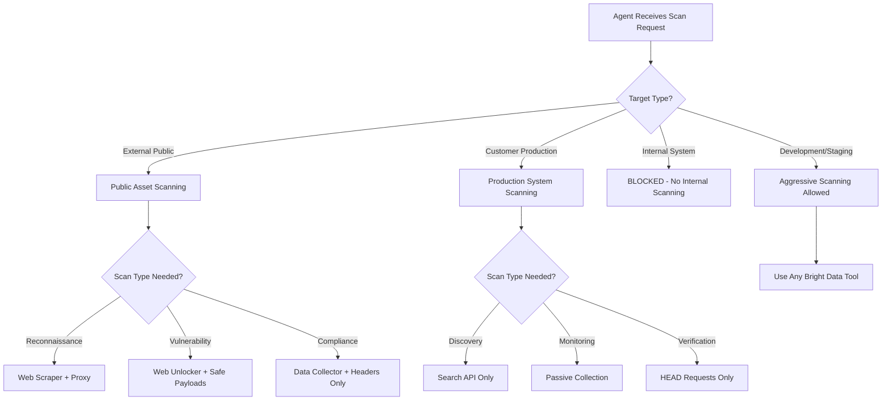

# Production-Safe Scanning Specification

## Executive Summary

This specification defines exactly what "production-safe scanning" means and how agents dynamically select appropriate Bright Data capabilities based on context, target sensitivity, and operational requirements. Each scanning type has specific safety constraints, rate limits, and Bright Data tool mappings.

## 1. Production Safety Levels

```typescript
enum SafetyLevel {
  PASSIVE = 'passive',       // Read-only, no direct interaction
  GENTLE = 'gentle',         // Minimal interaction, very slow
  MODERATE = 'moderate',     // Normal scanning, rate-limited
  AGGRESSIVE = 'aggressive', // Intensive scanning (dev/staging only)
  UNSAFE = 'unsafe'          // Never use in production
}

interface ProductionSafetyProfile {
  level: SafetyLevel;
  max_requests_per_second: number;
  max_concurrent_connections: number;
  allowed_methods: string[];
  prohibited_actions: string[];
  bright_data_config: BrightDataConfig;
}
```

## 2. Context-Aware Scanning Decision Tree



## 3. Production-Safe Scanning Types

### 3.1 Passive Reconnaissance (SAFETY: HIGH)

```typescript
class PassiveReconScanning {
  safety_level = SafetyLevel.PASSIVE;

  async execute(target: string): Promise<ScanResult> {
    // Use Bright Data without touching the target directly
    const brightDataCalls = [
      // Certificate Transparency Logs
      this.brightData.call({
        tool: 'search_api',
        params: {
          engine: 'crt.sh',
          query: target,
          no_direct_contact: true
        }
      }),

      // Search Engine Cache
      this.brightData.call({
        tool: 'search_api',
        params: {
          engine: 'google',
          query: `cache:${target}`,
          cached_only: true
        }
      }),

      // OSINT Sources
      this.brightData.call({
        tool: 'data_collector',
        params: {
          sources: ['shodan', 'censys', 'securitytrails'],
          target: target,
          passive_only: true
        }
      })
    ];

    return await Promise.all(brightDataCalls);
  }

  constraints = {
    no_target_interaction: true,
    uses_third_party_data: true,
    bright_data_proxy: 'not_required',
    rate_limit: 'unlimited',
    production_safe: true
  };
}
```

### 3.2 Gentle Active Scanning (SAFETY: MEDIUM-HIGH)

```typescript
class GentleActiveScanning {
  safety_level = SafetyLevel.GENTLE;

  async execute(target: string, context: ScanContext): Promise<ScanResult> {
    // Determine appropriate Bright Data configuration based on context
    const config = this.selectBrightDataConfig(context);

    return await this.brightData.call({
      tool: config.tool,
      params: {
        url: target,
        method: 'GET',  // Read-only
        follow_redirects: false,
        max_requests: 10,
        delay_between_requests: 2000,  // 2 seconds
        timeout: 5000,
        user_agent: 'Security-Scanner/1.0 (contact: security@company.com)',
        proxy_type: config.proxy_type
      }
    });
  }

  private selectBrightDataConfig(context: ScanContext): BrightDataConfig {
    if (context.target_sensitivity === 'high') {
      return {
        tool: 'web_unlocker',  // Most gentle, handles anti-bot
        proxy_type: 'residential',
        rotation: 'per_request'
      };
    } else if (context.requires_javascript) {
      return {
        tool: 'data_collector',  // Browser-based
        proxy_type: 'residential',
        rotation: 'sticky'
      };
    } else {
      return {
        tool: 'web_scraper',  // Simple HTTP
        proxy_type: 'datacenter',
        rotation: 'per_request'
      };
    }
  }

  constraints = {
    max_requests_per_second: 0.5,  // 1 request every 2 seconds
    max_concurrent: 1,
    methods_allowed: ['GET', 'HEAD', 'OPTIONS'],
    methods_prohibited: ['POST', 'PUT', 'DELETE', 'PATCH'],
    bright_data_proxy: 'required',
    production_safe: true
  };
}
```

### 3.3 Moderate Vulnerability Scanning (SAFETY: MEDIUM)

```typescript
class ModerateVulnerabilityScanning {
  safety_level = SafetyLevel.MODERATE;

  async execute(target: string, vulnType: VulnerabilityType): Promise<ScanResult> {
    // Select Bright Data tool based on vulnerability type
    const scanStrategy = this.selectScanStrategy(vulnType);

    return await this.brightData.call({
      tool: scanStrategy.tool,
      params: {
        url: target,
        ...scanStrategy.params,
        safety_checks: {
          avoid_dos_patterns: true,
          skip_destructive_payloads: true,
          use_benign_payloads: true,
          respect_rate_limits: true
        }
      }
    });
  }

  private selectScanStrategy(vulnType: VulnerabilityType): ScanStrategy {
    switch(vulnType) {
      case 'XSS':
        return {
          tool: 'data_collector',  // Need JS execution
          params: {
            payloads: this.getSafeXSSPayloads(),
            contexts: ['url', 'form', 'header'],
            max_payloads_per_param: 5,
            detect_only: true  // Don't actually exploit
          }
        };

      case 'SQLi':
        return {
          tool: 'web_scraper',
          params: {
            payloads: this.getSafeSQLiPayloads(),
            method: 'GET',
            time_based_threshold: 5000,  // 5 second max delay
            blind_detection_only: true
          }
        };

      case 'SSRF':
        return {
          tool: 'web_unlocker',
          params: {
            callback_url: 'https://safe-callback.company.com',
            test_parameters: ['url', 'uri', 'path'],
            internal_ip_ranges_blocked: true
          }
        };

      case 'Authentication':
        return {
          tool: 'web_scraper',
          params: {
            test_credentials: false,  // Never test real credentials
            check_endpoints: ['/login', '/admin', '/api/auth'],
            enumerate_users: false,  // Privacy protection
            response_analysis_only: true
          }
        };
    }
  }

  private getSafeXSSPayloads(): string[] {
    // Benign payloads that won't cause damage
    return [
      'test<b>bold</b>test',  // HTML injection test
      'test"onclick="',  // Event handler test (incomplete)
      "test'onclick='",  // Single quote variant
      'test<!--comment-->test',  // Comment injection
      'test<test>test'  // Custom tag test
    ];
  }

  private getSafeSQLiPayloads(): string[] {
    // Detection-only payloads, no data extraction
    return [
      "' AND '1'='1",  // Basic boolean
      "' AND '1'='2",  // False condition
      "' AND SLEEP(2) AND '1'='1",  // Time-based (short delay)
      "' ORDER BY 1--",  // Column enumeration
      "\\' AND \\'1\\'=\\'1"  // Escaped variant
    ];
  }

  constraints = {
    max_requests_per_second: 2,
    max_concurrent: 3,
    max_test_duration: 300000,  // 5 minutes max
    bright_data_proxy: 'required',
    production_safe: true,
    requires_authorization: true
  };
}
```

### 3.4 Compliance Scanning (SAFETY: HIGH)

```typescript
class ComplianceScanning {
  safety_level = SafetyLevel.GENTLE;

  async execute(target: string, standard: ComplianceStandard): Promise<ComplianceResult> {
    // Compliance scanning uses specific Bright Data tools
    const scans = [];

    // Headers and Security Configuration
    scans.push(
      this.brightData.call({
        tool: 'web_scraper',
        params: {
          url: target,
          method: 'HEAD',  // Headers only
          extract_headers: true,
          follow_redirects: true,
          check_ssl: true
        }
      })
    );

    // Privacy Policy and Terms
    scans.push(
      this.brightData.call({
        tool: 'data_collector',
        params: {
          urls: [
            `${target}/privacy`,
            `${target}/privacy-policy`,
            `${target}/terms`,
            `${target}/cookie-policy`
          ],
          extract_text: true,
          detect_pii: true,
          compliance_keywords: this.getComplianceKeywords(standard)
        }
      })
    );

    // Cookie Compliance
    scans.push(
      this.brightData.call({
        tool: 'data_collector',
        params: {
          url: target,
          analyze_cookies: true,
          check_consent_banner: true,
          gdpr_mode: standard === 'GDPR'
        }
      })
    );

    return this.analyzeCompliance(await Promise.all(scans), standard);
  }

  private getComplianceKeywords(standard: ComplianceStandard): string[] {
    const keywords = {
      'GDPR': ['data controller', 'data processor', 'lawful basis', 'right to erasure'],
      'CCPA': ['sale of personal information', 'opt-out', 'california residents'],
      'HIPAA': ['protected health information', 'PHI', 'notice of privacy practices'],
      'PCI-DSS': ['payment card', 'cardholder data', 'PCI compliance']
    };
    return keywords[standard] || [];
  }

  constraints = {
    intrusive_level: 'minimal',
    data_collection: 'headers_and_public_pages_only',
    bright_data_proxy: 'optional',
    production_safe: true
  };
}
```

## 4. Smart Context-Based Tool Selection

```typescript
class ContextAwareBrightDataSelector {
  // Main decision engine for selecting appropriate Bright Data tool
  async selectTool(request: ScanRequest): Promise<BrightDataToolConfig> {
    const context = await this.analyzeContext(request);

    // Decision matrix based on multiple factors
    const factors = {
      target_type: this.classifyTarget(request.target),
      sensitivity: this.assessSensitivity(request.target),
      scan_purpose: request.purpose,
      time_constraints: request.deadline,
      compliance_requirements: request.compliance,
      previous_scans: await this.getHistoricalData(request.target)
    };

    // Select optimal Bright Data configuration
    if (factors.target_type === 'production' && factors.sensitivity === 'critical') {
      return {
        tool: 'search_api',  // No direct contact
        proxy: 'not_needed',
        rate_limit: 'unlimited',
        safety: SafetyLevel.PASSIVE
      };
    } else if (factors.scan_purpose === 'vulnerability_assessment') {
      return {
        tool: 'web_unlocker',  // Handles anti-bot, gentle
        proxy: 'residential',
        rate_limit: '1_per_second',
        safety: SafetyLevel.GENTLE
      };
    } else if (factors.scan_purpose === 'compliance_check') {
      return {
        tool: 'data_collector',  // Full browser for JS apps
        proxy: 'datacenter',
        rate_limit: '5_per_second',
        safety: SafetyLevel.MODERATE
      };
    } else if (factors.target_type === 'public_internet') {
      return {
        tool: 'web_scraper',  // Simple and fast
        proxy: 'datacenter',
        rate_limit: '10_per_second',
        safety: SafetyLevel.MODERATE
      };
    }

    // Default safe configuration
    return {
      tool: 'search_api',
      proxy: 'not_needed',
      rate_limit: '1_per_second',
      safety: SafetyLevel.PASSIVE
    };
  }

  private classifyTarget(target: string): TargetType {
    if (this.isInternalIP(target) || this.isInternalDomain(target)) {
      throw new Error('BLOCKED: Internal targets not allowed');
    }

    if (this.isProductionSystem(target)) {
      return 'production';
    }

    if (this.isStagingSystem(target)) {
      return 'staging';
    }

    return 'public_internet';
  }

  private assessSensitivity(target: string): SensitivityLevel {
    // Check against known critical systems
    if (this.criticalSystems.includes(target)) {
      return 'critical';
    }

    // Check for financial/healthcare/government
    if (this.isRegulatedIndustry(target)) {
      return 'high';
    }

    // Check rate limiting history
    if (this.hasRateLimitHistory(target)) {
      return 'medium';
    }

    return 'low';
  }
}
```

## 5. Production Safety Rules

### 5.1 Hard Constraints (Never Violated)

```yaml
production_safety_rules:
  absolute_prohibitions:
    - internal_network_scanning: "10.0.0.0/8, 172.16.0.0/12, 192.168.0.0/16"
    - destructive_operations: ["DELETE", "DROP", "TRUNCATE", "UPDATE"]
    - credential_testing: "Never test with real user credentials"
    - dos_patterns: "No flooding, no resource exhaustion"
    - data_exfiltration: "No attempts to extract sensitive data"

  rate_limits:
    critical_systems:
      max_rps: 0.1  # 1 request per 10 seconds
      max_concurrent: 1
      backoff_multiplier: 2

    production_systems:
      max_rps: 1
      max_concurrent: 3
      backoff_multiplier: 1.5

    public_systems:
      max_rps: 10
      max_concurrent: 10
      backoff_multiplier: 1.2

  bright_data_configuration:
    production:
      required_proxy_types: ["residential"]
      rotation_strategy: "per_request"
      fingerprint_randomization: true
      javascript_execution: false

    staging:
      required_proxy_types: ["datacenter", "residential"]
      rotation_strategy: "sticky"
      fingerprint_randomization: true
      javascript_execution: true
```

### 5.2 Dynamic Safety Adjustments

```typescript
class DynamicSafetyController {
  async adjustSafetyBasedOnResponse(
    response: ScanResponse,
    currentConfig: BrightDataConfig
  ): Promise<BrightDataConfig> {

    // Detect signs of stress on target
    if (response.status_code === 429) {  // Rate limited
      return this.increaseDelays(currentConfig, 2.0);
    }

    if (response.response_time > 5000) {  // Slow response
      return this.reduceIntensity(currentConfig);
    }

    if (response.status_code === 503) {  // Service unavailable
      return this.pauseScanning(currentConfig);
    }

    if (response.waf_detected) {  // WAF/Anti-bot detected
      return this.switchToStealthMode(currentConfig);
    }

    // If all is well, can slightly increase rate
    if (response.status_code === 200 && response.response_time < 1000) {
      return this.gentlyIncreaseRate(currentConfig);
    }

    return currentConfig;
  }

  private switchToStealthMode(config: BrightDataConfig): BrightDataConfig {
    return {
      ...config,
      tool: 'web_unlocker',  // Best anti-detection
      proxy: 'residential',
      rotation: 'per_request',
      rate_limit: Math.min(config.rate_limit * 0.5, 0.5),  // Halve the rate
      user_agent_rotation: true,
      header_randomization: true
    };
  }
}
```

## 6. Agent Decision Examples

### Example 1: Agent Scanning E-commerce Site

```typescript
// Agent receives request to scan an e-commerce production site
const scanRequest = {
  target: 'https://shop.example.com',
  purpose: 'vulnerability_assessment',
  environment: 'production',
  authorization: true
};

// Agent's decision process:
const decision = await agent.decide(scanRequest);

// Result: Agent selects gentle scanning with Bright Data
{
  bright_data_tool: 'web_unlocker',
  reason: 'Production e-commerce site requires gentle scanning',
  configuration: {
    proxy_type: 'residential',
    rate_limit: '1 request per 2 seconds',
    methods: ['GET', 'HEAD'],
    payloads: 'safe_detection_only',
    max_scan_time: '10 minutes'
  }
}
```

### Example 2: Agent Scanning Development Environment

```typescript
// Agent receives request to scan development environment
const scanRequest = {
  target: 'https://dev.example.com',
  purpose: 'comprehensive_security_test',
  environment: 'development',
  authorization: true
};

// Agent's decision: More aggressive scanning allowed
{
  bright_data_tool: 'data_collector',
  reason: 'Development environment allows intensive testing',
  configuration: {
    proxy_type: 'datacenter',  // Cheaper, faster
    rate_limit: '50 requests per second',
    methods: ['GET', 'POST', 'PUT'],
    payloads: 'full_test_suite',
    javascript_execution: true,
    parallel_workers: 10
  }
}
```

### Example 3: Agent Conducting OSINT

```typescript
// Agent receives request for OSINT gathering
const scanRequest = {
  target: 'competitor.com',
  purpose: 'threat_intelligence',
  environment: 'external',
  authorization: false  // No direct scanning authorization
};

// Agent's decision: Passive only
{
  bright_data_tool: 'search_api',
  reason: 'No authorization for direct scanning, passive OSINT only',
  configuration: {
    sources: ['google', 'bing', 'shodan', 'censys'],
    direct_contact: false,
    cached_data_only: true,
    proxy_type: 'not_required'
  }
}
```

## 7. Safety Validation Framework

```typescript
class ProductionSafetyValidator {
  async validateScanIsSafe(
    scan: PlannedScan,
    target: Target,
    context: Context
  ): Promise<ValidationResult> {

    const checks = await Promise.all([
      this.checkTargetAllowlist(target),
      this.checkRateLimits(scan),
      this.checkPayloadSafety(scan),
      this.checkComplianceRequirements(target),
      this.checkTimeWindow(context),
      this.checkPreviousScans(target)
    ]);

    const failed = checks.filter(c => !c.passed);

    if (failed.length > 0) {
      return {
        safe: false,
        reasons: failed.map(f => f.reason),
        suggested_alternative: this.suggestSaferApproach(scan, failed)
      };
    }

    return {
      safe: true,
      bright_data_config: this.generateSafeConfig(scan, target, context),
      estimated_impact: this.estimateTargetImpact(scan)
    };
  }

  private generateSafeConfig(
    scan: PlannedScan,
    target: Target,
    context: Context
  ): BrightDataConfig {
    // Generate optimal Bright Data configuration for safety
    return {
      tool: this.selectOptimalTool(scan.type),
      proxy: this.selectProxyType(target.sensitivity),
      rate_limiting: this.calculateSafeRateLimit(target, context),
      safety_features: {
        auto_backoff: true,
        respect_robots_txt: true,
        avoid_honeypots: true,
        detect_and_avoid_waf: true
      }
    };
  }
}
```

## 8. Monitoring and Compliance

```typescript
class ProductionSafetyMonitor {
  async monitorScanSafety(activeScan: ActiveScan): Promise<void> {
    // Real-time monitoring of scan impact
    const metrics = await this.collectMetrics(activeScan);

    if (metrics.target_response_time > this.thresholds.response_time) {
      await this.adjustScanIntensity(activeScan, 'reduce');
    }

    if (metrics.error_rate > this.thresholds.error_rate) {
      await this.pauseScan(activeScan);
      await this.notifyOperator('High error rate detected');
    }

    if (metrics.waf_blocks > 0) {
      await this.switchToStealthMode(activeScan);
    }

    // Log for compliance
    await this.logForCompliance({
      scan_id: activeScan.id,
      target: activeScan.target,
      safety_level: activeScan.safety_level,
      bright_data_tool: activeScan.bright_data_config.tool,
      metrics: metrics,
      adjustments: activeScan.adjustments_made
    });
  }
}
```

## Conclusion

This specification defines a comprehensive framework for production-safe scanning where:

1. **Agents make intelligent decisions** about which Bright Data tool to use based on context
2. **Safety levels are enforced** through hard constraints and dynamic adjustments
3. **Different scan types** map to specific Bright Data capabilities
4. **Production systems are protected** through rate limiting and gentle scanning
5. **Compliance is maintained** through monitoring and logging

The key insight is that agents dynamically select the appropriate Bright Data tool (Web Scraper, Data Collector, Web Unlocker, or Search API) based on the target sensitivity, scan purpose, and production safety requirements.