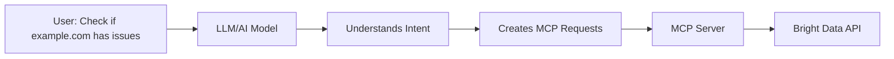

# How Natural Language Becomes MCP Calls: The Translation Process

## The Missing Link: LLM Translation Layer

When a user says "Check if example.com has any security issues", there's a crucial step I didn't explain clearly: **The LLM (like Claude or GPT) interprets this and creates structured MCP calls**.



## The Actual Translation Process

### Step 1: Natural Language Input
```
User: "Check if example.com has any security issues"
```

### Step 2: LLM Interprets Intent

The LLM (Claude, GPT, etc.) running with MCP capabilities understands this means:
- Target: example.com
- Task: Security assessment
- Scope: General security issues

### Step 3: LLM Generates Structured MCP Calls

Here's what ACTUALLY happens inside the LLM:

```typescript
// This happens INSIDE the LLM's "thinking"
class LLMTranslator {
  async translateUserPrompt(prompt: string): Promise<MCPCalls[]> {
    // The LLM parses the natural language
    const understanding = {
      intent: "security_assessment",
      target: this.extractDomain(prompt),  // "example.com"
      scope: this.determineScope(prompt)   // "general"
    };

    // The LLM decides what MCP tools to call
    const mcpCalls = [];

    // Based on "security issues", the LLM knows to check:

    // 1. SSL/TLS issues
    mcpCalls.push({
      tool: "brightdata.web_scraper",
      method: "analyze_ssl",
      params: {
        url: `https://${understanding.target}`,
        checks: ["certificate", "protocols", "ciphers"]
      }
    });

    // 2. Exposed sensitive files
    const sensitiveFiles = ['.env', '.git', 'wp-config.php'];
    for (const file of sensitiveFiles) {
      mcpCalls.push({
        tool: "brightdata.web_scraper",
        method: "check_file",
        params: {
          url: `https://${understanding.target}/${file}`,
          method: "HEAD"
        }
      });
    }

    // 3. Security headers
    mcpCalls.push({
      tool: "brightdata.web_scraper",
      method: "check_headers",
      params: {
        url: `https://${understanding.target}`,
        required_headers: ["HSTS", "CSP", "X-Frame-Options"]
      }
    });

    return mcpCalls;
  }
}
```

## Real Example: Complete Translation Flow

### User Input:
```
"Find SQL injection vulnerabilities on example.com"
```

### Step 1: LLM Understanding Phase

The LLM processes this and understands:
```javascript
{
  action: "find",
  vulnerability_type: "sql_injection",
  target: "example.com",
  implied_tasks: [
    "discover_parameters",
    "test_sql_payloads",
    "verify_vulnerabilities"
  ]
}
```

### Step 2: LLM Creates MCP Strategy

The LLM thinks: "To find SQL injection, I need to:"
1. Find all forms and parameters
2. Test each with SQL payloads
3. Look for error messages

### Step 3: LLM Generates Actual MCP Calls

```typescript
// The LLM generates these structured calls
const mcpRequests = [
  // First: Discover parameters
  {
    tool: "brightdata.data_collector",
    method: "discover_parameters",
    params: {
      url: "https://example.com",
      extract: {
        forms: "document.querySelectorAll('form')",
        inputs: "document.querySelectorAll('input')",
        urls_with_params: "Array.from(document.links).filter(a => a.href.includes('?'))"
      }
    }
  },

  // Then: Test each parameter
  {
    tool: "brightdata.web_scraper",
    method: "test_vulnerability",
    params: {
      url: "https://example.com/search",
      parameter: "q",
      payloads: [
        "' OR '1'='1",
        "1' AND '1'='2",
        "'; DROP TABLE users--"
      ],
      detection: {
        error_patterns: ["SQL syntax", "mysql_fetch", "PostgreSQL"],
        response_changes: true
      }
    }
  }
];
```

## The Key Insight: LLM as Translator

### What's Really Happening:

```python
# SIMPLIFIED VERSION OF WHAT HAPPENS

def process_user_request(user_input):
    # 1. LLM interprets the natural language
    intent = llm.understand(user_input)
    # Result: {task: "security_check", target: "example.com"}

    # 2. LLM decides what tools to use
    tools_needed = llm.select_tools(intent)
    # Result: ["ssl_checker", "vulnerability_scanner", "header_analyzer"]

    # 3. LLM creates structured MCP calls
    mcp_calls = []
    for tool in tools_needed:
        mcp_call = llm.create_mcp_call(tool, intent.target)
        mcp_calls.append(mcp_call)

    # 4. Execute MCP calls
    results = []
    for call in mcp_calls:
        result = mcp_server.execute(call)
        results.append(result)

    # 5. LLM interprets results for user
    summary = llm.summarize(results)
    return summary
```

## Concrete Example with Claude + MCP

### How Claude Actually Works with MCP:

```typescript
// When you ask Claude (with MCP enabled):
// "Check if example.com has security issues"

// Claude's internal process:
class ClaudeMCPIntegration {
  async handleUserPrompt(prompt: string) {
    // 1. Claude understands the request
    const intent = this.parseIntent(prompt);
    // {action: "security_check", target: "example.com"}

    // 2. Claude knows which MCP tools are available
    const availableTools = await this.mcp.listTools();
    // ["brightdata.web_scraper", "brightdata.search_api", ...]

    // 3. Claude decides which tools to use
    const relevantTools = this.selectTools(intent, availableTools);

    // 4. Claude creates the MCP request
    const mcpRequest = {
      jsonrpc: "2.0",
      method: "tools/call",
      params: {
        name: "brightdata.web_scraper",
        arguments: {
          url: "https://example.com",
          checks: ["ssl", "headers", "exposed_files"]
        }
      }
    };

    // 5. Send to MCP server
    const response = await this.mcp.sendRequest(mcpRequest);

    // 6. Claude interprets results for the user
    return this.explainResults(response);
  }
}
```

## The MCP Protocol Format

### What Actually Gets Sent:

```json
{
  "jsonrpc": "2.0",
  "id": 1,
  "method": "tools/call",
  "params": {
    "name": "brightdata.security_scan",
    "arguments": {
      "target": "example.com",
      "scan_type": "full",
      "checks": [
        "ssl_configuration",
        "security_headers",
        "exposed_endpoints",
        "common_vulnerabilities"
      ],
      "safety_level": "production",
      "proxy_config": {
        "type": "residential",
        "rotation": "per_request"
      }
    }
  }
}
```

## Why This Works

### The Magic is the LLM's Intelligence:

1. **Understanding Context**: LLM knows "security issues" means check SSL, headers, vulnerabilities
2. **Tool Selection**: LLM knows which MCP tools can help
3. **Parameter Generation**: LLM creates appropriate parameters
4. **Safety Awareness**: LLM adds production-safe constraints

### Example: Different Prompts → Different MCP Calls

**Prompt 1**: "Is example.com secure?"
```javascript
// LLM generates broad security checks
mcp.call("security.full_scan", {target: "example.com"})
```

**Prompt 2**: "Check example.com for SQL injection"
```javascript
// LLM generates specific SQL tests
mcp.call("vulnerability.sql_injection", {
  target: "example.com",
  payloads: ["'", "OR 1=1", "'; DROP TABLE"]
})
```

**Prompt 3**: "Find exposed files on example.com"
```javascript
// LLM generates file discovery
mcp.call("discovery.sensitive_files", {
  target: "example.com",
  files: [".env", ".git", "backup.sql"]
})
```

## Implementation with Airia + MCP

### How Airia Agents Handle This:

```python
# Using Airia's agent framework
class SecurityAgent(AiriaAgent):

    async def handle_user_request(self, prompt: str):
        # 1. Agent (powered by LLM) interprets prompt
        intent = self.llm.interpret(prompt)

        # 2. Agent creates MCP calls based on interpretation
        if "sql injection" in intent.keywords:
            mcp_calls = self.create_sql_injection_tests(intent.target)
        elif "general security" in intent.scope:
            mcp_calls = self.create_comprehensive_scan(intent.target)

        # 3. Execute through Bright Data MCP
        results = []
        for call in mcp_calls:
            result = await self.brightdata_mcp.execute(call)
            results.append(result)

        # 4. Agent summarizes for user
        return self.llm.summarize_findings(results)
```

## The Complete Picture

```
User Input: "Check example.com for security issues"
                        ↓
         LLM understands and interprets
                        ↓
    LLM creates structured MCP requests
                        ↓
    MCP Server receives structured requests
                        ↓
    Bright Data executes the actual scans
                        ↓
        Results returned through MCP
                        ↓
    LLM interprets results for the user
                        ↓
User Sees: "Found 3 security issues: No HTTPS,
           exposed .git directory, missing security headers"
```

## Key Takeaway

**The LLM is the translator!** It:
1. Understands natural language
2. Knows what security checks to run
3. Creates structured MCP calls
4. Interprets technical results back to natural language

Without the LLM, you'd have to write code like:
```javascript
brightdata.scan({url: "example.com", type: "security"})
```

With the LLM + MCP, you just say:
```
"Check if example.com is secure"
```

And the LLM handles all the translation!