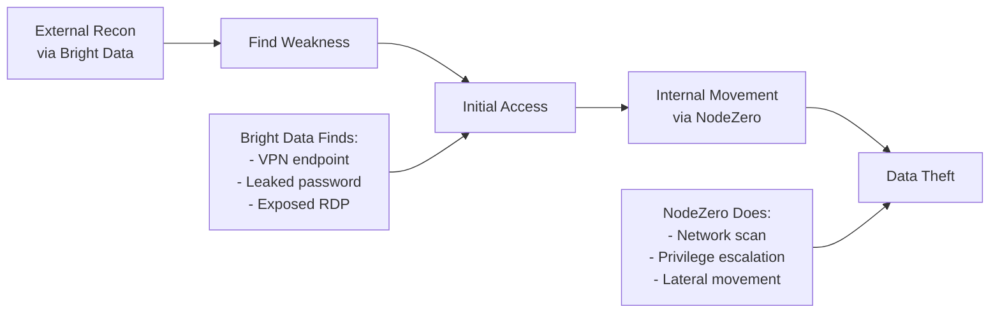

# Three-Vendor Security Architecture: Airia + Bright Data + NodeZero

## Executive Summary

This architecture combines three powerful vendors to create an AI-driven security platform that simulates real-world attack patterns by coordinating external reconnaissance with internal penetration testing.

## Vendor Responsibilities

### 1. Airia - Agent Development & Orchestration
**Role**: Build and coordinate intelligent security agents

- **Agent Framework**: Provides the infrastructure for creating autonomous agents
- **Orchestration**: Manages agent collaboration and task distribution
- **Decision Engine**: Determines which tools to use based on context
- **MCP Integration**: Connects to multiple MCP servers (Bright Data, NodeZero)

### 2. Bright Data - External Reconnaissance via MCP
**Role**: Gather intelligence from outside the target network

- **MCP Server**: Exposes tools through Model Context Protocol
- **Web Scraping**: Analyze public websites for vulnerabilities
- **Search APIs**: Find exposed credentials, leaked data, misconfigurations
- **Proxy Network**: Safe, distributed scanning without detection
- **OSINT Collection**: GitHub repos, S3 buckets, social media intel

### 3. Horizon3.ai NodeZero - Internal Penetration Testing
**Role**: Autonomous exploitation from inside the network

- **Network Discovery**: Map internal infrastructure
- **Vulnerability Scanning**: Find exploitable weaknesses
- **Exploit Engine**: Safely test attack paths
- **Privilege Escalation**: Simulate lateral movement
- **Attack Path Visualization**: Show how attackers would move

## How MCP Auto-Discovery Works

Your AI agents automatically understand available tools without manual configuration:

```python
# Step 1: Agent connects to MCP servers
class SecurityAgent(AiriaAgent):
    def __init__(self):
        self.mcp_clients = {
            'brightdata': MCPClient('brightdata://api.brightdata.com'),
            'nodezero': MCPClient('nodezero://api.horizon3.ai')
        }

    async def discover_tools(self):
        """MCP servers automatically expose their capabilities"""

        # Bright Data automatically returns:
        tools = await self.mcp_clients['brightdata'].list_tools()
        # Returns:
        # [
        #   {"name": "web_scraper", "description": "Scrape web pages", ...},
        #   {"name": "search_api", "description": "Search for exposed data", ...},
        #   {"name": "proxy_request", "description": "Make requests via proxy", ...}
        # ]

        # NodeZero automatically returns:
        tools = await self.mcp_clients['nodezero'].list_tools()
        # Returns:
        # [
        #   {"name": "network_scan", "description": "Scan internal network", ...},
        #   {"name": "exploit_check", "description": "Test for exploits", ...},
        #   {"name": "privilege_escalation", "description": "Find escalation paths", ...}
        # ]

# Step 2: LLM automatically maps user intent to tools
async def handle_user_request(self, request: str):
    # User says: "Check if example.com has any security issues"

    # LLM sees available tools and automatically decides:
    # 1. This is about a public website (example.com)
    # 2. I have brightdata.web_scraper available
    # 3. I should also check for exposed data

    # LLM generates these MCP calls automatically:
    results = []

    # External reconnaissance via Bright Data
    results.append(await self.mcp_clients['brightdata'].call({
        "tool": "web_scraper",
        "params": {"url": "https://example.com", "check": "security_headers"}
    }))

    results.append(await self.mcp_clients['brightdata'].call({
        "tool": "search_api",
        "params": {"query": "site:example.com password OR api_key"}
    }))

    return results
```

## External vs Internal Attack Coordination

### What Are External Attacks?
Attacks from **outside** your network - what any hacker on the internet can do:
- Scanning your public website
- Finding exposed databases
- Discovering leaked credentials on GitHub
- Checking misconfigured cloud storage
- Social engineering research

### What Are Internal Attacks?
Attacks from **inside** your network - after initial compromise:
- Scanning internal IP ranges (192.168.x.x, 10.x.x.x)
- Exploiting unpatched internal systems
- Moving laterally between computers
- Accessing internal file shares
- Escalating from user to admin privileges

### How Real Attackers Combine Both



### Your Coordinated Attack Simulation

```python
class CoordinatedAttackSimulator:
    """Combines external and internal attack vectors like real hackers"""

    def __init__(self):
        self.airia = AiriaOrchestrator()
        self.brightdata = BrightDataMCP()
        self.nodezero = NodeZeroAPI()

    async def simulate_real_attack(self, target: str):
        # Phase 1: External Reconnaissance (Bright Data)
        print(f"[EXTERNAL] Scanning {target} from the internet...")

        external_intel = await self.brightdata.call([
            {"tool": "search_api", "params": {"query": f"site:{target} filetype:sql"}},
            {"tool": "web_scraper", "params": {"url": f"https://{target}/admin"}},
            {"tool": "github_search", "params": {"query": f"org:{target} password"}}
        ])

        # Found: Exposed VPN, leaked credentials, vulnerable endpoint
        entry_points = self.analyze_external(external_intel)

        # Phase 2: Gain Initial Access
        if entry_points.has_vpn_creds:
            print("[ACCESS] Using leaked VPN credentials to get inside...")
            internal_access = True

        # Phase 3: Internal Exploitation (NodeZero)
        if internal_access:
            print("[INTERNAL] Now inside network, starting internal pentest...")

            # Feed external findings to NodeZero
            internal_results = await self.nodezero.pentest({
                "starting_point": entry_points.vpn_user,
                "known_passwords": external_intel.leaked_passwords,
                "target_systems": external_intel.discovered_subdomains
            })

            # NodeZero finds: Unpatched SMB, weak domain passwords, admin paths
            attack_paths = internal_results.attack_paths

        # Phase 4: Demonstrate Impact
        return {
            "external_vulnerabilities": external_intel,
            "initial_access_method": entry_points,
            "internal_attack_paths": attack_paths,
            "potential_impact": self.calculate_impact(attack_paths)
        }
```

## Why This Architecture Wins

### 1. Complete Attack Simulation
- **External**: Bright Data finds what hackers see from internet
- **Internal**: NodeZero shows what happens after they get in
- **Coordination**: Airia agents connect the dots between external and internal

### 2. Unique Value Proposition
- Most tools do ONLY external OR internal
- You simulate the COMPLETE attack chain
- Shows real business impact, not just vulnerabilities

### 3. Production Safe
- Bright Data uses proxies (no direct attacking)
- NodeZero has safety controls built-in
- Airia agents respect rate limits and safety rules

## Implementation for Hackathon

### Quick Start Code

```python
# main.py
from airia import Agent, Task
from mcp import MCPClient

class HackathonSecurityAgent(Agent):
    def __init__(self):
        super().__init__(name="security_orchestrator")

        # Auto-discover tools from MCP servers
        self.brightdata = MCPClient("brightdata")
        self.nodezero = MCPClient("nodezero")

    @Task(description="Full security assessment")
    async def assess(self, target: str):
        # The LLM automatically picks tools based on need

        # 1. External recon (automatically uses Bright Data)
        external = await self.ask(f"Find security issues on {target}")

        # 2. If we find a way in, test internal (uses NodeZero)
        if external.found_entry:
            internal = await self.ask(f"Test internal network from {external.entry_point}")

        # 3. Generate report
        return self.generate_report(external, internal)

# Run it
agent = HackathonSecurityAgent()
results = await agent.assess("example.com")
print(f"Found {len(results.vulnerabilities)} security issues")
print(f"Attack path: {results.attack_chain}")
```

### What Makes This Special

1. **No Manual MCP Configuration** - Tools auto-discovered
2. **No Prompt Engineering** - LLM understands tools automatically
3. **Real Attack Simulation** - External + Internal = Complete picture
4. **Business Value** - Shows actual risk, not just bug lists

## Hackathon Demo Flow

1. **User Input**: "Test the security of our production site"

2. **External Phase** (Bright Data):
   - Agent searches for exposed data
   - Finds leaked API key on GitHub
   - Discovers admin panel at /secret-admin

3. **Internal Phase** (NodeZero):
   - Agent uses API key to authenticate
   - Scans internal network
   - Finds path to database server

4. **Impact Report**:
   - "Attacker can steal all customer data"
   - "Attack path: GitHub leak → API access → Database"
   - "Fix: Rotate API keys, add network segmentation"

## Summary

- **Airia**: Builds intelligent agents that understand context
- **Bright Data**: Provides external view (what hackers see)
- **NodeZero**: Provides internal view (what hackers do once inside)
- **Together**: Complete attack chain simulation that wins hackathons!