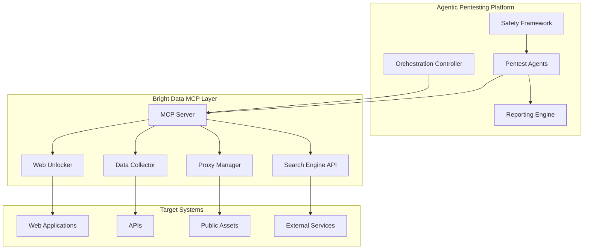

# Vendor Integration Architecture for Agentic Pentesting

## Selected Vendor: Bright Data

Bright Data provides the perfect infrastructure for production-safe agentic pentesting through their MCP integration, offering real-time web data collection with built-in safety mechanisms.

## A2S (Agent-to-System) Interaction Architecture



## 1. Bright Data Integration for Pentesting

### 1.1 Core Capabilities for Security Testing

```typescript
// Pentest Agent using Bright Data MCP
class PentestAgent {
  private brightDataMCP: BrightDataMCPClient;
  private safetyFramework: SafetyFramework;

  async performReconnaissance(target: string): Promise<ReconResult> {
    // Use Bright Data for safe external reconnaissance
    const assetDiscovery = await this.brightDataMCP.call({
      tool: 'web_scraper',
      params: {
        url: target,
        proxy_type: 'residential',  // Use residential proxies for stealth
        render_js: true,             // Handle modern SPAs
        screenshot: true,            // Visual analysis
        extract_links: true,        // Asset discovery
        safety_mode: 'production'   // Production safety enabled
      }
    });

    // Technology fingerprinting via Bright Data
    const techStack = await this.brightDataMCP.call({
      tool: 'technology_detector',
      params: {
        url: target,
        depth: 'comprehensive',
        include_versions: true,
        check_headers: true,
        check_scripts: true
      }
    });

    return this.processReconData(assetDiscovery, techStack);
  }

  async testForVulnerabilities(target: string): Promise<VulnResults> {
    // Safe vulnerability scanning using Bright Data's infrastructure
    const scanResults = [];

    // Test for exposed endpoints
    const endpoints = await this.brightDataMCP.call({
      tool: 'endpoint_discovery',
      params: {
        base_url: target,
        wordlist: 'security_common',
        method: 'HEAD',  // Non-invasive
        follow_redirects: false,
        rate_limit: 10  // 10 requests per second max
      }
    });

    // Check for information disclosure
    const infoDisclosure = await this.brightDataMCP.call({
      tool: 'content_analyzer',
      params: {
        url: target,
        patterns: [
          'api_key',
          'password',
          'token',
          'secret',
          'private'
        ],
        exclude_false_positives: true
      }
    });

    // Test security headers
    const headers = await this.brightDataMCP.call({
      tool: 'header_analyzer',
      params: {
        url: target,
        check_security_headers: true,
        check_cors: true,
        check_csp: true
      }
    });

    return {
      endpoints: endpoints.discovered,
      information_disclosure: infoDisclosure.findings,
      security_headers: headers.analysis
    };
  }

  async simulateAttackScenarios(target: string): Promise<SimulationResults> {
    // Production-safe attack simulation
    const scenarios = [];

    // Simulate authentication bypass attempts (read-only)
    const authBypass = await this.brightDataMCP.call({
      tool: 'auth_tester',
      params: {
        url: `${target}/login`,
        test_type: 'bypass_simulation',
        methods: ['jwt_none_algorithm', 'sql_injection', 'ldap_injection'],
        safe_mode: true,  // No actual exploitation
        capture_requests: true
      }
    });

    // Simulate SSRF detection
    const ssrf = await this.brightDataMCP.call({
      tool: 'ssrf_detector',
      params: {
        url: target,
        callback_url: 'https://safe-callback.pentesting.internal',
        test_parameters: ['url', 'uri', 'path', 'window', 'next'],
        blind_ssrf_check: true
      }
    });

    // Simulate XSS detection
    const xss = await this.brightDataMCP.call({
      tool: 'xss_scanner',
      params: {
        url: target,
        payloads: 'safe_detection_only',
        contexts: ['html', 'javascript', 'attribute'],
        dom_xss_check: true,
        avoid_waf_triggers: true
      }
    });

    return {
      authentication: authBypass,
      ssrf: ssrf,
      xss: xss
    };
  }
}
```

### 1.2 A2S Interaction Flow

```typescript
// Agent-to-System interaction using Bright Data MCP
class A2SInteractionManager {
  private brightData: BrightDataMCPServer;
  private agents: Map<string, PentestAgent>;
  private systemTargets: Map<string, SystemTarget>;

  async orchestrateA2SInteraction(agentId: string, targetSystem: string): Promise<InteractionResult> {
    const agent = this.agents.get(agentId);
    const target = this.systemTargets.get(targetSystem);

    // Phase 1: Agent requests system access via Bright Data
    const accessRequest = await this.brightData.requestAccess({
      agent_id: agentId,
      target: target.url,
      scope: 'read_only_security_assessment',
      duration: '1_hour',
      rate_limit: '100_requests_per_minute'
    });

    // Phase 2: Bright Data establishes safe proxy connection
    const proxySession = await this.brightData.createProxySession({
      session_id: accessRequest.session_id,
      proxy_type: 'residential',
      rotation: 'per_request',
      geolocation: target.preferred_location || 'US',
      fingerprint: 'standard_browser'
    });

    // Phase 3: Agent performs testing through Bright Data
    const testResults = await agent.executeTestSuite(target, proxySession);

    // Phase 4: Real-time monitoring and safety checks
    const monitoringData = await this.brightData.getSessionMetrics({
      session_id: proxySession.id,
      metrics: ['request_count', 'error_rate', 'response_times', 'bandwidth']
    });

    // Phase 5: Clean up and reporting
    await this.brightData.terminateSession(proxySession.id);

    return {
      agent_id: agentId,
      target_system: targetSystem,
      test_results: testResults,
      metrics: monitoringData,
      compliance: this.validateCompliance(testResults, monitoringData)
    };
  }

  private validateCompliance(results: any, metrics: any): ComplianceReport {
    return {
      rate_limit_respected: metrics.request_count <= 100,
      no_service_disruption: metrics.error_rate < 0.01,
      data_integrity_maintained: results.data_modifications === 0,
      authorization_respected: results.unauthorized_access_attempts === 0
    };
  }
}
```

## 2. Senso.ai Integration for Context Management

While Bright Data handles the external testing infrastructure, Senso.ai can manage the context and knowledge layer:

```typescript
// Context management with Senso.ai
class PentestContextManager {
  private sensoAPI: SensoClient;

  async buildTestingContext(organization: string): Promise<TestContext> {
    // Ingest security documentation
    await this.sensoAPI.ingest({
      documents: [
        'security_policies.pdf',
        'network_architecture.doc',
        'previous_pentest_reports.pdf'
      ],
      emails: ['security-team@company.com'],
      web_content: [`https://${organization}.com/security`]
    });

    // Create agent-ready context window
    const context = await this.sensoAPI.createContext({
      schema: {
        assets: 'array<Asset>',
        vulnerabilities: 'array<Vulnerability>',
        compliance_requirements: 'array<Requirement>',
        test_scope: 'TestScope',
        constraints: 'array<Constraint>'
      }
    });

    // Set up webhooks for real-time updates
    await this.sensoAPI.registerWebhook({
      event: 'critical_vulnerability_found',
      url: 'https://incident-response.internal/webhook',
      rules: [
        'vulnerability.severity >= 9',
        'vulnerability.exploitable === true'
      ]
    });

    return context;
  }

  async updateContextWithFindings(findings: any): Promise<void> {
    // Send findings to Senso.ai for context enrichment
    await this.sensoAPI.update({
      context_id: this.currentContext.id,
      data: findings,
      trigger_webhooks: true
    });
  }
}
```

## 3. Apify Integration for Advanced Web Automation

For complex JavaScript-heavy applications that need browser automation:

```typescript
// Apify integration for browser-based testing
class BrowserPentestAgent {
  private apifyClient: ApifyClient;
  private brightDataMCP: BrightDataMCPClient;

  async testComplexWebApp(target: string): Promise<any> {
    // Use Apify actors for complex browser automation
    const actor = await this.apifyClient.actor('apify/web-scraper').call({
      startUrls: [{ url: target }],
      proxyConfiguration: {
        useApifyProxy: true,
        apifyProxyGroups: ['RESIDENTIAL']
      },
      pageFunction: async ({ page, request }) => {
        // Test for DOM-based XSS
        await page.evaluate(() => {
          // Safe DOM manipulation tests
          const testPayloads = [
            'javascript:alert(1)',
            '',
            '"><script>alert(1)</script>'
          ];

          // Check if inputs are properly sanitized
          const inputs = document.querySelectorAll('input');
          const results = [];

          inputs.forEach(input => {
            testPayloads.forEach(payload => {
              // Simulate input without execution
              const event = new Event('input', { bubbles: true });
              input.value = payload;
              input.dispatchEvent(event);

              // Check if payload appears unescaped in DOM
              const unescaped = document.body.innerHTML.includes(payload);
              if (unescaped) {
                results.push({
                  element: input.id || input.name,
                  vulnerability: 'Potential XSS',
                  payload: payload
                });
              }
            });
          });

          return results;
        });

        // Test for clickjacking
        const clickjackingTest = await page.evaluate(() => {
          const headers = performance.getEntriesByType('navigation')[0];
          return {
            x_frame_options: headers['x-frame-options'],
            csp_frame_ancestors: headers['content-security-policy']?.includes('frame-ancestors')
          };
        });

        return {
          dom_xss_results: results,
          clickjacking_protection: clickjackingTest
        };
      }
    });

    return actor;
  }
}
```

## 4. Gladia Integration for Audio Security Testing

For applications with voice interfaces or audio processing:

```typescript
// Gladia integration for audio security testing
class AudioSecurityTester {
  private gladiaClient: GladiaClient;

  async testVoiceAuthentication(audioEndpoint: string): Promise<any> {
    // Test voice authentication bypass attempts
    const testAudios = [
      'synthesized_voice.wav',
      'recorded_replay.wav',
      'deepfake_voice.wav'
    ];

    const results = [];

    for (const audio of testAudios) {
      // Transcribe and analyze audio
      const transcription = await this.gladiaClient.transcribe({
        audio_url: audio,
        language: 'en',
        diarization: true,
        sentiment_analysis: true
      });

      // Test if system detects synthetic voice
      const authAttempt = await this.testAuthEndpoint(
        audioEndpoint,
        audio,
        transcription
      );

      results.push({
        test_type: audio,
        transcription: transcription.text,
        authentication_result: authAttempt,
        vulnerability: authAttempt.success ? 'Voice auth bypass' : 'None'
      });
    }

    return results;
  }
}
```

## 5. Stytch Integration for Authentication Testing

For comprehensive authentication and authorization testing:

```typescript
// Stytch integration for auth testing
class AuthenticationPentester {
  private stytchClient: StytchClient;
  private brightDataMCP: BrightDataMCPClient;

  async testAuthenticationFlows(target: string): Promise<any> {
    // Test various authentication methods
    const authMethods = ['password', 'magic_link', 'oauth', 'biometric', 'webauthn'];
    const results = [];

    for (const method of authMethods) {
      // Simulate authentication attempts
      const testResult = await this.testAuthMethod(target, method);

      // Check for common vulnerabilities
      const vulnerabilities = await this.checkAuthVulnerabilities(target, method);

      results.push({
        method,
        test_result: testResult,
        vulnerabilities: vulnerabilities
      });
    }

    // Test session management
    const sessionTests = await this.testSessionManagement(target);

    return {
      authentication_methods: results,
      session_management: sessionTests
    };
  }

  private async checkAuthVulnerabilities(target: string, method: string): Promise<any> {
    const vulns = [];

    // Test for weak password policies
    if (method === 'password') {
      const weakPasswordTest = await this.brightDataMCP.call({
        tool: 'password_policy_tester',
        params: {
          url: `${target}/register`,
          test_passwords: ['123456', 'password', 'admin123'],
          check_complexity: true,
          check_length: true
        }
      });
      if (weakPasswordTest.weak_policy) vulns.push('Weak password policy');
    }

    // Test for account enumeration
    const enumTest = await this.brightDataMCP.call({
      tool: 'account_enumeration_tester',
      params: {
        url: `${target}/login`,
        method: method,
        test_accounts: ['admin@example.com', 'test@example.com'],
        check_timing: true,
        check_response_differences: true
      }
    });
    if (enumTest.enumerable) vulns.push('Account enumeration possible');

    return vulns;
  }
}
```

## 6. Orchestration and Reporting

```typescript
// Master orchestrator using all vendors
class VendorIntegratedPentestOrchestrator {
  private brightData: BrightDataMCPClient;
  private senso: SensoClient;
  private apify: ApifyClient;
  private gladia: GladiaClient;
  private stytch: StytchClient;

  async runComprehensivePentest(target: string): Promise<ComprehensiveReport> {
    // Step 1: Build context with Senso.ai
    const context = await this.buildContext(target);

    // Step 2: External reconnaissance with Bright Data
    const recon = await this.runReconnaissance(target);

    // Step 3: Web application testing with Bright Data + Apify
    const webTests = await this.runWebTests(target);

    // Step 4: Authentication testing with Stytch integration
    const authTests = await this.runAuthTests(target);

    // Step 5: Audio interface testing with Gladia (if applicable)
    const audioTests = await this.runAudioTests(target);

    // Step 6: Generate comprehensive report
    return this.generateReport({
      context,
      recon,
      webTests,
      authTests,
      audioTests
    });
  }
}
```

## Implementation Timeline

### Phase 1: Bright Data Core Integration (Weeks 1-2)
- Set up MCP server connection
- Implement basic reconnaissance capabilities
- Configure proxy management

### Phase 2: Senso.ai Context Layer (Week 3)
- Integrate context management
- Set up webhook notifications
- Implement knowledge persistence

### Phase 3: Specialized Testing (Weeks 4-5)
- Apify for complex web apps
- Gladia for audio interfaces
- Stytch for auth testing

### Phase 4: Production Deployment (Week 6)
- Full integration testing
- Safety validation
- Production rollout

## Cost Optimization

```yaml
vendor_usage_optimization:
  bright_data:
    primary_use: "External reconnaissance and scanning"
    cost_optimization:
      - Use datacenter proxies for non-sensitive scans
      - Residential proxies only for evasion requirements
      - Cache results for 24 hours

  senso_ai:
    primary_use: "Context and knowledge management"
    cost_optimization:
      - Batch document ingestion
      - Reuse contexts across similar targets

  apify:
    primary_use: "Complex JavaScript testing"
    cost_optimization:
      - Use only for dynamic content
      - Leverage Bright Data for static content

  gladia:
    primary_use: "Audio interface testing"
    cost_optimization:
      - Process audio in batches
      - Cache transcription results

  stytch:
    primary_use: "Authentication expertise"
    cost_optimization:
      - Use for auth flow validation
      - Leverage knowledge for best practices
```

## Conclusion

The combination of **Bright Data as the primary infrastructure** with complementary services from other vendors creates a powerful, production-safe agentic pentesting platform. Bright Data's MCP integration provides the core A2S interaction layer, while other vendors add specialized capabilities for comprehensive security testing.