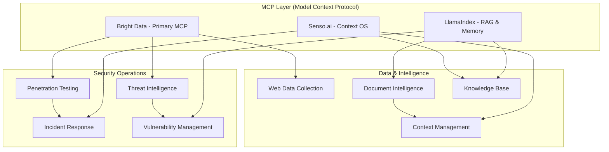

# Vendor Utilization Strategy: Security & MCP Architecture

## Executive Summary

This document outlines the strategic utilization of **three key vendors** for the comprehensive security automation platform, clearly delineating their roles in **MCP infrastructure**, **security operations**, and **intelligence management**.

## Vendor Mapping Overview



## 1. Primary Vendors and Their Domains

### 1.1 Bright Data - MCP Infrastructure & External Intelligence

**Primary Domain**: MCP Server Implementation & Web Intelligence
**Security Focus**: External reconnaissance, threat hunting, OSINT

```typescript
// Bright Data as Primary MCP Provider
class BrightDataMCPImplementation {
  // MCP Server for agent communication
  private mcpServer: BrightDataMCPServer;

  // Security-specific capabilities
  async securityOperations() {
    return {
      // External Attack Surface Management
      externalRecon: async (target: string) => {
        return await this.mcpServer.call({
          tool: 'web_scraper',
          params: {
            url: target,
            discover_subdomains: true,
            find_exposed_apis: true,
            detect_technologies: true
          }
        });
      },

      // Threat Intelligence Collection
      threatIntel: async (indicators: string[]) => {
        return await this.mcpServer.call({
          tool: 'threat_intelligence',
          params: {
            indicators,
            sources: ['pastebin', 'github', 'forums'],
            deep_web_search: true
          }
        });
      },

      // Phishing & Brand Protection
      brandProtection: async (brand: string) => {
        return await this.mcpServer.call({
          tool: 'phishing_detection',
          params: {
            brand_keywords: [brand],
            check_new_domains: true,
            visual_similarity: true
          }
        });
      },

      // Compliance Monitoring
      complianceCheck: async (domains: string[]) => {
        return await this.mcpServer.call({
          tool: 'compliance_scanner',
          params: {
            targets: domains,
            standards: ['GDPR', 'PCI-DSS', 'HIPAA'],
            check_privacy_policies: true
          }
        });
      }
    };
  }

  // MCP Protocol Implementation
  async handleMCPRequest(request: MCPRequest): Promise<MCPResponse> {
    // Route MCP requests to appropriate Bright Data tools
    switch(request.method) {
      case 'security.scan':
        return await this.performSecurityScan(request.params);
      case 'intelligence.gather':
        return await this.gatherIntelligence(request.params);
      case 'data.collect':
        return await this.collectWebData(request.params);
      default:
        throw new Error(`Unknown MCP method: ${request.method}`);
    }
  }
}
```

**Key Bright Data Use Cases**:
- 🌐 **Web Intelligence**: Real-time web scraping for security insights
- 🔍 **External Reconnaissance**: Asset discovery without touching internal systems
- 🎣 **Phishing Detection**: Monitor for brand impersonation
- 📊 **Compliance Monitoring**: Automated compliance verification
- 🕸️ **Dark Web Monitoring**: Safe dark web reconnaissance

### 1.2 LlamaIndex - RAG & Security Knowledge Management

**Primary Domain**: Document Intelligence & Knowledge Retrieval
**Security Focus**: Security documentation analysis, vulnerability knowledge base, incident history

```typescript
// LlamaIndex for Security Knowledge Management
class LlamaIndexSecurityRAG {
  private index: VectorStoreIndex;
  private securityKB: SecurityKnowledgeBase;
  private memoryStore: ChatMemoryBuffer;

  async initialize() {
    // Create specialized indexes for security domains
    this.indexes = {
      vulnerabilities: await this.createVulnerabilityIndex(),
      incidents: await this.createIncidentIndex(),
      playbooks: await this.createPlaybookIndex(),
      compliance: await this.createComplianceIndex(),
      threatIntel: await this.createThreatIntelIndex()
    };
  }

  // Security-Specific RAG Operations
  async securityOperations() {
    return {
      // Vulnerability Research
      vulnerabilityAnalysis: async (cve: string) => {
        // Query vulnerability databases and security advisories
        const query = `Provide detailed analysis of ${cve} including:
          - Technical details and affected systems
          - Exploitation techniques and POCs
          - Remediation strategies
          - Related vulnerabilities`;

        const response = await this.indexes.vulnerabilities.query({
          query,
          mode: 'embedding',
          topK: 10,
          includeMetadata: true
        });

        // Enhance with historical incident data
        const incidents = await this.findRelatedIncidents(cve);

        return {
          vulnerability: response,
          historical_incidents: incidents,
          remediation_playbook: await this.getRemediationPlaybook(cve)
        };
      },

      // Incident Investigation
      incidentInvestigation: async (indicators: IOC[]) => {
        // Build investigation context from multiple sources
        const context = await this.buildInvestigationContext(indicators);

        // Query across all security indexes
        const investigation = await Promise.all([
          this.searchIncidentHistory(indicators),
          this.searchThreatIntel(indicators),
          this.searchPlaybooks(indicators),
          this.searchVulnerabilities(indicators)
        ]);

        return {
          context,
          similar_incidents: investigation[0],
          threat_intelligence: investigation[1],
          recommended_playbooks: investigation[2],
          related_vulnerabilities: investigation[3]
        };
      },

      // Compliance Analysis
      complianceGuidance: async (standard: string, context: any) => {
        const query = `For ${standard} compliance, analyze:
          - Current compliance gaps
          - Required controls
          - Implementation guidance
          - Audit preparation`;

        const guidance = await this.indexes.compliance.query({
          query,
          context,
          mode: 'tree_summarize'
        });

        return {
          compliance_analysis: guidance,
          control_mappings: await this.mapControls(standard),
          implementation_steps: await this.getImplementationSteps(standard)
        };
      },

      // Security Documentation Q&A
      securityQA: async (question: string) => {
        // Multi-index search across all security documentation
        const answer = await this.multiIndexQuery(question);

        // Add chat memory for context
        this.memoryStore.addInteraction(question, answer);

        return {
          answer,
          sources: answer.sourceNodes,
          confidence: answer.confidence,
          related_questions: await this.getSimilarQuestions(question)
        };
      }
    };
  }

  // Advanced RAG Features for Security
  private async createVulnerabilityIndex(): Promise<VectorStoreIndex> {
    // Ingest security sources
    const documents = await this.ingestSecuritySources([
      'https://nvd.nist.gov/feeds',
      'https://cve.mitre.org/data',
      'https://www.exploit-db.com/feeds',
      'security_advisories/',
      'vulnerability_reports/'
    ]);

    // Create specialized index with security-aware chunking
    return await VectorStoreIndex.fromDocuments(documents, {
      chunkSize: 1024,
      chunkOverlap: 200,
      metadata: {
        type: 'vulnerability',
        security_context: true
      }
    });
  }

  // Memory Management for Security Operations
  private async buildInvestigationContext(indicators: IOC[]): Promise<Context> {
    // Retrieve relevant past investigations
    const historicalContext = await this.memoryStore.search({
      indicators,
      timeRange: 'last_90_days',
      similarity_threshold: 0.8
    });

    // Build comprehensive context
    return {
      current_indicators: indicators,
      historical_matches: historicalContext,
      threat_landscape: await this.getCurrentThreatLandscape(),
      organizational_context: await this.getOrgContext()
    };
  }

  // Integration with Other Systems
  async syncWithBrightData(brightDataFindings: any): Promise<void> {
    // Ingest Bright Data findings into LlamaIndex
    const documents = this.convertToDocuments(brightDataFindings);
    await this.indexes.threatIntel.insert(documents);
  }

  async syncWithSenso(sensoContext: any): Promise<void> {
    // Update indexes with Senso context
    await this.updateContextualIndexes(sensoContext);
  }
}
```

**Key LlamaIndex Use Cases**:
- 📚 **Security Knowledge Base**: RAG over security documentation, CVEs, and advisories
- 🔎 **Incident Investigation**: Historical incident analysis and pattern matching
- 📋 **Compliance Guidance**: Query compliance requirements and implementation guides
- 🧠 **Vulnerability Research**: Deep analysis of vulnerabilities and exploits
- 💾 **Security Memory**: Long-term memory for security operations

### 1.3 Senso.ai - Context OS & Workflow Orchestration

**Primary Domain**: Context Management & Action Orchestration
**Security Focus**: Incident response workflows, security context management, automated actions

```typescript
// Senso.ai for Security Context and Orchestration
class SensoSecurityContextOS {
  private sensoClient: SensoClient;
  private contexts: Map<string, SecurityContext>;
  private workflows: Map<string, SecurityWorkflow>;

  async initialize() {
    // Set up security-specific contexts
    this.contexts = new Map([
      ['incident_response', await this.createIncidentContext()],
      ['threat_hunting', await this.createThreatHuntingContext()],
      ['vulnerability_management', await this.createVulnContext()],
      ['compliance_monitoring', await this.createComplianceContext()]
    ]);

    // Register security workflows
    await this.registerSecurityWorkflows();
  }

  // Security Context Management
  async securityOperations() {
    return {
      // Incident Response Orchestration
      incidentResponse: async (incident: SecurityIncident) => {
        // Create incident context
        const context = await this.sensoClient.createContext({
          schema: {
            incident_id: 'string',
            severity: 'enum[critical, high, medium, low]',
            affected_assets: 'array<Asset>',
            indicators: 'array<IOC>',
            timeline: 'array<Event>',
            response_actions: 'array<Action>'
          },
          data: incident
        });

        // Set up automated workflows
        await this.sensoClient.registerWebhooks([
          {
            event: 'new_indicator_found',
            action: 'enrich_and_hunt',
            webhook: 'https://security.internal/hunt'
          },
          {
            event: 'severity_escalated',
            action: 'notify_and_isolate',
            webhook: 'https://security.internal/escalate'
          },
          {
            event: 'remediation_required',
            action: 'auto_remediate',
            webhook: 'https://security.internal/remediate'
          }
        ]);

        return context;
      },

      // Threat Hunting Workflows
      threatHunting: async (hypothesis: ThreatHypothesis) => {
        // Create hunting context
        const context = await this.sensoClient.createContext({
          schema: {
            hypothesis: 'string',
            indicators: 'array<IOC>',
            hunt_queries: 'array<Query>',
            findings: 'array<Finding>',
            conclusions: 'string'
          }
        });

        // Ingest hunt-related data
        await this.sensoClient.ingest({
          documents: hypothesis.reference_docs,
          emails: hypothesis.related_alerts,
          web_content: hypothesis.threat_intel_urls
        });

        // Set up hunt automation
        const workflow = await this.sensoClient.createWorkflow({
          name: 'automated_threat_hunt',
          triggers: ['new_ioc', 'suspicious_activity'],
          actions: [
            { type: 'query_siem', params: { queries: hypothesis.queries }},
            { type: 'analyze_results', params: { ml_model: 'anomaly_detection' }},
            { type: 'escalate_findings', params: { threshold: 0.8 }}
          ]
        });

        return { context, workflow };
      },

      // Security Automation Workflows
      automatedPlaybooks: async (trigger: string) => {
        const playbook = this.workflows.get(trigger);

        if (!playbook) {
          throw new Error(`No playbook for trigger: ${trigger}`);
        }

        // Execute playbook through Senso
        const execution = await this.sensoClient.executeWorkflow({
          workflow_id: playbook.id,
          context: await this.getCurrentSecurityContext(),
          params: {
            auto_remediate: true,
            require_approval: playbook.requires_approval,
            notification_channels: ['slack', 'pagerduty']
          }
        });

        return execution;
      },

      // Context Enrichment
      enrichContext: async (rawData: any) => {
        // Normalize and enrich data
        const enriched = await this.sensoClient.process({
          raw_data: rawData,
          enrichment_sources: [
            'threat_intelligence',
            'asset_inventory',
            'user_directory',
            'vulnerability_database'
          ],
          output_schema: 'normalized_security_event'
        });

        // Update relevant contexts
        await this.updateSecurityContexts(enriched);

        return enriched;
      }
    };
  }

  // Workflow Registration
  private async registerSecurityWorkflows(): Promise<void> {
    // Incident Response Workflow
    await this.sensoClient.registerWorkflow({
      name: 'incident_response',
      triggers: ['security_alert', 'manual_trigger'],
      steps: [
        { action: 'assess_severity', timeout: 60 },
        { action: 'gather_context', parallel: true },
        { action: 'contain_threat', requires_approval: true },
        { action: 'eradicate_threat', depends_on: 'contain_threat' },
        { action: 'recover_systems', depends_on: 'eradicate_threat' },
        { action: 'post_incident_review', delay: 86400000 } // 24 hours
      ],
      webhooks: {
        on_start: 'https://security.internal/incident/start',
        on_complete: 'https://security.internal/incident/complete',
        on_error: 'https://security.internal/incident/error'
      }
    });

    // Vulnerability Management Workflow
    await this.sensoClient.registerWorkflow({
      name: 'vulnerability_management',
      triggers: ['new_cve', 'scan_complete'],
      steps: [
        { action: 'assess_impact', timeout: 300 },
        { action: 'prioritize_remediation', depends_on: 'assess_impact' },
        { action: 'create_tickets', parallel: true },
        { action: 'deploy_patches', requires_approval: true },
        { action: 'verify_remediation', depends_on: 'deploy_patches' }
      ]
    });
  }

  // Integration Points
  async integrateWithBrightData(brightDataStream: any): Promise<void> {
    // Stream Bright Data findings into Senso context
    await this.sensoClient.streamIngestion({
      source: 'bright_data',
      data: brightDataStream,
      context_id: this.contexts.get('threat_hunting').id,
      real_time: true
    });
  }

  async integrateWithLlamaIndex(query: string): Promise<any> {
    // Query LlamaIndex through Senso context
    const context = await this.getCurrentSecurityContext();
    const enhanced_query = `${query} with context: ${JSON.stringify(context)}`;

    // Senso manages the query routing
    return await this.sensoClient.query({
      query: enhanced_query,
      sources: ['llamaindex_rag'],
      include_context: true
    });
  }
}
```

**Key Senso.ai Use Cases**:
- 🔄 **Incident Response Orchestration**: Automated IR workflows and playbooks
- 📊 **Security Context Management**: Centralized context for all security operations
- ⚡ **Action Automation**: Trigger security actions based on rules and events
- 🔗 **Workflow Integration**: Connect security tools and processes
- 📝 **Compliance Workflows**: Automated compliance monitoring and reporting

## 2. Integrated Architecture

### 2.1 Three-Vendor Security Platform

```typescript
// Integrated Security Platform Using All Three Vendors
class IntegratedSecurityPlatform {
  private brightData: BrightDataMCPImplementation;
  private llamaIndex: LlamaIndexSecurityRAG;
  private senso: SensoSecurityContextOS;

  async executeSecurityOperation(operation: SecurityOperation): Promise<Result> {
    switch(operation.type) {
      case 'INCIDENT_RESPONSE':
        return await this.handleIncident(operation);

      case 'THREAT_HUNT':
        return await this.conductThreatHunt(operation);

      case 'VULNERABILITY_ASSESSMENT':
        return await this.assessVulnerabilities(operation);

      case 'COMPLIANCE_AUDIT':
        return await this.auditCompliance(operation);
    }
  }

  private async handleIncident(operation: SecurityOperation): Promise<Result> {
    // Step 1: Create incident context with Senso.ai
    const context = await this.senso.incidentResponse(operation.incident);

    // Step 2: Gather external intelligence with Bright Data
    const externalIntel = await this.brightData.securityOperations().threatIntel(
      operation.incident.indicators
    );

    // Step 3: Query historical data with LlamaIndex
    const historicalAnalysis = await this.llamaIndex.securityOperations()
      .incidentInvestigation(operation.incident.indicators);

    // Step 4: Orchestrate response through Senso.ai
    const response = await this.senso.automatedPlaybooks('incident_response');

    return {
      context,
      external_intelligence: externalIntel,
      historical_context: historicalAnalysis,
      response_actions: response
    };
  }

  private async conductThreatHunt(operation: SecurityOperation): Promise<Result> {
    // Step 1: Build hypothesis with LlamaIndex RAG
    const hypothesis = await this.llamaIndex.securityOperations()
      .securityQA(operation.hunt_question);

    // Step 2: Collect external indicators with Bright Data
    const externalIndicators = await this.brightData.securityOperations()
      .externalRecon(operation.target_domain);

    // Step 3: Orchestrate hunt with Senso.ai
    const huntResults = await this.senso.securityOperations()
      .threatHunting({
        hypothesis: hypothesis.answer,
        indicators: externalIndicators,
        reference_docs: hypothesis.sources
      });

    return {
      hypothesis,
      external_indicators: externalIndicators,
      hunt_results: huntResults
    };
  }

  private async assessVulnerabilities(operation: SecurityOperation): Promise<Result> {
    // Step 1: External scanning with Bright Data
    const externalVulns = await this.brightData.securityOperations()
      .externalRecon(operation.target);

    // Step 2: Analyze vulnerabilities with LlamaIndex
    const vulnAnalysis = await Promise.all(
      externalVulns.vulnerabilities.map(vuln =>
        this.llamaIndex.securityOperations().vulnerabilityAnalysis(vuln.cve)
      )
    );

    // Step 3: Orchestrate remediation with Senso.ai
    const remediation = await this.senso.securityOperations()
      .automatedPlaybooks('vulnerability_management');

    return {
      discovered_vulnerabilities: externalVulns,
      detailed_analysis: vulnAnalysis,
      remediation_plan: remediation
    };
  }

  private async auditCompliance(operation: SecurityOperation): Promise<Result> {
    // Step 1: External compliance check with Bright Data
    const externalCompliance = await this.brightData.securityOperations()
      .complianceCheck(operation.domains);

    // Step 2: Query compliance requirements with LlamaIndex
    const complianceGuidance = await this.llamaIndex.securityOperations()
      .complianceGuidance(operation.standard, externalCompliance);

    // Step 3: Orchestrate compliance workflow with Senso.ai
    const complianceWorkflow = await this.senso.securityOperations()
      .automatedPlaybooks('compliance_audit');

    return {
      external_compliance_status: externalCompliance,
      compliance_guidance: complianceGuidance,
      audit_workflow: complianceWorkflow
    };
  }
}
```

### 2.2 MCP Communication Flow

```typescript
// MCP Integration Across All Vendors
class MCPOrchestrator {
  private vendors: {
    brightData: MCPClient;    // Primary MCP server
    llamaIndex: MCPClient;    // RAG MCP interface
    senso: MCPClient;         // Context MCP interface
  };

  async routeMCPRequest(request: MCPRequest): Promise<MCPResponse> {
    // Determine best vendor for the request
    const vendor = this.selectVendor(request);

    // Route to appropriate vendor
    switch(vendor) {
      case 'brightdata':
        // External data collection and web intelligence
        return await this.vendors.brightData.send(request);

      case 'llamaindex':
        // Knowledge retrieval and document analysis
        return await this.vendors.llamaIndex.send(request);

      case 'senso':
        // Context management and workflow orchestration
        return await this.vendors.senso.send(request);

      case 'multi':
        // Coordinate across multiple vendors
        return await this.multiVendorOperation(request);
    }
  }

  private selectVendor(request: MCPRequest): string {
    if (request.method.startsWith('external.') ||
        request.method.startsWith('web.')) {
      return 'brightdata';
    }

    if (request.method.startsWith('knowledge.') ||
        request.method.startsWith('rag.')) {
      return 'llamaindex';
    }

    if (request.method.startsWith('context.') ||
        request.method.startsWith('workflow.')) {
      return 'senso';
    }

    if (request.method.startsWith('security.')) {
      return 'multi';  // Security operations often need multiple vendors
    }

    return 'brightdata';  // Default to primary MCP provider
  }

  private async multiVendorOperation(request: MCPRequest): Promise<MCPResponse> {
    // Example: Security investigation requiring all three vendors

    // 1. Get external intelligence (Bright Data)
    const external = await this.vendors.brightData.send({
      method: 'external.investigate',
      params: request.params
    });

    // 2. Enrich with knowledge (LlamaIndex)
    const enriched = await this.vendors.llamaIndex.send({
      method: 'rag.enrich',
      params: { data: external.result }
    });

    // 3. Orchestrate response (Senso.ai)
    const response = await this.vendors.senso.send({
      method: 'workflow.execute',
      params: {
        data: enriched.result,
        workflow: 'security_investigation'
      }
    });

    return {
      success: true,
      result: {
        external_data: external.result,
        enriched_intelligence: enriched.result,
        response_actions: response.result
      }
    };
  }
}
```

## 3. Vendor Comparison Matrix

| Aspect | Bright Data | LlamaIndex | Senso.ai |
|--------|------------|------------|----------|
| **Primary Role** | MCP Server & Web Intelligence | RAG & Knowledge Management | Context OS & Orchestration |
| **MCP Support** | ✅ Native MCP Server | ✅ MCP-compatible RAG | ✅ MCP Context Layer |
| **Security Focus** | External Recon, OSINT, Threat Intel | Vuln Research, Incident Analysis | IR Workflows, Automation |
| **Data Sources** | Web, APIs, Dark Web | Documents, CVEs, Security KBs | Events, Alerts, Contexts |
| **Key Strength** | Safe external scanning | Deep security knowledge | Workflow orchestration |
| **Integration Type** | Data Collection | Knowledge Retrieval | Action Orchestration |
| **Best For** | External attack surface | Security research & analysis | Incident response |
| **Scalability** | High (proxy network) | High (vector DB) | High (event-driven) |
| **Real-time** | ✅ Yes | ⚠️ Near real-time | ✅ Yes |
| **Cost Model** | Usage-based (bandwidth) | Storage + queries | API calls + workflows |

## 4. Implementation Strategy

### Phase 1: Core MCP Setup (Day 1 Morning)
```yaml
tasks:
  - setup: "Bright Data MCP server"
    time: "2 hours"
    priority: "Critical"

  - setup: "LlamaIndex RAG system"
    time: "1.5 hours"
    priority: "High"

  - setup: "Senso.ai context management"
    time: "1.5 hours"
    priority: "High"
```

### Phase 2: Security Integration (Day 1 Afternoon)
```yaml
tasks:
  - integrate: "Bright Data external scanning"
    time: "1 hour"
    focus: "Web recon, threat intel"

  - integrate: "LlamaIndex security KB"
    time: "1 hour"
    focus: "CVE database, incident history"

  - integrate: "Senso.ai IR workflows"
    time: "1 hour"
    focus: "Automated playbooks"
```

### Phase 3: Demo Preparation (Day 1 Evening)
```yaml
demo_scenarios:
  - scenario: "External Attack Surface Discovery"
    vendors: ["Bright Data", "LlamaIndex"]
    duration: "5 minutes"

  - scenario: "Automated Incident Response"
    vendors: ["All three"]
    duration: "7 minutes"

  - scenario: "Vulnerability Research & Remediation"
    vendors: ["LlamaIndex", "Senso.ai"]
    duration: "5 minutes"
```

## 5. Cost Optimization

```typescript
class VendorCostOptimizer {
  optimizeUsage(operation: SecurityOperation): VendorSelection {
    // Use the most cost-effective vendor for each operation

    if (operation.type === 'EXTERNAL_SCAN') {
      // Bright Data only - no need for other vendors
      return { vendors: ['brightdata'], strategy: 'single' };
    }

    if (operation.type === 'KNOWLEDGE_QUERY') {
      // LlamaIndex only - pure RAG operation
      return { vendors: ['llamaindex'], strategy: 'single' };
    }

    if (operation.type === 'WORKFLOW_ONLY') {
      // Senso.ai only - just orchestration
      return { vendors: ['senso'], strategy: 'single' };
    }

    if (operation.type === 'FULL_INVESTIGATION') {
      // All vendors but optimize order
      return {
        vendors: ['brightdata', 'llamaindex', 'senso'],
        strategy: 'sequential',
        optimization: 'cache_results'
      };
    }
  }
}
```

## Conclusion

This three-vendor strategy provides:

1. **Bright Data**: Primary MCP infrastructure + external security intelligence
2. **LlamaIndex**: Advanced RAG for security knowledge and research
3. **Senso.ai**: Context management and security workflow orchestration

Together, they create a comprehensive security platform that covers:
- ✅ **MCP Layer**: Full protocol support across all vendors
- ✅ **Security Operations**: Complete coverage from recon to response
- ✅ **Intelligence Management**: External, historical, and contextual
- ✅ **Automation**: End-to-end security workflow automation

Perfect for demonstrating advanced multi-vendor integration in a hackathon setting!